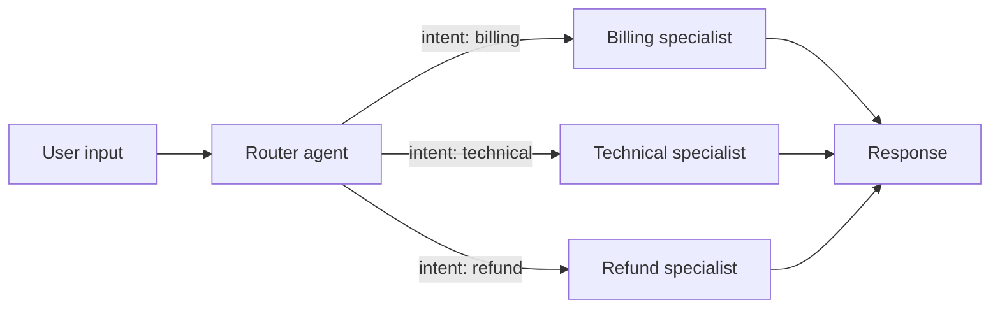
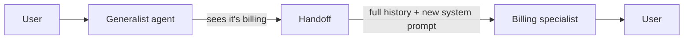
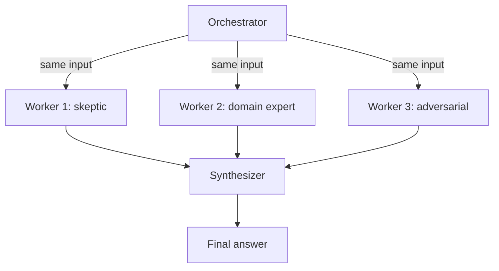
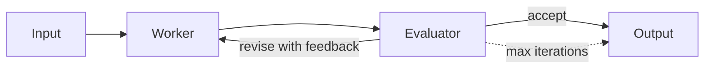
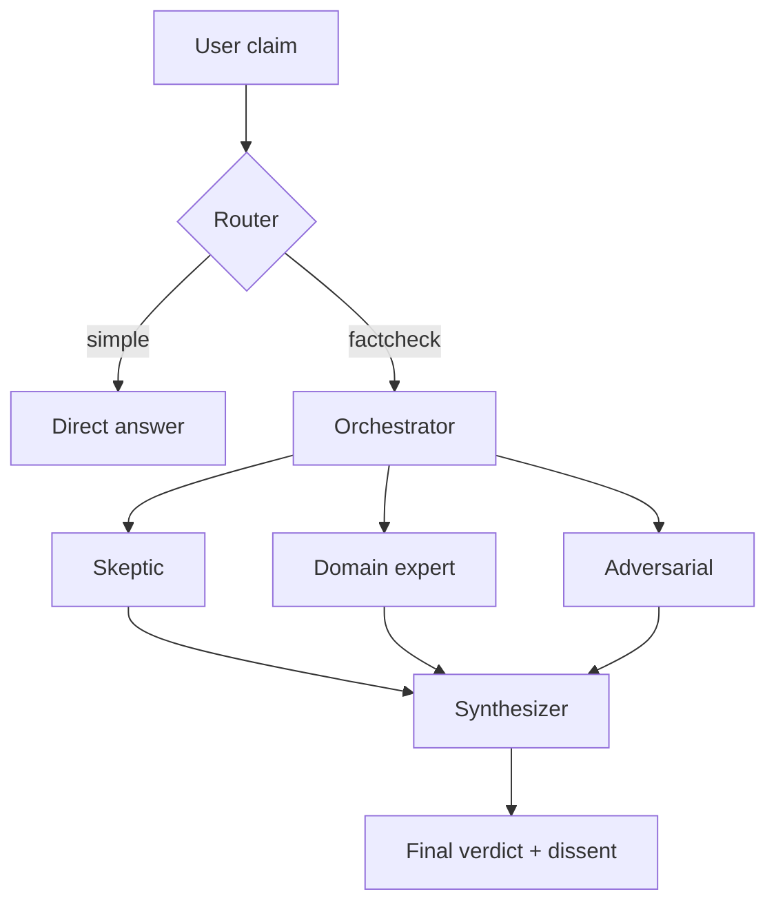

A single agent with well-scoped tools handles most problems. Multi-agent orchestration is worth the complexity only when one agent can't — either because the roles conflict, parallel perspectives are needed, or latency demands parallelism. This page covers the four patterns that cover almost every real case, plus the discipline that keeps them reliable.

## When to reach for multi-agent

Start with a single `chat()` call and a good tool set. Reach for multi-agent only when one of these is true:

1. **Role separation.** Two jobs in one prompt bleed into each other — a "neutral summarizer" and a "skeptical critic" in the same system prompt produce mush. Separate agents keep each role clean.
2. **Parallel perspectives.** You need several takes on the same input (review, consensus, adversarial) and merging them is the point. One agent asked to "list three perspectives" converges on one voice.
3. **Latency.** Independent work that can run in parallel will always beat a serial tool loop. If three lookups are independent, firing three agents in parallel is faster than one agent calling three tools in sequence.

If none of these hold, a single agent with the right tools is simpler, cheaper, and easier to debug. Come back when you hit one of them.

## The four patterns

### 1. Router

**Problem:** A request could be handled by one of several specialists, and you want the dispatcher to pick the right one based on intent. The dispatcher itself does no further work.



```typescript
import { chat } from "@tanstack/ai";
import { openaiText } from "@tanstack/ai-openai/adapters";
import { z } from "zod";

const Route = z.object({
  intent: z.enum(["billing", "technical", "refund"]),
  reason: z.string().meta({ description: "One sentence justifying the choice" }),
});

// Each specialist is a regular chat() call with its own system prompt.
// Return type is a string; swap in outputSchema / streaming per your needs.
const specialists = {
  billing: (msg: string) =>
    chat({
      adapter: openaiText("gpt-4o"),
      messages: [
        { role: "system", content: "You are a billing specialist. Only answer billing questions." },
        { role: "user", content: msg },
      ],
      stream: false,
    }),
  technical: (msg: string) =>
    chat({
      adapter: openaiText("gpt-4o"),
      messages: [
        { role: "system", content: "You are a technical support engineer. Ask for logs when needed." },
        { role: "user", content: msg },
      ],
      stream: false,
    }),
  refund: (msg: string) =>
    chat({
      adapter: openaiText("gpt-4o"),
      messages: [
        { role: "system", content: "You are a refunds agent. Follow policy X; escalate on edge cases." },
        { role: "user", content: msg },
      ],
      stream: false,
    }),
};

async function route(userMessage: string) {
  const decision = await chat({
    adapter: openaiText("gpt-4o-mini"),
    messages: [
      { role: "system", content: "Classify the user's intent. Return exactly one intent." },
      { role: "user", content: userMessage },
    ],
    outputSchema: Route,
    stream: false,
  });

  return specialists[decision.intent](userMessage);
}
```

**Tradeoffs:**

- Cheapest pattern — one classifier call plus one specialist call.
- Router should use a small, fast model. A 4o-class router on simple intents is wasted money.
- Router over-confidence is the main failure. Add an `"unknown"` variant to the enum and a fallback branch.
- The router does **not** see the specialist's reply, so it can't correct itself. That's a feature — it keeps the router cheap — but don't use this pattern when you need post-hoc quality checks.

### 2. Handoff

**Problem:** An agent realizes mid-conversation that a different specialist should take over, and the specialist needs the full conversation context to continue seamlessly.



```typescript
const Decision = z.object({
  handoffTo: z.enum(["generalist", "billing", "technical"]),
  reason: z.string(),
});

const decision = await chat({
  adapter: openaiText("gpt-4o"),
  messages: [
    { role: "system", content: GENERALIST_SYSTEM_PROMPT },
    ...history, // full conversation so far
  ],
  outputSchema: Decision,
  stream: false,
});

if (decision.handoffTo === "generalist") {
  // No handoff needed — generalist handles it directly.
  return chat({
    adapter: openaiText("gpt-4o"),
    messages: [
      { role: "system", content: GENERALIST_SYSTEM_PROMPT },
      ...history,
    ],
    stream: false,
  });
}

// Handoff: specialist inherits the full conversation, fresh system prompt.
return chat({
  adapter: openaiText("gpt-4o"),
  messages: [
    { role: "system", content: SPECIALIST_PROMPTS[decision.handoffTo] },
    ...history,
  ],
  stream: false,
});
```

**Tradeoffs:**

- Unlike Router, the generalist can handle the request itself; handoff is an escape hatch, not a gate.
- The specialist sees every prior message — that's the point, but it's also the cost. Long histories get expensive fast.
- Truncate or summarize history before handoff if you're past a comfortable budget. A summarization pass is cheap and keeps the specialist focused.
- Don't chain handoffs indefinitely. Cap the depth (2–3) and bail to a human or a generic fallback if exceeded.

### 3. Orchestrator + parallel workers + synthesizer

**Problem:** You need several independent perspectives on the same input, then one merged answer. Classic uses: multi-reviewer code review, fact-checking with different adversarial framings, ensemble scoring.



```typescript
const WorkerOutput = z.object({
  verdict: z.enum(["pass", "fail", "uncertain"]),
  findings: z.array(z.string()),
});

const personas = {
  skeptic: "You are a skeptical reviewer. Challenge every claim.",
  expert: "You are a domain expert. Apply rigorous standards.",
  adversarial: "You are an adversarial reviewer. Find the strongest counterargument.",
};

async function review(input: string) {
  const workers = await Promise.all(
    Object.values(personas).map((systemPrompt) =>
      chat({
        adapter: openaiText("gpt-4o"),
        messages: [
          { role: "system", content: systemPrompt },
          { role: "user", content: input },
        ],
        outputSchema: WorkerOutput,
        stream: false,
      }),
    ),
  );

  return chat({
    adapter: openaiText("gpt-4o"),
    messages: [
      { role: "system", content: "Synthesize the reviews. Highlight disagreement." },
      { role: "user", content: JSON.stringify({ input, workers }) },
    ],
    outputSchema: z.object({
      verdict: z.enum(["pass", "fail"]),
      rationale: z.string(),
      dissent: z.array(z.string()),
    }),
    stream: false,
  });
}
```

**Tradeoffs:**

- Cost multiplies by the worker count. Three workers cost roughly 3× the single-agent alternative plus the synthesizer. Budget before fan-out.
- Prompt bias is the silent killer. If the orchestrator's framing leaks into the workers ("verify that X is true"), they'll all agree. See [The discipline](#the-discipline).
- Latency is bounded by the slowest worker, not the sum. This is the pattern's big win.
- Route the synthesizer through a capable model even if the workers use a cheaper one — merging disagreement is harder than generating takes.

### 4. Evaluator / critic loop

**Problem:** An agent's first pass isn't good enough, and a second agent can tell you concretely what's wrong. Iterate until the evaluator is satisfied or a hard cap is hit.



```typescript
const Verdict = z.object({
  accepted: z.boolean(),
  feedback: z.string().meta({ description: "Required if accepted is false" }),
});

async function refine(draft: string, maxRounds = 3) {
  let current = draft;
  for (let i = 0; i < maxRounds; i++) {
    const verdict = await chat({
      adapter: openaiText("gpt-4o"),
      messages: [
        { role: "system", content: "Evaluate the draft against the spec. Reject on any ambiguity." },
        { role: "user", content: current },
      ],
      outputSchema: Verdict,
      stream: false,
    });

    if (verdict.accepted) return { output: current, rounds: i + 1 };

    current = await chat({
      adapter: openaiText("gpt-4o"),
      messages: [
        { role: "system", content: "Revise the draft based on the feedback. Return only the revised draft." },
        { role: "user", content: `Draft:\n${current}\n\nFeedback:\n${verdict.feedback}` },
      ],
      stream: false,
    });
  }
  throw new Error("Did not converge within budget");
}
```

**Tradeoffs:**

- The loop must have an explicit stop condition that isn't the agent saying "done". `maxRounds` is non-negotiable; infinite loops are the default failure mode of this pattern.
- The evaluator needs a strict rubric. "Is this good?" returns "yes" from a polite model. "Does this satisfy these five specific criteria?" produces useful rejections.
- This is the most expensive pattern per result — each round is two calls — but it's the one that raises the ceiling on quality.

## The discipline

The four patterns share five invariants. Break any of them and the system becomes flaky in ways that are hard to debug.

### Prompt isolation

Each worker prompt is a contract with that specific agent. Never leak the orchestrator's hypothesis, prior round findings, or other workers' output into a parallel worker's prompt — if you do, you'll confirm whatever the orchestrator already believed. For parallel workers, keep the prompt byte-identical across workers except for the persona system prompt. Anything that varies between workers is a variable you now have to reason about.

The handoff pattern is the exception: the specialist **needs** the conversation history. But the system prompt for the specialist should be fresh, not a concatenation of the generalist's prompt plus the specialist's role.

### Explicit convergence criteria

Every loop (evaluator) and every parallel round (orchestrator+workers) needs a stop condition that is not "the agent said stop." For the evaluator loop: a hard `maxRounds`. For fan-out: an explicit merge rule ("all three must agree on verdict", "at least two must agree"). For handoff chains: a depth limit.

If you can't state the stop condition as a pure function of the agents' outputs and a counter, you don't have convergence — you have a coin flip.

### Structured seams at agent boundaries

Agents pass data to each other. Use structured output (`outputSchema` with Zod, or tool calls with JSON Schema) at every boundary. Freeform text that the next agent has to re-parse is a source of silent bugs: the next agent will fill in plausible defaults for fields that were actually missing.

```typescript
// Good — the synthesizer gets a parsed, typed object
const worker = await chat({
  adapter,
  messages,
  outputSchema: WorkerOutput,
  stream: false,
});
const synth = await chat({
  adapter,
  messages: [{ role: "user", content: JSON.stringify(worker) }],
  outputSchema: SynthOutput,
  stream: false,
});

// Bad — the synthesizer has to guess what fields the worker produced
const workerText = await chat({ adapter, messages, stream: false }); // freeform string
const synth = await chat({
  adapter,
  messages: [{ role: "user", content: workerText }],
  stream: false,
});
```

### Cost and latency budgeting

Multi-agent patterns multiply token spend in ways that sneak up on you. Three workers plus a synthesizer is four calls, not one. An evaluator loop capped at three rounds is up to six calls. Budget before you ship:

- Classifiers and routers: smallest model that hits acceptable accuracy. Start with `gpt-4o-mini` or equivalent.
- Workers: match the task difficulty, not the synthesizer's tier.
- Synthesizers and evaluators: capable models. Merging disagreement is harder than generating it.
- Put a wall-clock budget on loops. A user-facing evaluator loop shouldn't exceed a couple of seconds; surface timeout behavior explicitly.

### Fail loud

A worker's error kills the round, not silently degrades it. If two of three parallel workers return and the third throws, the synthesizer is seeing a biased sample — often without any signal that anything went wrong. `Promise.all` fails fast, which is the right default here; wrap in `Promise.allSettled` only when you've decided in writing how to handle partial fan-outs.

Log every retry. Silent retries mask capacity and rate-limit signals that you need to see to tune the system.

## Worked example: research-grade fact check

Combines routing, parallel workers, and structured synthesis.



```typescript
import { chat } from "@tanstack/ai";
import { openaiText } from "@tanstack/ai-openai/adapters";
import { z } from "zod";

const Intent = z.object({ kind: z.enum(["simple", "factcheck"]) });

const Review = z.object({
  verdict: z.enum(["true", "false", "uncertain"]),
  evidence: z.array(z.string()),
});

const Final = z.object({
  verdict: z.enum(["true", "false", "uncertain"]),
  confidence: z.number().min(0).max(1),
  dissenting: z.array(z.string()),
});

const personas = {
  skeptic: "You are a skeptical reviewer. Demand citations.",
  expert: "You are a domain expert. Apply rigorous standards.",
  adversarial: "You are adversarial. Find the strongest counterargument.",
};

export async function factCheck(claim: string) {
  const intent = await chat({
    adapter: openaiText("gpt-4o-mini"),
    messages: [
      { role: "system", content: "Classify: is this a factual claim that needs verification, or a simple question?" },
      { role: "user", content: claim },
    ],
    outputSchema: Intent,
    stream: false,
  });

  if (intent.kind === "simple") {
    const answer = await chat({
      adapter: openaiText("gpt-4o-mini"),
      messages: [{ role: "user", content: claim }],
      stream: false,
    });
    return { kind: "simple" as const, answer };
  }

  const reviews = await Promise.all(
    Object.values(personas).map((systemPrompt) =>
      chat({
        adapter: openaiText("gpt-4o"),
        messages: [
          { role: "system", content: systemPrompt },
          { role: "user", content: claim },
        ],
        outputSchema: Review,
        stream: false,
      }),
    ),
  );

  const final = await chat({
    adapter: openaiText("gpt-4o"),
    messages: [
      { role: "system", content: "Merge the reviews. Surface disagreement explicitly." },
      { role: "user", content: JSON.stringify({ claim, reviews }) },
    ],
    outputSchema: Final,
    stream: false,
  });

  return { kind: "factcheck" as const, ...final };
}
```

Notice the discipline in practice: the router uses a cheap model, workers share a byte-identical prompt template modulo persona, every boundary is Zod-typed, and the final answer carries dissent instead of flattening it into a single "yes/no."

## Cheat sheet

| Problem | Pattern | Key risk |
| --- | --- | --- |
| One of several specialists should handle the request | Router | Router over-confidence — include an `unknown` variant and a fallback |
| A specialist needs the full conversation context | Handoff | Context truncation and unbounded handoff chains — cap depth |
| Need multiple perspectives merged | Orchestrator + workers + synthesizer | Prompt bias, cost multiplication — verbatim worker templates, budget up front |
| First pass isn't good enough, iteratively refine | Evaluator / critic loop | Infinite loops — explicit `maxRounds` is non-negotiable |

## What's next

- [Agentic Cycle](../chat/agentic-cycle) — the single-agent loop each pattern above is built on.
- [Middleware](./middleware) — how to observe, log, and intercept agent calls at scale.
- [Debug Logging](./debug-logging) — structured per-category logs that make multi-agent flows debuggable.
- [Structured Outputs](../chat/structured-outputs) — the `outputSchema` mechanism that makes agent-to-agent seams type-safe.
