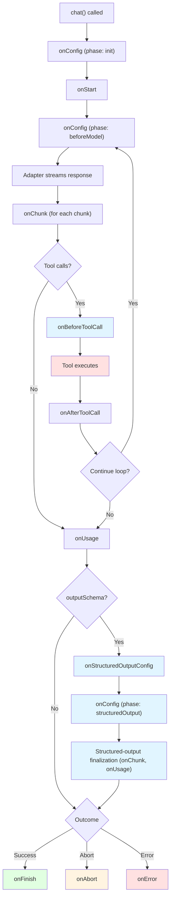

If you need to observe, transform, or short-circuit a `chat()` run → pass `middleware: ChatMiddleware[]`.

**Typical uses:** logging/usage, config transforms, stream redaction, tool interception, side effects.

## Quick start

```typescript
import { chat, type ChatMiddleware } from "@tanstack/ai";
import { openaiText } from "@tanstack/ai-openai";

const logger: ChatMiddleware = {
  name: "logger",
  onStart: (ctx) => {
    console.log(`[${ctx.requestId}] Chat started`);
  },
  onFinish: (ctx, info) => {
    console.log(`[${ctx.requestId}] Finished in ${info.duration}ms`);
  },
};

const stream = chat({
  adapter: openaiText("gpt-5.5"),
  messages: [{ role: "user", content: "Hello" }],
  middleware: [logger],
});
```

Dev-only chunk visibility without custom middleware: `debug: { middleware: true }` — [Debug Logging](./debug-logging).

## Lifecycle



### Phases

| Phase | When | Hooks |
|-------|------|-------|
| `init` | Once at startup | `onConfig` |
| `beforeModel` | Before each model call | `onConfig` |
| `modelStream` | Adapter streaming | `onChunk`, `onUsage` |
| `beforeTools` | Before tools | `onBeforeToolCall` |
| `afterTools` | After tools | `onAfterToolCall` |
| `structuredOutput` | Final structured-output call when `outputSchema` is set **and** adapter lacks `supportsCombinedToolsAndSchema()`. Does **not** fire for native-combined adapters (modern OpenAI Chat Completions/Responses, Claude 4.5+, Gemini 3.x, Grok 4.x — issue #605) | `onStructuredOutputConfig`, `onConfig`, `onChunk`, `onUsage` |

With `outputSchema` on a single-iteration separate-finalization run, `onConfig` fires three times: `init` → `beforeModel` → `structuredOutput`.

## Hooks

### onConfig

Transform config at `init`, each `beforeModel`, and (if applicable) `structuredOutput`. Return a **partial** object — shallow-merged. No need to spread the full config.

```typescript
import { type ChatMiddleware } from "@tanstack/ai";

const dynamicTemperature: ChatMiddleware = {
  name: "dynamic-temperature",
  onConfig: (ctx, config) => {
    if (ctx.phase === "init") {
      return {
        systemPrompts: [
          ...config.systemPrompts,
          "You are a helpful assistant.",
        ],
      };
    }

    if (ctx.phase === "beforeModel" && ctx.iteration > 0) {
      const current =
        typeof config.modelOptions?.temperature === "number"
          ? config.modelOptions.temperature
          : 0.7;
      return {
        modelOptions: {
          ...config.modelOptions,
          temperature: Math.min(current + 0.1, 1.0),
        },
      };
    }
  },
};
```

Sampling params live under `modelOptions` with provider-native keys — see [Moving Sampling Options into modelOptions](../migration/sampling-options-to-model-options).

| Field | Type | Description |
|-------|------|-------------|
| `messages` | `ModelMessage[]` | Conversation history |
| `systemPrompts` | `string[]` | System prompts |
| `tools` | `Tool[]` | Available tools |
| `metadata` | `Record<string, unknown>` | Request metadata |
| `modelOptions` | `Record<string, unknown>` | Provider-native options (incl. sampling) |

Multiple `onConfig` hooks **pipe** in array order.

### onStructuredOutputConfig

Fires once at structured-output finalization — only on the **legacy** path (no `supportsCombinedToolsAndSchema()`). Access/transform the JSON Schema. Native-combined adapters skip this hook; mutate schema in `onConfig` instead (adapter-specific location).

```typescript
import { type ChatMiddleware } from "@tanstack/ai";
import { sharedDefs } from "./defs";

const injectDefs: ChatMiddleware = {
  name: "inject-defs",
  onStructuredOutputConfig: (_ctx, config) => {
    return {
      outputSchema: {
        ...config.outputSchema,
        $defs: { ...sharedDefs },
      },
    };
  },
};
```

| Field | Type | Description |
|-------|------|-------------|
| `messages` | `ModelMessage[]` | Final-call history |
| `systemPrompts` | `SystemPrompt[]` | Final-call system prompts |
| `metadata` | `Record<string, unknown>` | Metadata |
| `modelOptions` | `Record<string, unknown>` | Provider options |
| `outputSchema` | `JSONSchema` | Schema sent to provider |

**Order at boundary:** (1) `onStructuredOutputConfig` pipes, (2) `onConfig` re-fires with `ctx.phase === 'structuredOutput'` (config minus `outputSchema`).

### onStart

Once after initial `onConfig`. Setup / logging.

```typescript
import { type ChatMiddleware } from "@tanstack/ai";

const timer: ChatMiddleware = {
  name: "timer",
  onStart: (ctx) => {
    console.log(`Request ${ctx.requestId} started at iteration ${ctx.iteration}`);
  },
};
```

### onChunk

Every streamed chunk. Return:

| Return | Effect |
|--------|--------|
| `void` / `undefined` | Pass through |
| `StreamChunk` | Replace |
| `StreamChunk[]` | Expand |
| `null` | Drop (later middleware never see it) |

```typescript ignore
import { type ChatMiddleware } from "@tanstack/ai";

const redactor: ChatMiddleware = {
  name: "redactor",
  onChunk: (ctx, chunk) => {
    if (chunk.type === "TEXT_MESSAGE_CONTENT") {
      return {
        ...chunk,
        delta: chunk.delta.replace(/\b\d{3}-\d{2}-\d{4}\b/g, "[REDACTED]"),
      };
    }
  },
};
```

#### Chunk types

[AG-UI events](https://docs.ag-ui.com/introduction). Narrow on `chunk.type`:

| `chunk.type` | Meaning | Key fields |
|--------------|---------|------------|
| `RUN_STARTED` / `RUN_FINISHED` / `RUN_ERROR` | Run lifecycle | `runId`, `finishReason`, `usage`, `message` |
| `TEXT_MESSAGE_START` / `CONTENT` / `END` | Assistant text | `messageId`, `delta` |
| `TOOL_CALL_START` / `ARGS` / `END` | Tool streaming | `toolCallId`, `toolCallName`, `delta` |
| `STEP_STARTED` / `STEP_FINISHED` | Reasoning steps | `delta`, `signature` |
| `STATE_SNAPSHOT` / `STATE_DELTA` | Agent state | `snapshot`, `delta` |
| `CUSTOM` | Extensibility (incl. structured-output) | `name`, `value` |

#### Structured-output chunks

No separate chunk hook. With `outputSchema`, JSON deltas and `structured-output.start` / `structured-output.complete` CUSTOM events go through the same `onChunk`:

- **Separate finalization:** `ctx.phase === 'structuredOutput'`
- **Native-combined:** phase stays `'modelStream'` — key off CUSTOM event names

```typescript ignore
import { type ChatMiddleware } from "@tanstack/ai";

const redactStructuredOutput: ChatMiddleware = {
  name: "redact-structured-output",
  onChunk: (ctx, chunk) => {
    if (
      ctx.phase === "structuredOutput" &&
      chunk.type === "TEXT_MESSAGE_CONTENT"
    ) {
      return {
        ...chunk,
        delta: chunk.delta.replace(/\b\d{3}-\d{2}-\d{4}\b/g, "[REDACTED]"),
      };
    }

    if (chunk.type === "CUSTOM" && chunk.name === "structured-output.complete") {
      console.log("final structured output:", chunk.value);
    }
  },
};
```

### onShouldContinue

Decides whether another agent-loop iteration starts. AND across middleware **and** `agentLoopStrategy` — any explicit `false` stops. Does **not** hard-abort (stream finishes normally). Use `ctx.abort()` for a hard stop.

```typescript
import { type ChatMiddleware } from "@tanstack/ai";

const budget: ChatMiddleware = {
  name: "tool-budget",
  onShouldContinue: (_ctx, state) => {
    if (state.toolCallCount >= 20) return false;
  },
};
```

Full recipe: [Tool-call budgets](../chat/agentic-cycle#tool-call-budgets-middleware-recipe).

### onBeforeToolCall

First non-void decision wins; remaining middleware skip that call.

```typescript
import { type ChatMiddleware } from "@tanstack/ai";

function isRecord(v: unknown): v is Record<string, unknown> {
  return typeof v === "object" && v !== null;
}

const guard: ChatMiddleware = {
  name: "guard",
  onBeforeToolCall: (ctx, hookCtx) => {
    if (hookCtx.toolName === "deleteDatabase") {
      return { type: "abort", reason: "Dangerous operation blocked" };
    }

    if (
      hookCtx.toolName === "search" &&
      isRecord(hookCtx.args) &&
      !hookCtx.args.limit
    ) {
      return {
        type: "transformArgs",
        args: { ...hookCtx.args, limit: 10 },
      };
    }
  },
};
```

| Decision | Effect |
|----------|--------|
| `void` / `undefined` | Continue; next middleware may decide |
| `{ type: 'transformArgs', args }` | Replace args |
| `{ type: 'skip', result }` | Skip execution; use result |
| `{ type: 'abort', reason? }` | Abort entire run |

`hookCtx`: `toolCall`, `tool`, `args`, `toolName`, `toolCallId`.

### onAfterToolCall

Runs for every middleware (no short-circuit).

```typescript
import { type ChatMiddleware } from "@tanstack/ai";

const toolLogger: ChatMiddleware = {
  name: "tool-logger",
  onAfterToolCall: (ctx, info) => {
    if (info.ok) {
      console.log(`${info.toolName} completed in ${info.duration}ms`);
    } else {
      console.error(`${info.toolName} failed:`, info.error);
    }
  },
};
```

`info`: `toolCall`, `tool`, `toolName`, `toolCallId`, `ok`, `duration`, `result` / `error`.

### onUsage

Once per model iteration when `RUN_FINISHED` includes usage.

```typescript
import { type ChatMiddleware } from "@tanstack/ai";

const usageTracker: ChatMiddleware = {
  name: "usage-tracker",
  onUsage: (ctx, usage) => {
    console.log(`Iteration ${ctx.iteration}: ${usage.totalTokens} tokens`);
  },
};
```

`usage`: `promptTokens`, `completionTokens`, `totalTokens`.

### Terminal: onFinish / onAbort / onError

Exactly **one** fires per run:

| Hook | When |
|------|------|
| `onFinish` | Normal completion |
| `onAbort` | `ctx.abort()`, external `AbortSignal`, or `{ type: 'abort' }` from `onBeforeToolCall` |
| `onError` | Unhandled error |

**Structured-output:** `onFinish` fires **after** finalization. `onIteration` does **not** fire for finalization.

`FinishInfo` reflects the **agent loop**, not finalization:

| Field | Notes |
|-------|-------|
| `content` | Agent-loop text only — not finalization JSON. Use `structured-output.complete` via `onChunk` |
| `usage` | Last agent-loop `RUN_FINISHED.usage`; may be `undefined`. Finalization tokens → `onUsage` |
| `finishReason` | Last agent-loop reason; `null` if no agent-loop `RUN_FINISHED` |
| `duration` | Wall-clock for entire `chat()`, including finalization |

Aggregate full-run tokens from `onUsage`, not `info.usage` alone.

```typescript
import { type ChatMiddleware } from "@tanstack/ai";

const terminal: ChatMiddleware = {
  name: "terminal",
  onFinish: (ctx, info) => {
    console.log(`Finished: ${info.finishReason}, ${info.duration}ms`);
    console.log(`Content: ${info.content}`);
    if (info.usage) {
      console.log(`Tokens: ${info.usage.totalTokens}`);
    }
  },
  onAbort: (ctx, info) => {
    console.log(`Aborted: ${info.reason}, ${info.duration}ms`);
  },
  onError: (ctx, info) => {
    console.error(`Error after ${info.duration}ms:`, info.error);
  },
};
```

## Context object

Every hook gets `ChatMiddlewareContext`:

| Field | Type | Description |
|-------|------|-------------|
| `requestId` | `string` | Request ID |
| `streamId` | `string` | Stream ID |
| `threadId` | `string` | AG-UI thread (caller `threadId` / legacy `conversationId`, or generated) |
| `conversationId` | `string \| undefined` | **Deprecated** alias of `threadId` |
| `phase` | `ChatMiddlewarePhase` | Current phase |
| `iteration` | `number` | Agent loop (0-indexed) |
| `chunkIndex` | `number` | Chunks yielded |
| `signal` | `AbortSignal \| undefined` | External abort |
| `abort(reason?)` | `function` | Abort run |
| `context` | `TContext` | Runtime context |
| `defer(promise)` | `function` | Non-blocking side effect |

### Typed runtime context

```typescript
import { chat, type ChatMiddleware } from "@tanstack/ai";
import { openaiText } from "@tanstack/ai-openai";
import { session, audit } from "./server";

type AppContext = {
  userId: string;
  audit: {
    write(event: { userId: string; requestId: string }): Promise<void>;
  };
};

export const auditMiddleware: ChatMiddleware<AppContext> = {
  name: "audit",
  onStart(ctx) {
    ctx.defer(
      ctx.context.audit.write({
        userId: ctx.context.userId,
        requestId: ctx.requestId,
      }),
    );
  },
};

chat({
  adapter: openaiText("gpt-5.5"),
  messages: [{ role: "user", content: "Hello" }],
  middleware: [auditMiddleware],
  context: {
    userId: session.user.id,
    audit,
  },
});
```

Process-local only — not AG-UI protocol context. Patterns: [Runtime Context](./runtime-context).

### Abort from middleware

```typescript
import { type ChatMiddleware } from "@tanstack/ai";

const timeout: ChatMiddleware = {
  name: "timeout",
  onChunk: (ctx) => {
    if (ctx.chunkIndex > 1000) {
      ctx.abort("Too many chunks");
    }
  },
};
```

### Deferred side effects

`ctx.defer()` runs after the terminal hook without blocking the stream:

```typescript
import { type ChatMiddleware } from "@tanstack/ai";

const analytics: ChatMiddleware = {
  name: "analytics",
  onFinish: (ctx, info) => {
    ctx.defer(
      fetch("/api/analytics", {
        method: "POST",
        body: JSON.stringify({
          requestId: ctx.requestId,
          duration: info.duration,
          tokens: info.usage?.totalTokens,
        }),
      }),
    );
  },
};
```

## Composition

Execute in array order.

| Hook | Composition | Order effect |
|------|-------------|--------------|
| `onConfig` | Piped | Earlier first |
| `onStructuredOutputConfig` | Piped | Earlier first |
| `onStart` | Sequential | All run |
| `onChunk` | Piped | Drop skips later |
| `onBeforeToolCall` | First-win | Earlier priority |
| `onShouldContinue` | AND | Any `false` stops |
| `onAfterToolCall` / `onUsage` / terminals | Sequential | All run |

## Capabilities

Share typed state across middleware in one run. Consumer declares needs; provider declares offers; `chat()` fails at compile time **and** runtime if a required capability is missing.

### Create a capability

```typescript
import { createCapability } from "@tanstack/ai";

const counterCapability = createCapability<{ value: number }>()("counter");
const [getCounter, provideCounter] = counterCapability;
```

Curried: value type explicit, name inferred as literal. The handle **is** the identity for `requires` / `provides` and destructures to `[get, provide]`.

| Accessor | Behavior |
|----------|----------|
| `getCounter(ctx)` | Value; **throws** if missing |
| `getCounter(ctx, { optional: true })` | `TValue \| undefined` |
| `provideCounter(ctx, value)` | Set for this run (call from `setup`) |

Also: `ctx.get` / `ctx.getOptional` / `ctx.provide` with the handle.

Capability names must be unique app-wide (type check keys on the name literal).

### setup / requires / provides

`setup(ctx)` runs **first** (before any `onConfig` init), in array order. May be async.

| Field | Meaning |
|-------|---------|
| `provides` | Must `provide` each in `setup` or `chat()` throws |
| `requires` | Must be provided earlier (compile + runtime) |
| `optionalRequires` | Non-gating; use optional get |

### Array example

```typescript
import {
  chat,
  createCapability,
  defineChatMiddleware,
} from "@tanstack/ai";
import { openaiText } from "@tanstack/ai-openai";

const counterCapability = createCapability<{ value: number }>()("counter");
const [getCounter, provideCounter] = counterCapability;

const withCounter = defineChatMiddleware({
  name: "with-counter",
  provides: [counterCapability],
  setup(ctx) {
    provideCounter(ctx, { value: 0 });
  },
});

const countsChunks = defineChatMiddleware({
  name: "counts-chunks",
  requires: [counterCapability],
  onChunk(ctx) {
    getCounter(ctx).value++;
  },
  onFinish(ctx) {
    console.log(`Saw ${getCounter(ctx).value} chunks`);
  },
});

const stream = chat({
  adapter: openaiText("gpt-5.5"),
  messages: [{ role: "user", content: "Hello" }],
  middleware: [withCounter, countsChunks],
});
```

### Builder

`createChatMiddleware()` enforces provider-before-consumer at each `.use()`:

```typescript
import { chat, createChatMiddleware } from "@tanstack/ai";
import { openaiText } from "@tanstack/ai-openai";
import { withCounter, countsChunks } from "./counter-middleware";

const middleware = createChatMiddleware()
  .use(withCounter)
  .use(countsChunks)
  .build();

const stream = chat({
  adapter: openaiText("gpt-5.5"),
  messages: [{ role: "user", content: "Hello" }],
  middleware,
});
```

### Validation

1. Compile-time coverage on array + builder
2. Runtime throw before adapter if required capability missing
3. Post-`setup` throw if `provides` never called `provide`
4. Duplicate provide → last-wins + dev warning

## Built-in middleware

| Middleware | Import | Role |
|------------|--------|------|
| `toolCacheMiddleware` | `@tanstack/ai/middlewares` | Cache tool results |
| `contentGuardMiddleware` | `@tanstack/ai/middlewares` | Redact/transform/block text |
| `otelMiddleware` | `@tanstack/ai/middlewares/otel` | OTel spans + metrics |

Details: [Built-in Middleware](./built-in-middleware).

## Recipes

### Rate limit tool calls

```typescript
import { type ChatMiddleware } from "@tanstack/ai";

function rateLimitMiddleware(maxCalls: number): ChatMiddleware {
  let toolCallCount = 0;
  return {
    name: "rate-limit",
    onBeforeToolCall: () => {
      toolCallCount++;
      if (toolCallCount > maxCalls) {
        return {
          type: "abort",
          reason: `Rate limit: exceeded ${maxCalls} tool calls`,
        };
      }
    },
  };
}
```

### Audit trail

```typescript
import { type ChatMiddleware } from "@tanstack/ai";
import { db } from "./db";

const auditTrail: ChatMiddleware = {
  name: "audit-trail",
  onStart: (ctx) => {
    ctx.defer(
      db.auditLog.create({
        requestId: ctx.requestId,
        event: "chat_started",
        timestamp: Date.now(),
      }),
    );
  },
  onAfterToolCall: (ctx, info) => {
    ctx.defer(
      db.auditLog.create({
        requestId: ctx.requestId,
        event: "tool_executed",
        toolName: info.toolName,
        success: info.ok,
        duration: info.duration,
        timestamp: Date.now(),
      }),
    );
  },
  onFinish: (ctx, info) => {
    ctx.defer(
      db.auditLog.create({
        requestId: ctx.requestId,
        event: "chat_finished",
        duration: info.duration,
        tokens: info.usage?.totalTokens,
        timestamp: Date.now(),
      }),
    );
  },
};
```

### Per-iteration tools

```typescript
import { type ChatMiddleware } from "@tanstack/ai";

const toolSwapper: ChatMiddleware = {
  name: "tool-swapper",
  onConfig: (ctx, config) => {
    if (ctx.phase !== "beforeModel") return;
    if (ctx.iteration === 0) {
      return {
        tools: config.tools.filter((t) => t.name === "search"),
      };
    }
  },
};
```

### Drop filtered content

```typescript ignore
import { type ChatMiddleware } from "@tanstack/ai";
import { containsProfanity } from "./filters";

const contentFilter: ChatMiddleware = {
  name: "content-filter",
  onChunk: (ctx, chunk) => {
    if (chunk.type === "TEXT_MESSAGE_CONTENT") {
      if (containsProfanity(chunk.delta)) {
        return null;
      }
    }
  },
};
```

### Error alerting

```typescript
import { type ChatMiddleware } from "@tanstack/ai";
import { alertService } from "./services";

const errorRecovery: ChatMiddleware = {
  name: "error-recovery",
  onError: (ctx, info) => {
    ctx.defer(
      alertService.send({
        level: "error",
        message: `Chat ${ctx.requestId} failed after ${info.duration}ms`,
        error: String(info.error),
      }),
    );
  },
};
```

## Types

```typescript
import type {
  ChatMiddleware,
  ChatMiddlewareContext,
  ChatMiddlewarePhase,
  ChatMiddlewareConfig,
  StructuredOutputMiddlewareConfig,
  ToolCallHookContext,
  BeforeToolCallDecision,
  AfterToolCallInfo,
  IterationInfo,
  ToolPhaseCompleteInfo,
  UsageInfo,
  FinishInfo,
  AbortInfo,
  ErrorInfo,
} from "@tanstack/ai";
```

Built-in option types from `@tanstack/ai/middlewares` (not main barrel):

```typescript
import type {
  ToolCacheMiddlewareOptions,
  ToolCacheStorage,
  ToolCacheEntry,
  ContentGuardMiddlewareOptions,
  ContentGuardRule,
  ContentFilteredInfo,
} from "@tanstack/ai/middlewares";
```

## Related

- [Built-in Middleware](./built-in-middleware)
- [OpenTelemetry](./otel)
- [Tools](../tools/tools)
- [Agentic Cycle](../chat/agentic-cycle)
- [Streaming](../chat/streaming)
