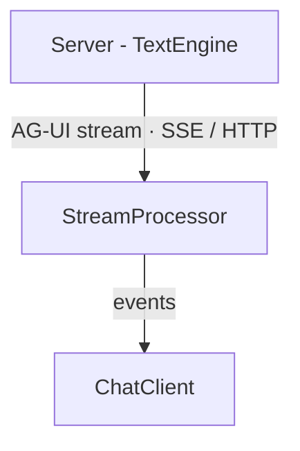
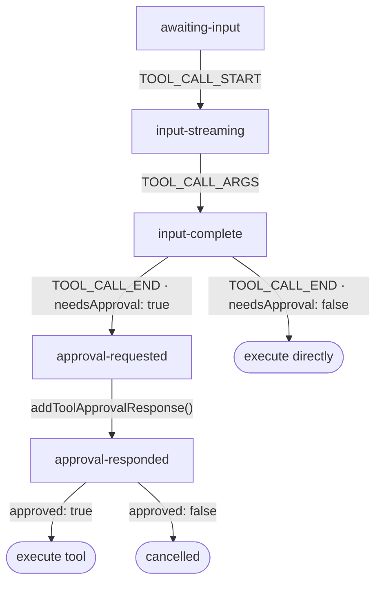

# Approval Flow Processing Architecture

> Internal architecture reference for the tool approval system in TanStack AI.
> Covers the full lifecycle from stream event to continuation, with emphasis on
> concurrency control and the chained approval mechanism.

---

## Table of Contents

1. [Overview](#overview)
2. [Component Responsibilities](#component-responsibilities)
3. [Type System](#type-system)
4. [State Machine](#state-machine)
5. [Single Approval Lifecycle](#single-approval-lifecycle)
6. [Chained Approvals and Continuation Control](#chained-approvals-and-continuation-control)
7. [Stream Event Protocol](#stream-event-protocol)
8. [Key Source Files](#key-source-files)

---

## Overview

The approval flow allows tools marked with `needsApproval: true` to pause
execution until the user explicitly approves or denies the action. This
creates a human-in-the-loop checkpoint for sensitive operations (sending
emails, making purchases, deleting data).

The primary durable wait signal is now the AG-UI terminal event
`RUN_FINISHED.outcome.type === 'interrupt'`. The legacy
`CUSTOM { name: "approval-requested" }` event is kept as a compatibility
projection for older clients and UI state updates, but new persistence and
resume logic should treat actionable waits as interrupts.

The flow spans three layers:



| Layer | Responsibility |
|-------|----------------|
| **Server (TextEngine)** | `chat()` detects `needsApproval` -> emits a `RUN_FINISHED` interrupt outcome and may project legacy `approval-requested` events |
| **StreamProcessor** | Receives interrupt outcome / compatibility custom event -> `updateToolCallApproval()` -> fires `onApprovalRequest` callback |
| **ChatClient** | Exposes `addToolApprovalResponse()` -> updates message state -> sends AG-UI `RunAgentInput.resume[]` entries through the next request |

Framework hooks (`useChat` in React, Solid, Vue, Svelte) delegate to
`ChatClient`, which owns all concurrency and continuation logic.

---

## Component Responsibilities

### TextEngine (server)

- Runs the agent loop: calls the LLM adapter, accumulates tool calls, executes
  tools, and re-invokes the adapter with results.
- When a tool has `needsApproval: true`, the engine emits a terminal
  `RUN_FINISHED` event with `outcome.type === 'interrupt'` instead of executing
  the tool.
- Compatibility `CUSTOM { name: "approval-requested" }` events may still be
  emitted or projected so older approval UI can render the same tool-call state.
- Persistence stores pending interrupts and validates the later
  `RunAgentInput.resume[]` response before accepting normal new input on the
  same thread.

### StreamProcessor (`packages/ai/src/activities/chat/stream/processor.ts`)

- Single source of truth for `UIMessage[]` state.
- On `RUN_FINISHED.outcome.type === 'interrupt'`:
  1. Persists/surfaces each interrupt as a pending user-actionable wait.
  2. Calls `updateToolCallApproval()` for approval-shaped interrupts so legacy
     approval UI renders as before.
- On legacy `approval-requested` custom event:
  1. Calls `updateToolCallApproval()` to set the tool-call part's state to
     `approval-requested` and attach approval metadata.
  2. Fires `onApprovalRequest` so the ChatClient can emit devtools events.
- On `addToolApprovalResponse(approvalId, approved)`:
  1. Calls `updateToolCallApprovalResponse()` to set state to
     `approval-responded` and record `approval.approved`.
- Provides `areAllToolsComplete()` which the ChatClient uses to decide whether
  to auto-continue the conversation.

### ChatClient (`packages/ai-client/src/chat-client.ts`)

- Owns the streaming lifecycle (`streamResponse`), post-stream action queue,
  and continuation control flags.
- Exposes `addToolApprovalResponse()` as the public API for responding to
  approval requests.
- Manages two critical flags for continuation:
  - `continuationPending` — prevents concurrent `streamResponse` calls.
  - `continuationSkipped` — detects when a queued continuation check was
    suppressed by `continuationPending` and needs re-evaluation.

### Framework Hooks (React `useChat`, Solid `useChat`, etc.)

- Wrap `ChatClient` methods in framework-specific reactive primitives.
- Expose `addToolApprovalResponse` directly to the component.
- No approval-specific logic beyond delegation.

---

## Type System

### ToolCallState

```typescript group=approval-flow-processing
type ToolCallState =
  | 'awaiting-input'       // TOOL_CALL_START received, no arguments yet
  | 'input-streaming'      // Partial arguments being received
  | 'input-complete'       // All arguments received (TOOL_CALL_END)
  | 'approval-requested'   // Waiting for user approval
  | 'approval-responded'   // User has approved or denied
```

### ToolCallPart (approval-relevant fields)

```typescript group=approval-flow-processing
interface ToolCallPart {
  type: 'tool-call'
  id: string               // Unique tool call ID
  name: string             // Tool name
  arguments: string        // JSON string of arguments
  state: ToolCallState

  approval?: {
    id: string             // Unique approval ID (NOT the toolCallId)
    needsApproval: boolean // Always true when present
    approved?: boolean     // undefined until user responds
  }

  output?: any             // Set after execution (client tools)
}
```

### Key distinction: approval ID vs tool call ID

The `approval.id` is a separate identifier generated per approval request.
All user-facing APIs (`addToolApprovalResponse`) use the **approval ID**,
not the tool call ID. This allows the system to correlate approval responses
even when multiple tools share similar call IDs across different messages.

---

## State Machine



### Terminal states for `areAllToolsComplete()`

A tool call is considered complete (and eligible for auto-continuation) when
any of the following is true:

1. `state === 'approval-responded'` — user approved or denied
2. `output !== undefined && !approval` — client tool finished (no approval flow)
3. A corresponding `tool-result` part exists — server tool finished

---

## Single Approval Lifecycle

Step-by-step flow for a single tool requiring approval:

### 1. Server emits approval request during stream

```
TOOL_CALL_START   { toolCallId: "tc-1", toolName: "send_email" }
TOOL_CALL_ARGS    { toolCallId: "tc-1", delta: '{"to":"..."}' }
TOOL_CALL_END     { toolCallId: "tc-1" }
RUN_FINISHED      { outcome: {
                      type: "interrupt",
                      interrupts: [{
                        id: "appr-1",
                        reason: "approval_required",
                        metadata: {
                          kind: "approval",
                          toolCallId: "tc-1",
                          toolName: "send_email",
                          input: { to: "..." }
                        }
                      }]
                  }}
```

### 2. StreamProcessor processes the interrupt outcome

```
handleRunFinished():
  1. updateToolCallApproval(messages, messageId, "tc-1", "appr-1")
     → Sets part.state = "approval-requested"
     → Sets part.approval = { id: "appr-1", needsApproval: true }
  2. records the pending interrupt on the client
  3. emitMessagesChange()
  4. fires onApprovalRequest({ toolCallId, toolName, input, approvalId })
```

### 3. Stream ends, ChatClient processes

```
streamResponse() finally block:
  1. setIsLoading(false)
  2. drainPostStreamActions() → (nothing queued)
  3. streamCompletedSuccessfully check:
     lastPart is tool-call (not tool-result) → no auto-continue
  → Returns to caller (sendMessage resolves)
```

The conversation is now paused. The UI renders the approval prompt.

### 4. User approves

```
addToolApprovalResponse({ id: "appr-1", approved: true }):
  1. processor.addToolApprovalResponse("appr-1", true)
     → updateToolCallApprovalResponse():
       part.approval.approved = true
       part.state = "approval-responded"
  2. queue a resume entry:
     { interruptId: "appr-1", status: "resolved", payload: { approved: true } }
  3. isLoading is false → call checkForContinuation() directly
```

### 5. Continuation

```
checkForContinuation():
  1. continuationPending = false, isLoading = false → proceed
  2. shouldAutoSend() → areAllToolsComplete():
     part.state === "approval-responded" → true
  3. continuationPending = true
  4. streamResponse() → new stream to server with `resume[]`
  5. Persistence validates `resume[]`, resolves the pending interrupt, then the
     server executes or cancels the tool and returns result + LLM response
  6. continuationPending = false
```

---

## Chained Approvals and Continuation Control

The most complex scenario: a continuation stream produces **another** tool call
that also needs approval, and the user responds to it while the stream is still
active.

### The Problem

```
Timeline:
─────────────────────────────────────────────────────────────

1. User approves tool A
   └─ checkForContinuation() sets continuationPending = true
   └─ streamResponse() starts (stream 2)

2. Stream 2 produces tool B needing approval
   └─ approval-requested chunk processed
   └─ UI shows approval prompt for tool B

3. User approves tool B WHILE stream 2 is still active
   └─ addToolApprovalResponse():
      └─ processor state updated (approval-responded)
      └─ isLoading is true → queues checkForContinuation

4. Stream 2 ends
   └─ streamResponse() finally block:
      └─ setIsLoading(false)
      └─ drainPostStreamActions():
         └─ Runs queued checkForContinuation()
         └─ BUT continuationPending is STILL TRUE (from step 1)
         └─ *** EARLY RETURN — approval swallowed ***
   └─ Returns to step 1's checkForContinuation()
   └─ continuationPending = false

5. Nobody re-checks → tool B's approval is lost
```

### The Solution: `continuationSkipped` Flag

Two flags work together to handle this:

- **`continuationPending`** — prevents concurrent `streamResponse()` calls.
  Set to `true` when entering `checkForContinuation`'s streaming path, cleared
  in the `finally` block.

- **`continuationSkipped`** — set to `true` whenever `checkForContinuation()`
  returns early due to `continuationPending` or `isLoading` being true.
  Checked after `continuationPending` is cleared to trigger a re-evaluation.

```typescript
class ChatClient {
  private continuationPending = false
  private continuationSkipped = false
  private isLoading = false

  private shouldAutoSend(): boolean { return false }
  private async streamResponse(): Promise<void> {}

  private async checkForContinuation(): Promise<void> {
    if (this.continuationPending || this.isLoading) {
      this.continuationSkipped = true   // ← Mark that a check was suppressed
      return
    }

    if (this.shouldAutoSend()) {
      this.continuationPending = true
      this.continuationSkipped = false  // ← Reset before entering stream
      try {
        await this.streamResponse()
      } finally {
        this.continuationPending = false
      }
      // If a check was skipped during the stream, re-evaluate now
      if (this.continuationSkipped) {
        this.continuationSkipped = false
        await this.checkForContinuation()  // ← Recurse safely
      }
    }
  }
}
```

### Why the recursion is safe

The recursion terminates because:

1. **`continuationSkipped` is only set when a real check was suppressed.** After
   the final stream (e.g., a text-only response), no new approvals arrive, so
   `continuationSkipped` stays `false` and the recursion stops.

2. **`shouldAutoSend()` returns `false` when tools are still pending approval.**
   If a new approval arrives that hasn't been responded to yet, `areAllToolsComplete()`
   returns `false` and the method exits without streaming.

3. **Each recursion level sets `continuationPending = true`**, preventing any
   concurrent checks from entering the streaming path.

### Corrected Timeline

```
Timeline (with fix):
─────────────────────────────────────────────────────────────

1. User approves tool A
   └─ checkForContinuation() [OUTER]
   └─ continuationPending = true, continuationSkipped = false
   └─ streamResponse() starts (stream 2)

2. Stream 2 produces tool B, user approves during stream
   └─ Queues checkForContinuation as post-stream action

3. Stream 2 ends
   └─ drainPostStreamActions():
      └─ checkForContinuation(): continuationPending is true
         └─ continuationSkipped = true  ← MARKED
         └─ returns early
   └─ Back in OUTER: continuationPending = false

4. OUTER checks continuationSkipped → true
   └─ continuationSkipped = false
   └─ Recurses into checkForContinuation() [INNER]
   └─ shouldAutoSend() → true (tool B is approval-responded)
   └─ continuationPending = true
   └─ streamResponse() → stream 3 (final text response)
   └─ continuationPending = false
   └─ continuationSkipped is false → no further recursion

5. Done. All three streams completed correctly.
```

---

## Stream Event Protocol

### Approval-related AG-UI events

The primary wait event is `RUN_FINISHED` with an interrupt outcome:

```typescript ignore
{
  type: 'RUN_FINISHED',
  outcome: {
    type: 'interrupt',
    interrupts: [
      {
        id: string,
        reason: 'approval_required',
        metadata: {
          kind: 'approval',
          toolCallId: string,
          toolName: string,
          input: unknown
        }
      }
    ]
  }
}
```

Resume uses AG-UI `RunAgentInput.resume[]` on the next request:

```typescript ignore
{
  resume: [
    {
      interruptId: 'appr-1',
      status: 'resolved',
      payload: { approved: true }
    }
  ]
}
```

Pending user-actionable interrupts block normal input on the same thread by
default. A stale cursor replay may read the public event tail, but a new
non-resume input must resolve the pending interrupts first.

#### `approval-requested`

Legacy compatibility/projection event emitted when a tool with
`needsApproval: true` has its arguments finalized. Use this to keep older UI
rendering paths working; do not use it as the primary durable wait signal.

```typescript ignore
{
  type: 'CUSTOM',
  name: 'approval-requested',
  value: {
    toolCallId: string,    // ID of the tool call
    toolName: string,      // Name of the tool
    input: any,            // Parsed arguments
    approval: {
      id: string,          // Unique approval ID
      needsApproval: true
    }
  }
}
```

**Processor handling:** `handleCustomEvent()` → `updateToolCallApproval()` →
`onApprovalRequest` callback.

#### Relation to other tool events

A complete approval tool call in the stream looks like:

```
TOOL_CALL_START     → creates tool-call part (state: awaiting-input)
TOOL_CALL_ARGS*     → accumulates arguments (state: input-streaming)
TOOL_CALL_END       → finalizes arguments (state: input-complete)
CUSTOM              → approval-requested (state: approval-requested)
RUN_FINISHED        → outcome.type: "interrupt"
```

After the stream ends and the user responds, the ChatClient:
1. Updates the tool-call part (state: `approval-responded`)
2. Sends a new stream request with `RunAgentInput.resume[]` entries resolving
   the pending interrupt
3. Persistence validates the resume entries, resolves the interrupt, and the
   server executes or cancels the tool based on the resume payload

---

## Key Source Files

| File | Role |
|------|------|
| `packages/ai/src/types.ts` | `ToolCallState`, `ToolCallPart`, tool approval types |
| `packages/ai/src/activities/chat/stream/processor.ts` | `handleCustomEvent()` (approval-requested), `areAllToolsComplete()`, `addToolApprovalResponse()` |
| `packages/ai/src/activities/chat/stream/message-updaters.ts` | `updateToolCallApproval()`, `updateToolCallApprovalResponse()` |
| `packages/ai-client/src/chat-client.ts` | `addToolApprovalResponse()`, `checkForContinuation()`, continuation flags |
| `packages/ai-react/src/use-chat.ts` | React hook: exposes `addToolApprovalResponse` |
| `packages/ai-solid/src/use-chat.ts` | Solid hook: exposes `addToolApprovalResponse` |
| `packages/ai-vue/src/use-chat.ts` | Vue composable: exposes `addToolApprovalResponse` |
| `packages/ai-svelte/src/create-chat.svelte.ts` | Svelte: exposes `addToolApprovalResponse` |
| `packages/ai-client/tests/chat-client.test.ts` | Chained approval test (`describe('chained tool approvals')`) |
| `packages/ai/docs/chat-architecture.md` | Internal stream processing architecture |
