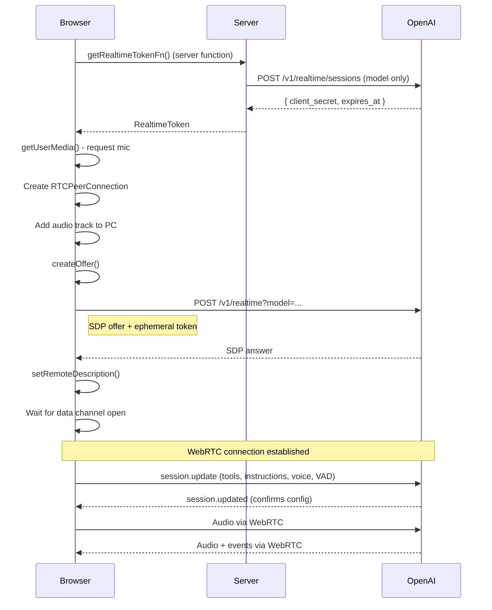
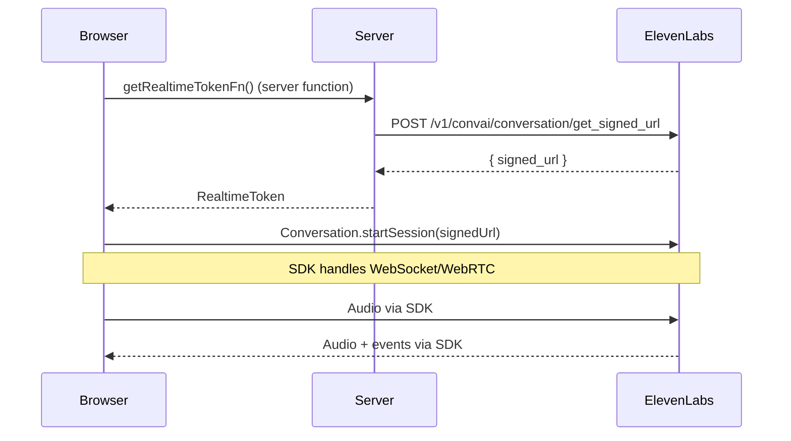
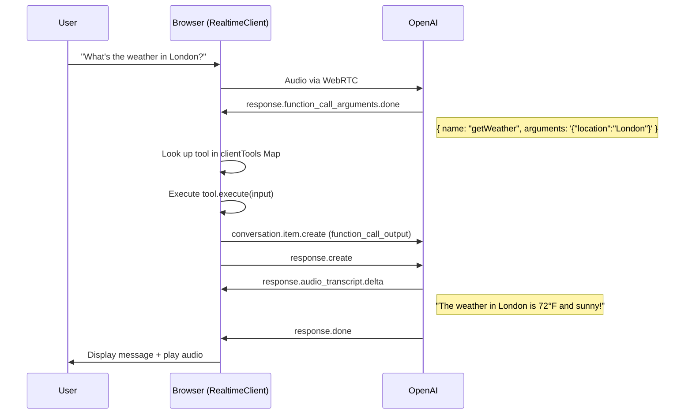

# Realtime Voice Chat Architecture

This document describes the architecture of TanStack AI's realtime voice-to-voice chat capability, which enables browser-based voice conversations with AI models.

## Overview

The realtime chat system provides a vendor-neutral, type-safe abstraction for voice-to-voice AI interactions. It currently supports:

- **OpenAI Realtime API** - WebRTC-based connection with GPT-4o realtime models
- **ElevenLabs Conversational AI** - SDK-based connection for voice conversations

## Architecture Layers

```
┌─────────────────────────────────────────────────────────────────┐
│                        React Application                         │
│  ┌─────────────────────────────────────────────────────────┐    │
│  │                   useRealtimeChat()                      │    │
│  │  - Connection state (status, mode)                       │    │
│  │  - Messages & transcripts                                │    │
│  │  - Audio visualization (levels, waveforms)               │    │
│  │  - Control methods (connect, disconnect, interrupt)      │    │
│  │  - Client-side tool configuration                        │    │
│  └─────────────────────────────────────────────────────────┘    │
└─────────────────────────────────────────────────────────────────┘
                                │
                                ▼
┌─────────────────────────────────────────────────────────────────┐
│                       @tanstack/ai-client                        │
│  ┌─────────────────────────────────────────────────────────┐    │
│  │                    RealtimeClient                        │    │
│  │  - Connection lifecycle management                       │    │
│  │  - Token refresh scheduling                              │    │
│  │  - Client-side session configuration (tools, voice, etc) │    │
│  │  - Event subscription & dispatch                         │    │
│  │  - Tool execution coordination                           │    │
│  └─────────────────────────────────────────────────────────┘    │
└─────────────────────────────────────────────────────────────────┘
                                │
                                ▼
┌─────────────────────────────────────────────────────────────────┐
│                      Provider Adapters                           │
│  ┌──────────────────────┐    ┌──────────────────────┐          │
│  │   openaiRealtime()   │    │ elevenlabsRealtime() │          │
│  │  - WebRTC connection │    │  - SDK wrapper       │          │
│  │  - Audio I/O         │    │  - Signed URL auth   │          │
│  │  - Event mapping     │    │  - Event mapping     │          │
│  │  - Session updates   │    │                      │          │
│  └──────────────────────┘    └──────────────────────┘          │
└─────────────────────────────────────────────────────────────────┘
                                │
                                ▼
┌─────────────────────────────────────────────────────────────────┐
│                         Server-Side                              │
│  ┌─────────────────────────────────────────────────────────┐    │
│  │            Token Generation (Server Function)            │    │
│  │  - openaiRealtimeToken() - ephemeral client secrets     │    │
│  │  - elevenlabsRealtimeToken() - signed URLs              │    │
│  │  (Minimal config: model only — session config is        │    │
│  │   applied client-side via session.update)               │    │
│  └─────────────────────────────────────────────────────────┘    │
└─────────────────────────────────────────────────────────────────┘
```

## Key Components

### 1. Token Adapters (Server-Side)

Token adapters generate short-lived credentials for client-side connections. This keeps API keys secure on the server. The token endpoint sends **only the model** to the provider; all other session configuration (instructions, voice, tools, VAD) is applied client-side.

```typescript
// Server function (TanStack Start)
import { createServerFn } from '@tanstack/react-start'
import { realtimeToken } from '@tanstack/ai'
import { openaiRealtimeToken } from '@tanstack/ai-openai'

const getRealtimeTokenFn = createServerFn({ method: 'POST' })
  .handler(async () => {
    return realtimeToken({
      adapter: openaiRealtimeToken({
        model: 'gpt-4o-realtime-preview',
      }),
    })
  })
```

**Token Structure:**
```typescript
interface RealtimeToken {
  provider: string        // 'openai' | 'elevenlabs'
  token: string          // Ephemeral token or signed URL
  expiresAt: number      // Expiration timestamp (ms)
  config: RealtimeSessionConfig  // Session configuration
}
```

### 2. Client Adapters (Browser-Side)

Client adapters handle the actual connection to provider APIs, managing:
- WebRTC or WebSocket connections
- Audio capture and playback
- Event translation to common format
- Audio visualization data
- Session configuration updates (tools, instructions, voice, VAD)

```typescript
// Client-side adapter usage
import { openaiRealtime } from '@tanstack/ai-openai'

const adapter = openaiRealtime({
  connectionMode: 'webrtc', // default
})
```

**Data Channel Readiness:** The OpenAI adapter waits for the WebRTC data channel to be fully open before returning the connection. If `updateSession()` is called before the channel is ready, events are queued and flushed once the channel opens.

### 3. RealtimeClient

The `RealtimeClient` class manages the connection lifecycle:

- **Connection Management**: Connect, disconnect, reconnect
- **Token Refresh**: Automatically refreshes tokens before expiry
- **Session Configuration**: Applies client-side config (instructions, voice, tools, VAD) via `session.update` after connecting
- **Event Handling**: Subscribes to adapter events and dispatches to callbacks
- **State Management**: Tracks status, mode, messages, transcripts
- **Tool Execution**: Looks up client-side tools by name, executes them, and sends results back to the provider

### 4. useRealtimeChat Hook

The React hook provides a reactive interface:

```typescript
const {
  // Connection state
  status,      // 'idle' | 'connecting' | 'connected' | 'reconnecting' | 'error'
  error,
  connect,
  disconnect,

  // Conversation state
  mode,        // 'idle' | 'listening' | 'thinking' | 'speaking'
  messages,
  pendingUserTranscript,
  pendingAssistantTranscript,

  // Voice control
  startListening,
  stopListening,
  interrupt,

  // Audio visualization
  inputLevel,
  outputLevel,
  getInputTimeDomainData,
  getOutputTimeDomainData,
} = useRealtimeChat({
  getToken: () => getRealtimeTokenFn(),
  adapter: openaiRealtime(),
  instructions: 'You are a helpful voice assistant.',
  voice: 'alloy',
  tools: myClientTools,
})
```

## Connection Flow

### OpenAI WebRTC Flow



### ElevenLabs Flow



## Client-Side Tool Calling

Tools are defined once using `toolDefinition()` and instantiated for client-side execution with `.client()`. When the AI model invokes a tool, the `RealtimeClient` executes it locally in the browser and sends the result back to the provider.

### Tool Definition

```typescript
import { toolDefinition } from '@tanstack/ai'
import { z } from 'zod'

const getWeatherToolDef = toolDefinition({
  name: 'getWeather',
  description: 'Get the current weather for a location.',
  inputSchema: z.object({
    location: z.string().describe('City and state/country'),
  }),
  outputSchema: z.object({
    location: z.string(),
    temperature: z.number(),
    condition: z.string(),
  }),
})

// Create client-side implementation
const getWeatherClient = getWeatherToolDef.client(({ location }) => ({
  location,
  temperature: 72,
  condition: 'Sunny',
}))
```

### Tool Call Flow



### Session Configuration

When connecting, the `RealtimeClient` calls `applySessionConfig()` which sends a `session.update` event to the provider with:

- **instructions** — System prompt for the assistant
- **voice** — Voice to use for audio output (e.g., `'alloy'`)
- **tools** — Array of `RealtimeToolConfig` descriptors (name, description, JSON Schema parameters), plus `tool_choice: 'auto'`
- **turn_detection** — VAD configuration (server_vad, semantic_vad, or manual)
- **input_audio_transcription** — Enables user speech transcription (e.g., Whisper)

Tool schemas are converted from Zod (or any Standard JSON Schema compliant library) to JSON Schema using `convertSchemaToJsonSchema()` before being sent to the provider.

## Audio Visualization

The system provides real-time audio visualization through the `AudioVisualization` interface:

```typescript
interface AudioVisualization {
  inputLevel: number           // 0-1 normalized input volume
  outputLevel: number          // 0-1 normalized output volume
  getInputFrequencyData(): Uint8Array   // FFT frequency bins
  getOutputFrequencyData(): Uint8Array
  getInputTimeDomainData(): Uint8Array  // Raw waveform samples
  getOutputTimeDomainData(): Uint8Array
  inputSampleRate: number
  outputSampleRate: number
}
```

The OpenAI adapter uses Web Audio API `AnalyserNode` for visualization:
- `fftSize: 2048` for high-resolution analysis
- Peak amplitude detection for responsive volume meters
- Separate analysers for input (microphone) and output (AI voice)

## Event System

Adapters emit standardized events:

| Event | Payload | Description |
|-------|---------|-------------|
| `status_change` | `{ status }` | Connection status changed |
| `mode_change` | `{ mode }` | Conversation mode changed |
| `transcript` | `{ role, transcript, isFinal }` | Speech-to-text update |
| `message_complete` | `{ message }` | Full message received |
| `tool_call` | `{ toolCallId, toolName, input }` | Tool invocation requested |
| `interrupted` | `{ messageId? }` | Response was interrupted |
| `error` | `{ error }` | Error occurred |

## Current Status

### Implemented Features

- [x] OpenAI Realtime API integration (WebRTC)
- [x] ElevenLabs Conversational AI integration
- [x] Token generation and refresh
- [x] Audio capture and playback
- [x] Real-time transcription display
- [x] Audio visualization (levels, waveforms)
- [x] Interrupt capability
- [x] Client-side tool calling (define, execute, return results)
- [x] Client-side session configuration (instructions, voice, tools, VAD)
- [x] React hook (`useRealtimeChat`)
- [x] Demo application at `/realtime` route with tool examples

### Known Limitations

- **Device Selection**: Currently uses system default audio devices. Custom device selection not yet implemented.
- **ElevenLabs SDK**: Using `@11labs/client@0.2.0` which has limited TypeScript support.
- **Push-to-Talk**: Manual VAD mode implemented but not exposed in demo UI.

### Demo Application

The `examples/ts-react-chat` application includes a realtime voice chat demo at the `/realtime` route:

**Features:**
- Provider selection (OpenAI / ElevenLabs)
- Connection status indicator
- Conversation mode indicator (Listening/Thinking/Speaking)
- Message history with transcripts
- Audio level meters
- Waveform visualization
- Interrupt button during AI speech
- Client-side tool execution (getCurrentTime, getWeather, setReminder, searchKnowledge)

**Required Environment Variables:**
```bash
OPENAI_API_KEY=sk-...
ELEVENLABS_API_KEY=xi-...      # Optional, for ElevenLabs
ELEVENLABS_AGENT_ID=...        # Optional, for ElevenLabs
```

## Files Reference

### Core Types
- `packages/typescript/ai/src/realtime/types.ts` - Core type definitions
- `packages/typescript/ai-client/src/realtime-types.ts` - Client-side types

### Token Generation (Server)
- `packages/typescript/ai/src/realtime/index.ts` - `realtimeToken()` function
- `packages/typescript/ai-openai/src/realtime/token.ts` - OpenAI token adapter
- `packages/typescript/ai-elevenlabs/src/realtime/token.ts` - ElevenLabs token adapter

### Client Adapters
- `packages/typescript/ai-openai/src/realtime/adapter.ts` - OpenAI WebRTC adapter
- `packages/typescript/ai-elevenlabs/src/realtime/adapter.ts` - ElevenLabs SDK adapter

### Client Library
- `packages/typescript/ai-client/src/realtime-client.ts` - RealtimeClient class

### React Integration
- `packages/typescript/ai-react/src/use-realtime-chat.ts` - React hook
- `packages/typescript/ai-react/src/realtime-types.ts` - Hook types

### Demo Application
- `examples/ts-react-chat/src/routes/realtime.tsx` - Demo UI component
- `examples/ts-react-chat/src/lib/use-realtime.ts` - Custom hook with server function for token generation
- `examples/ts-react-chat/src/lib/realtime-tools.ts` - Client-side tool definitions
- `examples/ts-react-chat/src/components/AudioSparkline.tsx` - Audio waveform visualization component
