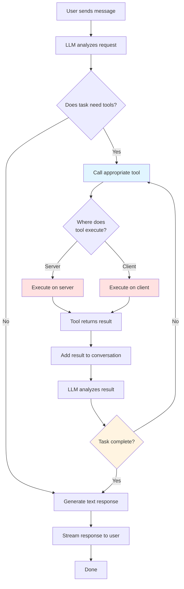
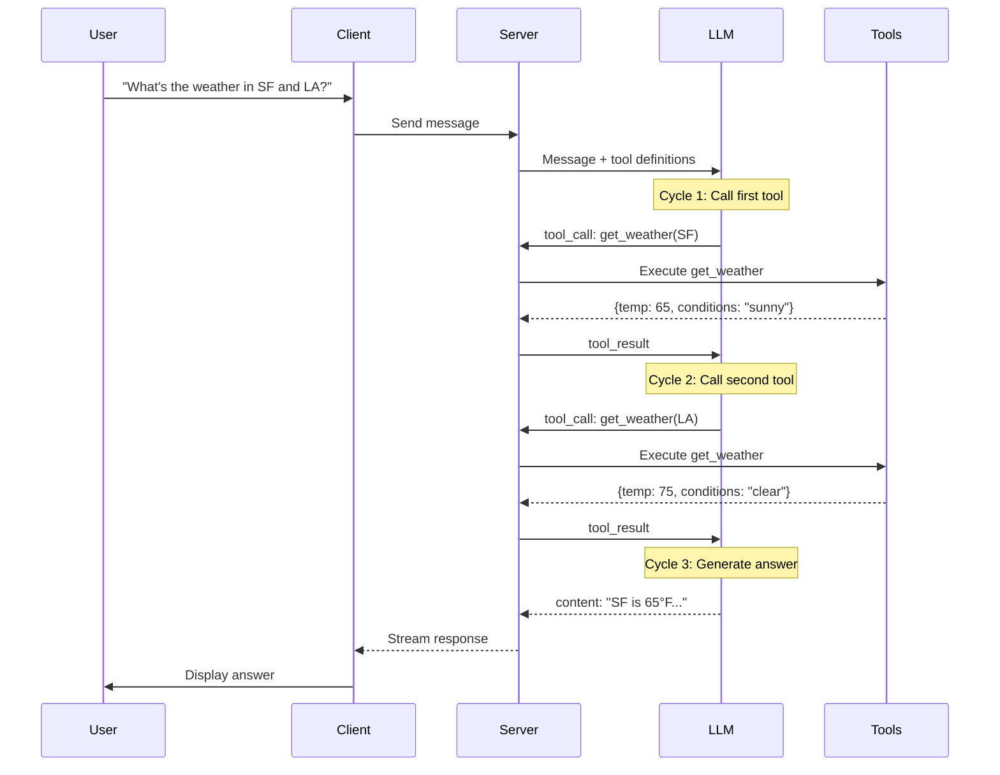

The agentic cycle is the pattern where the LLM repeatedly calls tools, receives results, and continues reasoning until it can provide a final answer. This enables complex multi-step operations.

> **Tip:** Code Mode can reduce agent loop iterations by letting the LLM write a program that calls multiple tools in a single execution. See [Code Mode](../code-mode/code-mode).



### Detailed Agentic Flow



### Multi-Step Example

Here's a real-world example of the agentic cycle:

**User**: "Find me flights to Paris under $500 and book the cheapest one"

**Cycle 1**: LLM calls `searchFlights({destination: "Paris", maxPrice: 500})`
- Tool returns: `[{id: "F1", price: 450}, {id: "F2", price: 480}]`

**Cycle 2**: LLM analyzes results and calls `bookFlight({flightId: "F1"})`
- Tool requires approval (sensitive operation) — see [Tool Approval](../tools/tool-approval)
- User approves
- Tool returns: `{bookingId: "B123", confirmed: true}`

**Cycle 3**: LLM generates final response
- "I found 2 flights under $500. I've booked the cheapest one (Flight F1) for $450. Your booking ID is B123."

### Code Example: Agentic Weather Assistant

```typescript
import { chat, toolDefinition, toServerSentEventsResponse } from "@tanstack/ai";
import { openaiText } from "@tanstack/ai-openai";
import { z } from "zod";

// Tool definitions
const getWeatherDef = toolDefinition({
  name: "get_weather",
  description: "Get current weather for a city",
  inputSchema: z.object({
    city: z.string(),
  }),
});

const getClothingAdviceDef = toolDefinition({
  name: "get_clothing_advice",
  description: "Get clothing recommendations based on weather",
  inputSchema: z.object({
    temperature: z.number(),
    conditions: z.string(),
  }),
});

// Server implementations
const getWeather = getWeatherDef.server(async ({ city }) => {
  const response = await fetch(`https://api.weather.com/v1/${city}`);
  return await response.json();
});

const getClothingAdvice = getClothingAdviceDef.server(async ({ temperature, conditions }) => {
  // Business logic for clothing recommendations
  if (temperature < 50) {
    return { recommendation: "Wear a warm jacket" };
  }
  return { recommendation: "Light clothing is fine" };
});

// Server route
export async function POST(request: Request) {
  const { messages } = await request.json();

  const stream = chat({
    adapter: openaiText("gpt-5.5"),
    messages,
    tools: [getWeather, getClothingAdvice],
  });

  return toServerSentEventsResponse(stream);
}
```

**User**: "What should I wear in San Francisco today?"

**Agentic Cycle**:
1. LLM calls `get_weather({city: "San Francisco"})` → Returns `{temp: 62, conditions: "cloudy"}`
2. LLM calls `get_clothing_advice({temperature: 62, conditions: "cloudy"})` → Returns `{recommendation: "Light jacket recommended"}`
3. LLM generates: "The weather in San Francisco is 62°F and cloudy. I recommend wearing a light jacket."

The loop continues only while the model's finish reason is `tool_calls` (with pending tool calls) **and** the agent loop strategy permits another iteration; it ends as soon as the model returns a normal `stop` finish reason.

### Controlling the loop

By default the loop is bounded by `maxIterations(5)` — after five **model turns** it stops even if the model would keep calling tools. Override this with the `agentLoopStrategy` option.

Other built-in strategies:

- **`untilFinishReason([...])`** — continue until the model returns one of the given finish reasons (e.g. `untilFinishReason(["stop", "length"])`).
- **`combineStrategies([...])`** — combine multiple strategies with AND logic; the loop continues only while every strategy agrees.

A strategy is just a function that receives `{ iterationCount, finishReason, messages, toolCallCount, lastTurnToolCallCount }` and returns `true` to allow another iteration or `false` to stop, so you can also write your own:

```typescript
import { chat, combineStrategies, maxIterations, toServerSentEventsResponse } from "@tanstack/ai";
import { openaiText } from "@tanstack/ai-openai";
import type { AgentLoopState } from "@tanstack/ai";
import { getWeather, getClothingAdvice } from "./tools";

export async function POST(request: Request) {
  const { messages } = await request.json();
  const stream = chat({
    adapter: openaiText("gpt-5.5"),
    messages,
    tools: [getWeather, getClothingAdvice],
    agentLoopStrategy: combineStrategies([
      maxIterations(10),
      ({ messages }: AgentLoopState) => messages.length < 100,
    ]),
  });
  return toServerSentEventsResponse(stream);
}
```

### Tool-call budgets (middleware recipe)

> **Iterations ≠ tool calls.** One model turn can emit many parallel tool calls. `maxIterations` only bounds **model turns**. Strategies run *between* turns, so without a per-turn cap a single runaway turn can still fan out unbounded.

There is no built-in `maxToolCalls` strategy. Cap tools with middleware:

- **`onBeforeToolCall`** — skip excess calls inside one turn (`maxPerTurn`)
- **`onShouldContinue`** — stop further turns once cumulative **emitted** tools hit a budget (`max`); skipped calls still count toward `toolCallCount`

```typescript
import {
  chat,
  maxIterations,
  toServerSentEventsResponse,
  type ChatMiddleware,
} from "@tanstack/ai";
import { openaiText } from "@tanstack/ai-openai";
import { getWeather, getClothingAdvice } from "./tools";

/** App-owned policy — not a library export. */
function toolCallBudget(options: {
  max?: number;
  maxPerTurn?: number;
}): ChatMiddleware {
  const { max, maxPerTurn } = options;
  let perTurn = 0;

  return {
    name: "tool-call-budget",
    onIteration() {
      perTurn = 0;
    },
    // Fresh per-turn budget for pending/resume batches (no onIteration).
    onToolPhaseComplete() {
      perTurn = 0;
    },
    onBeforeToolCall() {
      if (maxPerTurn == null) return undefined;
      perTurn += 1;
      if (perTurn > maxPerTurn) {
        return {
          type: "skip",
          result: {
            error: `Skipped: exceeded maxToolCallsPerTurn (${maxPerTurn})`,
          },
        };
      }
      return undefined;
    },
    onShouldContinue(_ctx, state) {
      if (max != null && state.toolCallCount >= max) return false;
      return undefined;
    },
  };
}

export async function POST(request: Request) {
  const { messages } = await request.json();
  const stream = chat({
    adapter: openaiText("gpt-5.5"),
    messages,
    tools: [getWeather, getClothingAdvice],
    agentLoopStrategy: maxIterations(20), // model turns
    middleware: [
      toolCallBudget({
        maxPerTurn: 10, // cap parallel fan-out inside one turn
        max: 20, // stop further turns once cumulative emitted tools hit 20
      }),
    ],
  });
  return toServerSentEventsResponse(stream);
}
```

Place this **before** `toolCacheMiddleware` so over-budget skips win over cache hits. See [`onShouldContinue`](../advanced/middleware#onshouldcontinue) for the hook contract.
