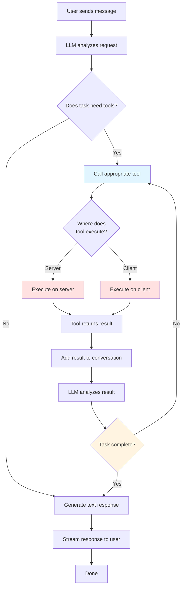
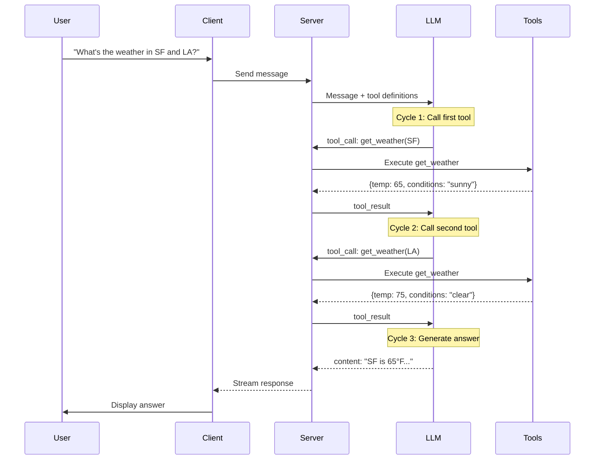

If the model needs tools → it calls them, gets results, and continues until it can answer. That loop is the agentic cycle.

> **Tip:** Need fewer iterations for multi-tool work? Use [Code Mode](../code-mode/code-mode) so the model writes one program that calls many tools.


```mermaid
graph TD
    A[User sends message] --> B[LLM analyzes request]
    B --> C{Does task need tools?}
    C -->|No| D[Generate text response]
    C -->|Yes| E[Call appropriate tool]
    E --> F{Where does<br/>tool execute?}
    F -->|Server| G[Execute on server]
    F -->|Client| H[Execute on client]
    G --> I[Tool returns result]
    H --> I
    I --> J[Add result to conversation]
    J --> K[LLM analyzes result]
    K --> L{Task complete?}
    L -->|No| E
    L -->|Yes| D
    D --> M[Stream response to user]
    M --> N[Done]
    
    style E fill:#e1f5ff
    style G fill:#ffe1e1
    style H fill:#ffe1e1
    style L fill:#fff4e1
```

## Multi-step flow


```mermaid
sequenceDiagram
    participant User
    participant Client
    participant Server
    participant LLM
    participant Tools
    
    User->>Client: "What's the weather in SF and LA?"
    Client->>Server: Send message
    Server->>LLM: Message + tool definitions
    
    Note over LLM: Cycle 1: Call first tool
    
    LLM->>Server: tool_call: get_weather(SF)
    Server->>Tools: Execute get_weather
    Tools-->>Server: {temp: 65, conditions: "sunny"}
    Server->>LLM: tool_result
    
    Note over LLM: Cycle 2: Call second tool
    
    LLM->>Server: tool_call: get_weather(LA)
    Server->>Tools: Execute get_weather
    Tools-->>Server: {temp: 75, conditions: "clear"}
    Server->>LLM: tool_result
    
    Note over LLM: Cycle 3: Generate answer
    
    LLM-->>Server: content: "SF is 65°F..."
    Server-->>Client: Stream response
    Client->>User: Display answer
```

**Example:** "Find flights to Paris under $500 and book the cheapest"

1. Call `searchFlights({destination: "Paris", maxPrice: 500})` → two flights
2. Call `bookFlight({flightId: "F1"})` — may need [Tool Approval](../tools/tool-approval)
3. Final text with booking ID

The loop continues while finish reason is `tool_calls` (pending tools) **and** the agent loop strategy allows another iteration. It stops on a normal `stop` finish reason.

## Wire tools into chat

```typescript
import { chat, toolDefinition, toServerSentEventsResponse } from "@tanstack/ai";
import { openaiText } from "@tanstack/ai-openai";
import { z } from "zod";

const getWeatherDef = toolDefinition({
  name: "get_weather",
  description: "Get current weather for a city",
  inputSchema: z.object({
    city: z.string(),
  }),
});

const getClothingAdviceDef = toolDefinition({
  name: "get_clothing_advice",
  description: "Get clothing recommendations based on weather",
  inputSchema: z.object({
    temperature: z.number(),
    conditions: z.string(),
  }),
});

const getWeather = getWeatherDef.server(async ({ city }) => {
  const response = await fetch(`https://api.weather.com/v1/${city}`);
  return await response.json();
});

const getClothingAdvice = getClothingAdviceDef.server(async ({ temperature, conditions }) => {
  if (temperature < 50) {
    return { recommendation: "Wear a warm jacket" };
  }
  return { recommendation: "Light clothing is fine" };
});

export async function POST(request: Request) {
  const { messages } = await request.json();

  const stream = chat({
    adapter: openaiText("gpt-5.5"),
    messages,
    tools: [getWeather, getClothingAdvice],
  });

  return toServerSentEventsResponse(stream);
}
```

**User:** "What should I wear in San Francisco today?"

1. `get_weather({city: "San Francisco"})` → `{temp: 62, conditions: "cloudy"}`
2. `get_clothing_advice({temperature: 62, conditions: "cloudy"})` → recommendation
3. Model streams the final answer

## Bound the loop

Default: `maxIterations(5)` — stops after five **model turns**, even if the model would keep calling tools.

**Built-in strategies:**

| Strategy | Use when |
| --- | --- |
| `maxIterations(n)` | Cap model turns (default 5) |
| `untilFinishReason([...])` | Stop on specific finish reasons |
| `combineStrategies([...])` | AND multiple strategies |

A strategy receives `{ iterationCount, finishReason, messages, toolCallCount, lastTurnToolCallCount }` and returns `true` to continue or `false` to stop:

```typescript
import { chat, combineStrategies, maxIterations, toServerSentEventsResponse } from "@tanstack/ai";
import { openaiText } from "@tanstack/ai-openai";
import type { AgentLoopState } from "@tanstack/ai";
import { getWeather, getClothingAdvice } from "./tools";

export async function POST(request: Request) {
  const { messages } = await request.json();
  const stream = chat({
    adapter: openaiText("gpt-5.5"),
    messages,
    tools: [getWeather, getClothingAdvice],
    agentLoopStrategy: combineStrategies([
      maxIterations(10),
      ({ messages }: AgentLoopState) => messages.length < 100,
    ]),
  });
  return toServerSentEventsResponse(stream);
}
```

## Cap tool calls (middleware)

> **Iterations ≠ tool calls.** One model turn can emit many parallel tool calls. `maxIterations` only bounds **model turns**.

No built-in `maxToolCalls`. Cap with middleware:

1. **`onBeforeToolCall`** — skip excess calls inside one turn (`maxPerTurn`)
2. **`onShouldContinue`** — stop further turns once cumulative **emitted** tools hit `max` (skipped calls still count toward `toolCallCount`)

```typescript
import {
  chat,
  maxIterations,
  toServerSentEventsResponse,
  type ChatMiddleware,
} from "@tanstack/ai";
import { openaiText } from "@tanstack/ai-openai";
import { getWeather, getClothingAdvice } from "./tools";

/** App-owned policy — not a library export. */
function toolCallBudget(options: {
  max?: number;
  maxPerTurn?: number;
}): ChatMiddleware {
  const { max, maxPerTurn } = options;
  let perTurn = 0;

  return {
    name: "tool-call-budget",
    onIteration() {
      perTurn = 0;
    },
    // Fresh per-turn budget for pending/resume batches (no onIteration).
    onToolPhaseComplete() {
      perTurn = 0;
    },
    onBeforeToolCall() {
      if (maxPerTurn == null) return undefined;
      perTurn += 1;
      if (perTurn > maxPerTurn) {
        return {
          type: "skip",
          result: {
            error: `Skipped: exceeded maxToolCallsPerTurn (${maxPerTurn})`,
          },
        };
      }
      return undefined;
    },
    onShouldContinue(_ctx, state) {
      if (max != null && state.toolCallCount >= max) return false;
      return undefined;
    },
  };
}

export async function POST(request: Request) {
  const { messages } = await request.json();
  const stream = chat({
    adapter: openaiText("gpt-5.5"),
    messages,
    tools: [getWeather, getClothingAdvice],
    agentLoopStrategy: maxIterations(20), // model turns
    middleware: [
      toolCallBudget({
        maxPerTurn: 10,
        max: 20,
      }),
    ],
  });
  return toServerSentEventsResponse(stream);
}
```

Place this **before** `toolCacheMiddleware` so over-budget skips win over cache hits. See [`onShouldContinue`](../advanced/middleware#onshouldcontinue).
