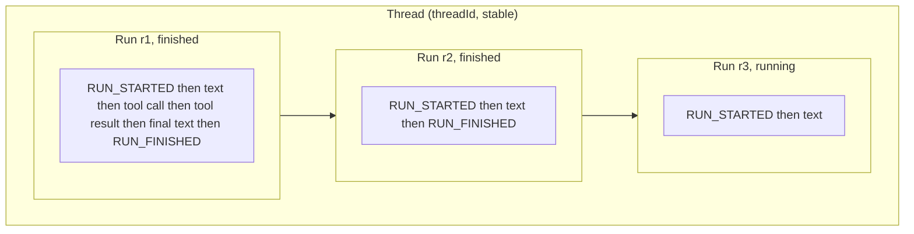

You have a stream of chunks. You need to know which ones are tokens, which ones are tools, and when the run is done.

Branch on `chunk.type`. Two ids frame every stream: `threadId` and `runId`.

## Event types

Public `StreamChunk` follows [AG-UI](https://docs.ag-ui.com/introduction). TanStack extras live under `metadata.tanstack`.

Do now:

- `RUN_STARTED`: `threadId`, `runId`
- `TEXT_MESSAGE_START` / `CONTENT` / `END`: `messageId`, `delta`
- `TOOL_CALL_START` / `ARGS` / `END`: `toolCallId`, `toolCallName`, args `delta`
- `RUN_FINISHED` / `RUN_ERROR`: usage and finish reason

Later:

- `REASONING_*` / `REASONING_ENCRYPTED_VALUE`: thinking content. See [Thinking and Reasoning](./thinking-content)
- `STEP_STARTED` / `STEP_FINISHED`: `stepName` only
- `CUSTOM`: `name` and `value`. See [Custom Events](../protocol/custom-events)

On `RUN_FINISHED`, in-process `chat()` still uses TanStack `TokenUsage` (`promptTokens`). The SSE and HTTP wires use the spec `usage` array (`inputTokens`). Read `finishReason` from `metadata.tanstack.finishReason`. Custom servers: see [Event metadata](../protocol/metadata).

```typescript
import { chat } from "@tanstack/ai";
import { openaiText } from "@tanstack/ai-openai";

const stream = chat({
  adapter: openaiText("gpt-5.6"),
  messages: [{ role: "user", content: "Hello!" }],
});

for await (const chunk of stream) {
  if (chunk.type === "TEXT_MESSAGE_CONTENT") {
    console.log(chunk.delta);
  }
  if (chunk.type === "RUN_FINISHED") {
    console.log(chunk.usage);
    console.log(chunk.metadata?.tanstack?.finishReason);
  }
}
```

## Threads and runs

Two ids frame every stream. They come from the AG-UI protocol, not from a storage layer.

- A **thread** (`threadId`) is the conversation. It stays the same across every exchange, reload, and device.
- A **run** (`runId`) is one execution inside that thread. It spans `RUN_STARTED` to `RUN_FINISHED` (or `RUN_ERROR`). Every start mints a fresh run id. A thread collects many runs over its life.

Tool calls and follow-up responses stream inside the same run. The whole [agentic cycle](./agentic-cycle) is one run, however many loops it takes.



Because run ids are short-lived, anything long-lived anchors on the thread:

- [Resumable streams](../resumable-streams/overview) log delivery per `runId`
- [Server persistence](../persistence/chat-persistence#threads-runs-and-turns) stores the transcript per `threadId`

The media generation hooks take a `threadId` too. There it names a slot, not a conversation. See [Id map](../persistence/id-map).

## Tool input and output

SSE and HTTP `TOOL_CALL_END` does not carry parsed `input`. In-process `chat()` still has `input`. Tool input and output also live on `UIMessage` parts.

On the server, feed chunks into `StreamProcessor`. On the client, read `useChat` `messages`.

### Server

```typescript
import { chat, StreamProcessor, toolDefinition } from "@tanstack/ai";
import { openaiText } from "@tanstack/ai-openai";
import { z } from "zod";

const weatherTool = toolDefinition({
  name: "get_weather",
  description: "Get weather for a location",
  inputSchema: z.object({
    location: z.string(),
    unit: z.enum(["celsius", "fahrenheit"]).optional(),
  }),
});

const stream = chat({
  adapter: openaiText("gpt-5.6"),
  messages: [{ role: "user", content: "What is the weather in Paris?" }],
  tools: [weatherTool],
});

const processor = new StreamProcessor();
for await (const chunk of stream) {
  processor.processChunk(chunk);
}
processor.finalizeStream();

for (const message of processor.getMessages()) {
  for (const part of message.parts) {
    if (part.type === "tool-call") {
      console.log(part.name, part.input, part.output);
    }
  }
}
```

### Type-safe tool call events

Pass your `.client()` tools to `useChat`. A check on `part.name` narrows `part.input` and `part.output`:

```typescript
import { useChat, fetchServerSentEvents } from "@tanstack/ai-react";
import { toolDefinition } from "@tanstack/ai";
import { z } from "zod";

const weatherTool = toolDefinition({
  name: "get_weather",
  description: "Get weather for a location",
  inputSchema: z.object({
    location: z.string(),
    unit: z.enum(["celsius", "fahrenheit"]).optional(),
  }),
}).client(async (input) => {
  return { location: input.location };
});

const { messages } = useChat({
  connection: fetchServerSentEvents("/api/chat"),
  tools: [weatherTool],
});

for (const message of messages) {
  for (const part of message.parts) {
    if (part.type === "tool-call" && part.name === "get_weather") {
      console.log(part.input?.location);
    }
  }
}
```

You now know which chunk is text, which is a tool, and which id is the conversation versus one run.
