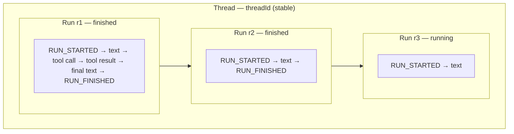

If you need live token-by-token UI → stream `chat()` and wire it with a connection adapter.

## 1. Stream on the server

```typescript
import { chat, toServerSentEventsResponse } from "@tanstack/ai";
import { openaiText } from "@tanstack/ai-openai";

export async function POST(request: Request) {
  const { messages } = await request.json();

  const stream = chat({
    adapter: openaiText("gpt-5.5"),
    messages,
  });

  return toServerSentEventsResponse(stream);
}
```

Iterate chunks yourself when needed:

```typescript
import { chat } from "@tanstack/ai";
import { openaiText } from "@tanstack/ai-openai";

const stream = chat({
  adapter: openaiText("gpt-5.5"),
  messages: [{ role: "user", content: "Hello!" }],
});

for await (const chunk of stream) {
  console.log(chunk);
}
```

## 2. Consume on the client

`useChat` updates `messages` as chunks arrive:

```typescript
import { useChat, fetchServerSentEvents } from "@tanstack/ai-react";

const { messages, sendMessage, isLoading } = useChat({
  connection: fetchServerSentEvents("/api/chat"),
});
```

## Stream events (AG-UI)

TanStack AI uses the [AG-UI Protocol](https://docs.ag-ui.com/introduction).

| Event | When |
| --- | --- |
| `RUN_STARTED` | Run begins |
| `TEXT_MESSAGE_START/CONTENT/END` | Text streaming |
| `TOOL_CALL_START/ARGS/END` | Tool invocation |
| `STEP_STARTED/STEP_FINISHED` | Thinking/reasoning (legacy) |
| `CUSTOM` | Extensions — [Custom Events](../protocol/custom-events) |
| `RUN_FINISHED` | Success + usage |
| `RUN_ERROR` | Failure |

Thinking streams before text. See [Thinking & Reasoning](./thinking-content).

### Threads vs runs

- **`threadId`** — conversation identity across reloads/devices
- **`runId`** — one execution (`RUN_STARTED` → `RUN_FINISHED` / `RUN_ERROR`)

A run includes the full [agentic cycle](./agentic-cycle) (tool calls + follow-ups), not just one model response.



Resumable streams log per `runId`; [server persistence](../persistence/chat-persistence#threads-runs-and-turns) stores per `threadId`. See [Id map](../persistence/id-map).

### Type-safe tool call events

Pass tools from `toolDefinition()` + Zod → `toolCallName` / `input` narrow on the stream:

```typescript
import { chat, toolDefinition } from "@tanstack/ai";
import { openaiText } from "@tanstack/ai-openai";
import { z } from "zod";

const weatherTool = toolDefinition({
  name: "get_weather",
  description: "Get weather for a location",
  inputSchema: z.object({
    location: z.string(),
    unit: z.enum(["celsius", "fahrenheit"]).optional(),
  }),
});

const messages = [
  { role: "user" as const, content: "What's the weather in Paris?" },
];

const stream = chat({
  adapter: openaiText("gpt-5.5"),
  messages,
  tools: [weatherTool],
});

for await (const chunk of stream) {
  // `'type' in chunk` required for control-flow narrowing on StreamChunk
  if ("type" in chunk && chunk.type === "TOOL_CALL_END") {
    chunk.toolCallName; // "get_weather"
    chunk.input; // { location: string; unit?: ... } | undefined
  }
}
```

With multiple tools, check `toolCallName` to narrow `input` / `output` per tool:

```typescript
import { chat, toolDefinition } from "@tanstack/ai";
import { openaiText } from "@tanstack/ai-openai";
import { z } from "zod";

const weatherTool = toolDefinition({
  name: "get_weather",
  description: "Get weather for a location",
  inputSchema: z.object({
    location: z.string(),
    unit: z.enum(["celsius", "fahrenheit"]).optional(),
  }),
});

const searchTool = toolDefinition({
  name: "search",
  description: "Search the web",
  inputSchema: z.object({ query: z.string() }),
});

const messages = [
  { role: "user" as const, content: "Find the weather for Paris" },
];

const stream = chat({
  adapter: openaiText("gpt-5.5"),
  messages,
  tools: [weatherTool, searchTool],
});

for await (const chunk of stream) {
  if ("type" in chunk && chunk.type === "TOOL_CALL_END") {
    if (chunk.toolCallName === "get_weather") {
      console.log(`Weather in ${chunk.input?.location}`);
    }
    if (chunk.toolCallName === "search") {
      console.log(`Searched for: ${chunk.input?.query}`);
    }
  }
}
```

Without typed tools, names are `string` and `input`/`output` are `unknown`. Typed stream type: `TypedStreamChunk<TTools>`.

### Thinking parts

Adapters emit `REASONING_MESSAGE_*` and legacy `STEP_*` events. Read the reconciled `ThinkingPart` from `message.parts` — do not hand-parse raw events:

```typescript
import { useChat, fetchServerSentEvents } from "@tanstack/ai-react";

const { messages } = useChat({
  connection: fetchServerSentEvents("/api/chat"),
});

for (const message of messages) {
  for (const part of message.parts) {
    if (part.type === "thinking") {
      console.log("Thinking:", part.content);
    }
  }
}
```

Thinking is UI-only — never sent back to the model. See [Thinking & Reasoning](./thinking-content).

## Connection adapters

| Transport | Import |
| --- | --- |
| SSE (default) | `fetchServerSentEvents("/api/chat")` |
| NDJSON HTTP | `fetchHttpStream("/api/chat")` |
| Async / server fn | `fetcher` option (sibling of `connection`) |

```typescript
import { useChat, fetchServerSentEvents } from "@tanstack/ai-react";

const { messages } = useChat({
  connection: fetchServerSentEvents("/api/chat"),
});
```

```typescript
import { useChat, fetchHttpStream } from "@tanstack/ai-react";

const { messages } = useChat({
  connection: fetchHttpStream("/api/chat"),
});
```

`fetcher` for a custom request (returns `Response` or `AsyncIterable<StreamChunk>`):

```typescript
import { useChat } from "@tanstack/ai-react";

const { messages } = useChat({
  fetcher: ({ messages, data }, { signal }) =>
    fetch("/api/chat", {
      method: "POST",
      body: JSON.stringify({ messages, ...data }),
      signal,
    }),
});
```

> **Note:** `stream()` needs a factory that returns `AsyncIterable<StreamChunk>` **synchronously**. Prefer `fetcher` for anything you `await`. Full matrix: [Connection Adapters](./connection-adapters).

## Monitor progress

```typescript
import { useChat, fetchServerSentEvents } from "@tanstack/ai-react";

const { messages } = useChat({
  connection: fetchServerSentEvents("/api/chat"),
  onChunk: (chunk) => {
    console.log("Received chunk:", chunk);
  },
  onFinish: (message) => {
    console.log("Stream finished:", message);
  },
});
```

## Cancel

```typescript
import { useChat, fetchServerSentEvents } from "@tanstack/ai-react";

const { stop } = useChat({
  connection: fetchServerSentEvents("/api/chat"),
});

stop(); // aborts active stream (expected AbortError)
```

Truncated mid-line streams throw `StreamTruncatedError` instead. On the server, pass `abortController` so the run cancels on client disconnect:

```typescript
import { chat, toServerSentEventsResponse } from "@tanstack/ai";
import { openaiText } from "@tanstack/ai-openai";

export async function POST(request: Request) {
  const { messages } = await request.json();
  const stream = chat({ adapter: openaiText("gpt-5.5"), messages });

  const abortController = new AbortController();
  return toServerSentEventsResponse(stream, { abortController });
}
```

## Queue messages while streaming

Default: `sendMessage` while busy **queues** (does not drop). Sends after a **successful** settle.

```tsx group=queueing-messages
import { useChat, fetchServerSentEvents } from "@tanstack/ai-react";

const { messages, queue, sendMessage, cancelQueued, isLoading } = useChat({
  connection: fetchServerSentEvents("/api/chat"),
  queue: { whenBusy: "queue", drain: "fifo", maxSize: 5 },
});
```

**Must configure if you care:**

| Option | Values | Default |
| --- | --- | --- |
| `whenBusy` | `"queue"` \| `"drop"` \| `"interrupt"` | `"queue"` |
| `drain` | `"fifo"` \| `"batch"` | `"fifo"` |
| `maxSize` | number (`0` = never queue) | — |
| `onOverflow` | `"reject"` \| `"drop-oldest"` | `"reject"` |

- **`interrupt`** — abort current stream, send immediately; does **not** clear the queue
- Shorthand: `queue: "interrupt"` → `{ whenBusy: "interrupt" }`
- Per-send override: `sendMessage("…", { whenBusy: "interrupt" })`

**Drain vs flush:**

| Action | When |
| --- | --- |
| Drain (auto-send) | After successful stream settle |
| Flush (discard) | Error/abort of active generation, `clear()`, `unsubscribe()`, `reload()` |
| Interrupt | Keeps queue; drains after successful interrupting turn |

Render pending items from `queue`:

```tsx group=queueing-messages
function PendingQueue() {
  return (
    <>
      {queue.map((q) => (
        <div key={q.id} className="pending">
          {typeof q.content === "string" ? q.content : "[attachment]"}
          <button onClick={() => cancelQueued(q.id)}>Cancel</button>
        </div>
      ))}
    </>
  );
}
```

> **Note:** Busy sends used to drop silently. Opt into `queue: "drop"` to restore that.

## Must-do checklist

1. Use `isLoading` / `error` for UI feedback
2. Call `stop()` (or honor abort) on unmount
3. Render partial content as it streams
4. Render `queue` separately from `messages` when queueing is on

## Next

- [Connection Adapters](./connection-adapters)
- [API Reference](../api/ai)
