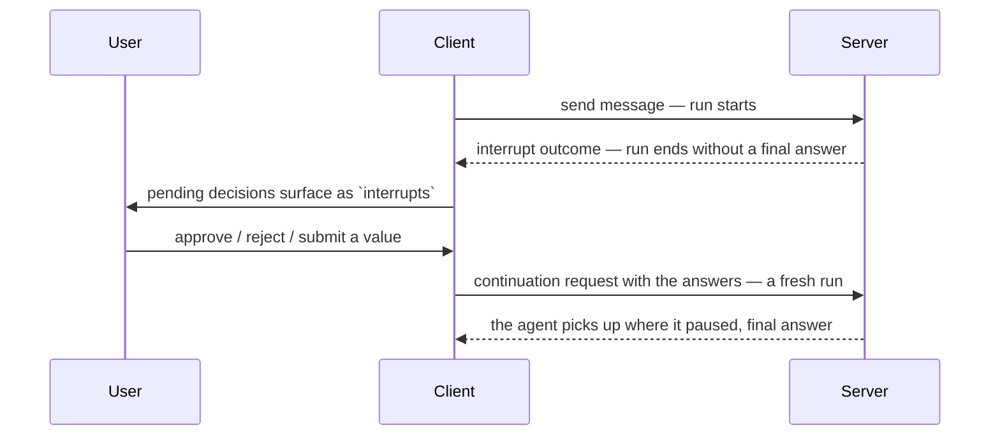

# Interrupts

If you need a human yes/no or a free-form answer mid-run → pause with an interrupt, resolve it on the client, then continue.

## How it works

1. Server ends the run with an `interrupt` outcome (not a final answer).
2. Client exposes pending decisions as `interrupts`.
3. You resolve each one (approve, reject, submit a value, or cancel).
4. Client starts a **new** continuation run that carries the answers.



One user-visible turn, two run lifecycles — see [Threads and runs](../chat/streaming#threads-and-runs).

No database required: the browser resends full message history on continue, so a stateless server can rebuild the paused step.

## What pauses a run

| `kind` | When | Guide |
| --- | --- | --- |
| `tool-approval` | Tool has `needsApproval` and the model calls it | [Tool Approval](./tool-approval) |
| `generic` | Your app ends a run to ask something that is not a tool | [Generic Interrupts](./generic) |

## Unbound interrupts (`kind: 'unbound'`)

Foreign AG-UI producers can emit the same interrupt envelope. TanStack only resumes pauses that carry a binding under `INTERRUPT_BINDING_METADATA_KEY`.

Without a binding you get `kind: 'unbound'`, `canResolve: false`, and no `resolveInterrupt`:

```tsx
import { fetchServerSentEvents, useChat } from '@tanstack/ai-react'
import { toolDefinition } from '@tanstack/ai'
import { z } from 'zod'

const transferTool = toolDefinition({
  name: 'transfer',
  description: 'Move money between accounts',
  needsApproval: true,
  inputSchema: z.object({ recipient: z.string(), amount: z.number() }),
  outputSchema: z.object({ receiptId: z.string() }),
}).client()

export function Pauses() {
  const { interrupts } = useChat({
    threadId: 'thread-1',
    connection: fetchServerSentEvents('/api/chat'),
    tools: [transferTool] as const,
  })

  return (
    <>
      {interrupts.map((interrupt) => {
        if (interrupt.kind === 'unbound') {
          return (
            <p key={interrupt.id}>
              Paused elsewhere: {interrupt.message ?? interrupt.reason}
            </p>
          )
        }
        if (interrupt.kind === 'generic') {
          return (
            <button
              key={interrupt.id}
              onClick={() => interrupt.resolveInterrupt({ confirmed: true })}
            >
              {interrupt.message ?? interrupt.reason}
            </button>
          )
        }
        return (
          <button
            key={interrupt.id}
            onClick={() => interrupt.resolveInterrupt(true)}
          >
            Approve {interrupt.toolName}
          </button>
        )
      })}
    </>
  )
}
```

Unbound items never block resolving yours. To make your own pauses resumable here, attach a binding with `withInterruptBinding` (do not hand-write the metadata key):

```ts
import {
  INTERRUPT_BINDING_VERSION,
  canonicalInterruptJson,
  digestInterruptJson,
  withInterruptBinding,
} from '@tanstack/ai'

const responseSchema = {
  type: 'object',
  properties: { speed: { type: 'string' } },
  required: ['speed'],
}

const descriptor = withInterruptBinding(
  {
    id: 'shipping-1',
    reason: 'confirmation',
    message: 'Which shipping speed?',
    responseSchema,
  },
  {
    v: INTERRUPT_BINDING_VERSION,
    kind: 'generic',
    interruptId: 'shipping-1',
    responseSchemaHash: digestInterruptJson(
      canonicalInterruptJson(responseSchema),
    ),
  },
)
```

`v` is the binding wire version. Unknown versions are rejected so foreign bindings are not mistaken for ours.

## Client tools vs approval

| Tool | What you handle |
| --- | --- |
| Server tool | Nothing unless `needsApproval` → then `tool-approval` pause, then server runs. |
| Client tool | Runs in the browser automatically. With `needsApproval` it pauses first, then runs client-side. |

Client tools without approval never appear in `interrupts`. See [Client Tools](../tools/client-tools).

## Next

| You want | Page |
| --- | --- |
| Approve or reject one tool call | [Tool Approval](./tool-approval) |
| Resolve several decisions at once | [Multiple Interrupts](./multiple) |
| Ask something that is not a tool | [Generic Interrupts](./generic) |
| Leave legacy `approval-requested` events | [Migration](./migration) |
