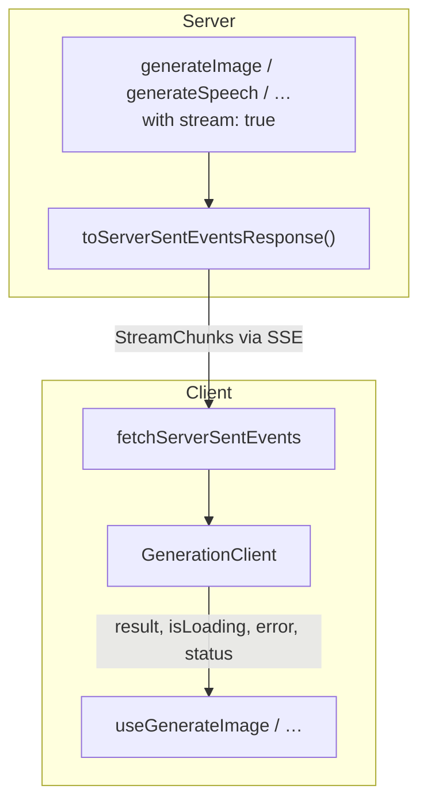

# Generations

If you need a single media result (not a conversation) → use a generation: one request, one result. Swap the function/hook pair; the shape stays the same.

## Fastest path

### 1. Server route (SSE)

```typescript ignore
import { generateImage, toServerSentEventsResponse } from '@tanstack/ai'
import { openaiImage } from '@tanstack/ai-openai'

export async function POST(request: Request) {
  const { prompt } = await request.json()
  const stream = generateImage({
    adapter: openaiImage('dall-e-3'),
    prompt: typeof prompt === 'string' ? prompt : '',
    stream: true,
  })
  return toServerSentEventsResponse(stream)
}
```

### 2. Client hook

```tsx
import { fetchServerSentEvents, useGenerateImage } from '@tanstack/ai-react'

function ImageGenerator() {
  const { generate, result, isLoading, error } = useGenerateImage({
    connection: fetchServerSentEvents('/api/generate/image'),
  })

  return (
    <div>
      <button onClick={() => generate({ prompt: 'A sunset over mountains' })}>
        {isLoading ? 'Generating…' : 'Generate'}
      </button>
      {error && <p role="alert">{error.message}</p>}
      {result?.images.map((img, i) => (
        
      ))}
    </div>
  )
}
```

## Pick a transport

| Transport | When | How |
| --- | --- | --- |
| **Streaming route** | Default API route | `stream: true` + `toServerSentEventsResponse` + `connection:` |
| **Direct** | Server function → JSON | Return result; pass `fetcher:` |
| **Server function + SSE** | TanStack Start, typed + streaming | Return `toServerSentEventsResponse(...)`; pass `fetcher:` |

Details: [Transports in full](#transports-in-full).

## Available generations

| Activity | Server | Client (React) | Guide |
|----------|--------|----------------|-------|
| Image | `generateImage()` | `useGenerateImage()` | [Image](./image-generation) |
| Audio | `generateAudio()` | `useGenerateAudio()` | [Audio](./audio-generation) |
| TTS | `generateSpeech()` | `useGenerateSpeech()` | [TTS](./text-to-speech) |
| Transcription | `generateTranscription()` | `useTranscription()` | [Transcription](./transcription) |
| Summarization | `summarize()` | `useSummarize()` | — |
| Video | `generateVideo()` | `useGenerateVideo()` | [Video](./video-generation) |

Video uses jobs/polling. `useGenerateVideo` adds `jobId`, `videoStatus`, `onJobCreated`, `onStatusUpdate`. See [Video Generation](./video-generation).

## Advanced

### Transports in full

#### Streaming (connection adapter)

**Server**

```typescript ignore
import { generateImage, toServerSentEventsResponse } from '@tanstack/ai'
import { openaiImage } from '@tanstack/ai-openai'

const stream = generateImage({
  adapter: openaiImage('dall-e-3'),
  prompt: 'A sunset over mountains',
  stream: true,
})

return toServerSentEventsResponse(stream)
```

**Client**

```tsx
import { useGenerateImage, fetchServerSentEvents } from '@tanstack/ai-react'

const { generate, result, isLoading } = useGenerateImage({
  connection: fetchServerSentEvents('/api/generate/image'),
})
```

#### Direct (fetcher + JSON)

**Server**

```typescript ignore
import { createServerFn } from '@tanstack/react-start'
import { generateImage } from '@tanstack/ai'
import { openaiImage } from '@tanstack/ai-openai'

export const generateImageFn = createServerFn({ method: 'POST' })
  .inputValidator((data: { prompt: string }) => data)
  .handler(async ({ data }) => {
    return generateImage({
      adapter: openaiImage('dall-e-3'),
      prompt: data.prompt,
    })
  })
```

**Client**

```tsx
import { useGenerateImage } from '@tanstack/ai-react'
import { generateImageFn } from '../lib/server-functions'

const { generate, result, isLoading } = useGenerateImage({
  fetcher: (input) => generateImageFn({ data: input }),
})
```

#### Server function streaming (fetcher + Response)

Fetcher returns an SSE `Response`; the client parses it automatically.

**Server**

```typescript ignore
import { createServerFn } from '@tanstack/react-start'
import { generateImage, toServerSentEventsResponse } from '@tanstack/ai'
import { openaiImage } from '@tanstack/ai-openai'

export const generateImageStreamFn = createServerFn({ method: 'POST' })
  .inputValidator((data: { prompt: string }) => data)
  .handler(({ data }) => {
    return toServerSentEventsResponse(
      generateImage({
        adapter: openaiImage('dall-e-3'),
        prompt: data.prompt,
        stream: true,
      }),
    )
  })
```

**Client**

```tsx
import { useGenerateImage } from '@tanstack/ai-react'
import { generateImageStreamFn } from '../lib/server-functions'

const { generate, result, isLoading } = useGenerateImage({
  fetcher: (input) => generateImageStreamFn({ data: input }),
})
```

### How streaming works

With `stream: true`, the function yields `StreamChunk` events:

1. `RUN_STARTED` → status `'generating'`
2. `CUSTOM` (`name: 'generation:result'`) → result
3. `RUN_FINISHED` → status `'success'`

On throw: `RUN_ERROR` → `error` + status `'error'`.

Same transport as chat (`toServerSentEventsResponse`, `fetchServerSentEvents`).

```tsx
import { useGenerateImage, fetchServerSentEvents } from '@tanstack/ai-react'

function ImageGenerator() {
  const { generate, result, error, status } = useGenerateImage({
    connection: fetchServerSentEvents('/api/generate/image'),
    onError: (err) => console.error('Generation failed:', err.message),
  })

  return (
    <div>
      <button onClick={() => generate({ prompt: 'A sunset over mountains' })}>
        Generate
      </button>
      {status === 'error' && <p role="alert">Error: {error?.message}</p>}
      {result?.images.map((img, i) => (
        
      ))}
    </div>
  )
}
```

### Common hook API

| Option | Type | Description |
|--------|------|-------------|
| `connection` | `ConnectionAdapter` | Streaming transport |
| `fetcher` | `(input) => Promise<Result \| Response>` | Direct call or SSE Response |
| `id` | `string` | Instance id |
| `body` | `Record<string, any>` | Extra body (connection mode) |
| `onResult` / `onError` / `onProgress` | callbacks | Transform, errors, 0–100 progress |

| Return | Type | Description |
|--------|------|-------------|
| `generate` | `(input) => Promise<void>` | Trigger |
| `result` | `T \| null` | Result (optionally transformed) |
| `isLoading` | `boolean` | In progress |
| `error` | `Error \| undefined` | Current error |
| `status` | `GenerationClientState` | `'idle'` \| `'generating'` \| `'success'` \| `'error'` |
| `stop` / `reset` | functions | Abort / clear |

#### Result transform (`onResult`)

- Non-null return → replaces stored result
- `null` → keep previous
- `void` → store raw result

```tsx
import { useGenerateSpeech, fetchServerSentEvents } from '@tanstack/ai-react'
import type { TTSResult } from '@tanstack/ai'

function SpeechPlayer() {
  const { result } = useGenerateSpeech({
    connection: fetchServerSentEvents('/api/generate/speech'),
    onResult: (raw: TTSResult) => ({
      audioUrl: `data:${raw.contentType};base64,${raw.audio}`,
      duration: raw.duration,
    }),
  })
  // result: { audioUrl: string; duration?: number } | null
}
```

### Architecture



Every generation is an async function. `stream: true` turns it into a `StreamChunk` iterable the client already knows how to consume.
