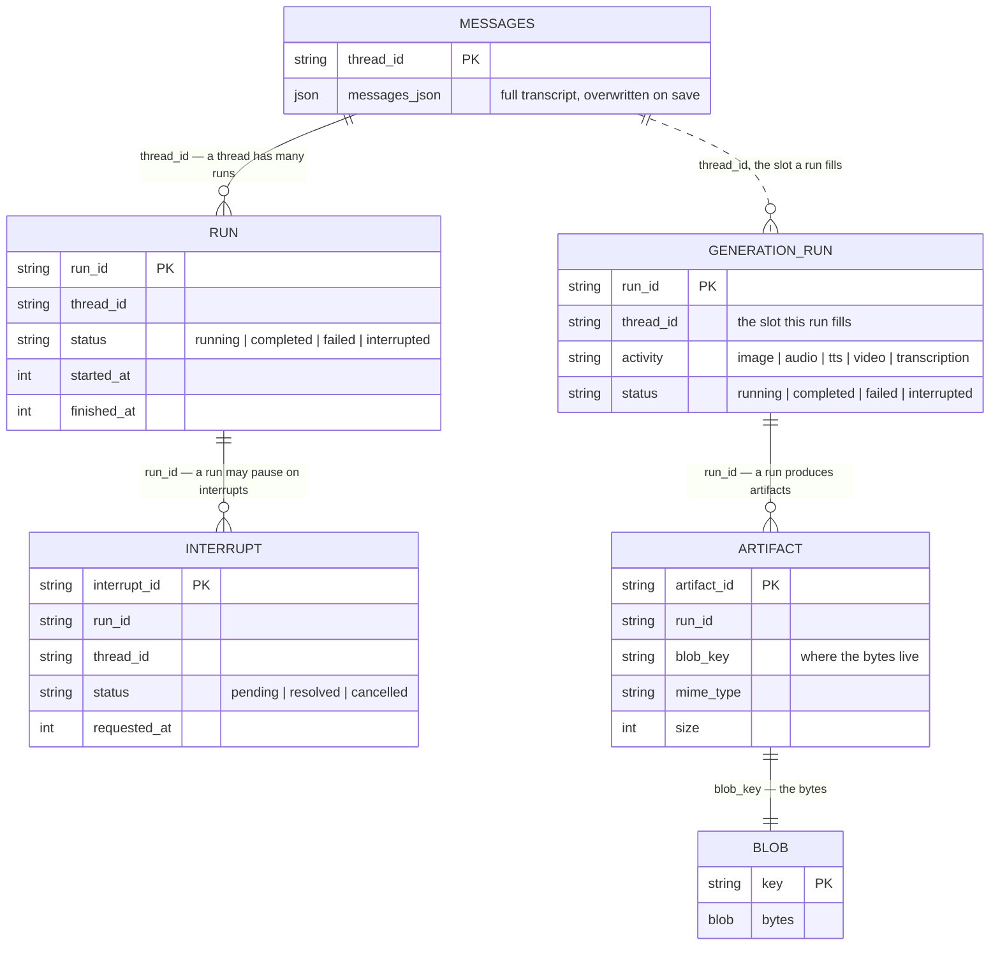

# Build Your Own Persistence Adapter

You want server-side chat persistence, but your data lives in your own database:
Postgres behind Prisma, a SQLite file, Cloudflare D1, Mongo, whatever you already
run. TanStack AI does not ship a backend for your exact stack, and you would
rather not add one more service just for chat history.

You do not need a packaged backend. Server persistence is a small set of plain
store interfaces from `@tanstack/ai-persistence`. Implement the ones you want
against your database, hand the result to `withPersistence`, and you are done.
The core never inspects your tables, so the schema is yours to shape.

This guide builds a complete SQLite adapter on Node's built-in `node:sqlite`, end
to end, then shows how to map the same contracts onto a database schema you
already have. The runnable version of everything here lives in the
`examples/ts-react-chat` app (`src/lib/sqlite-persistence.ts`).

## Which stores do you need?

There are seven stores and you almost certainly do not want all of them. Each one
switches on a single capability. Find the column for what you are building and
implement the rows marked ✅:

| Store | Save the transcript | Rejoin a run after reload | Durable approvals | App key/value | Persist generation runs | Keep generated files |
| --- | :-: | :-: | :-: | :-: | :-: | :-: |
| `messages` | ✅ | ✅ | ✅ | ✅ | ❌ | ❌ |
| `runs` | ❌ | ✅ | ✅ | ❌ | ❌ | ❌ |
| `interrupts` | ❌ | ❌ | ✅ | ❌ | ❌ | ❌ |
| `metadata` | ❌ | ❌ | ❌ | ✅ | ❌ | ❌ |
| `generationRuns` | ❌ | ❌ | ❌ | ❌ | ✅ | ✅ |
| `artifacts` | ❌ | ❌ | ❌ | ❌ | ❌ | ✅ |
| `blobs` | ❌ | ❌ | ❌ | ❌ | ❌ | ✅ |

How to read it:

- **Columns stack.** Want durable approvals *and* generated files? Implement the
  union of those two columns.
- **The four chat columns all need `messages`.** `withPersistence` refuses to run
  without it, so it is the floor for anything chat-related.
- **The two generation columns feed `withGenerationPersistence`** instead, and
  need none of the chat stores. Chat and generation persistence are independent;
  see [Generation persistence](./generation-persistence).

Two pairs cannot be split:

- `interrupts` needs `runs`. An interrupt record is scoped to a run.
- `artifacts` and `blobs` go together. Metadata with no bytes, or bytes with
  nothing describing them, is not a usable combination.

So the smallest adapter worth shipping is a single `messages` store, and the
common production shape is `messages` + `runs` + `interrupts`. The guide below
builds them in that order.

## What an adapter is

An adapter is an object with a `stores` map:

```ts
import type { ChatTranscriptPersistence } from '@tanstack/ai-persistence'
// `messages` and `runs` are your store implementations (built below); import
// them from your own modules.
import { messages } from './message-store'
import { runs } from './run-store'

const persistence: ChatTranscriptPersistence = {
  stores: { messages, runs },
}
```

Each store is independent, so provide only the ones you need.

For chat:

- `messages`: the transcript.
- `runs`: run lifecycle.
- `interrupts`: durable approvals. Needs `runs`.
- `metadata`: namespaced key/value state.

For generation:

- `generationRuns`: the generation run lifecycle. The counterpart to `runs`,
  keyed by its own `runId`.
- `artifacts` + `blobs`: keep the generated media bytes. See
  [Generation & media stores](#generation--media-stores).

The middleware turns on behavior for whatever stores it finds, so a
`messages`-only adapter is a valid adapter.

Those seven — `messages`, `runs`, `interrupts`, `metadata`, `generationRuns`,
`artifacts`, `blobs` — are the *only* keys `stores` accepts; anything else
throws `Unknown AIPersistence store key` at construction. Need a mutex across
instances? That is `withLocks`; see [Locks](../advanced/locks).

Type each store with its `define*Store` helper, as the sections below do. There
is one per store:

- `defineMessageStore`
- `defineRunStore`
- `defineInterruptStore`
- `defineMetadataStore`
- `defineGenerationRunStore`
- `defineArtifactStore`
- `defineBlobStore`

Each checks the object against the contract inline (autocomplete, no
`: MessageStore` annotation) and composes into `defineAIPersistence`, which
tracks **exact presence**:

- The stores you pass are defined, and their keys autocomplete on
  `persistence.stores`.
- Accessing one you did not pass is a compile error.

Annotate the value with a named shape:

- `ChatPersistence`: all four chat stores.
- `ChatTranscriptPersistence`: the `messages` floor.
- `AIPersistence`: the all-optional bag. `withPersistence` rejects it, because
  `stores.messages` is possibly `undefined`.

Every method signature and invariant is in the
[store interface reference](#store-interface-reference) at the end of this page.
The invariants (idempotent creates, insert-if-absent, ordered listings) are what
the shared conformance suite checks, and getting one wrong is the usual source of
subtle bugs.

The records the stores hold form a small schema. The thread is not a table of
its own — it exists as the `thread_id` key the other records hang off — and
`metadata` is independent of all of it (its identity is `(namespace, key)`).
Note the asymmetry on the generation side. A chat run belongs to a thread, and
its own `run_id` is secondary. A generation run is keyed by its own `run_id`
first, and its `thread_id` names the slot the run fills, which is what
`findLatestForThread` hydrates by:



## New database: a SQLite adapter start to finish

### 1. The schema

Four tables. JSON payloads are stored as text (SQLite has no JSON column type),
timestamps as integers (epoch milliseconds), everything keyed the way the store
methods look records up.

```sql
CREATE TABLE IF NOT EXISTS messages (
  thread_id text PRIMARY KEY NOT NULL,
  messages_json text NOT NULL
);
CREATE TABLE IF NOT EXISTS runs (
  run_id text PRIMARY KEY NOT NULL,
  thread_id text NOT NULL,
  status text NOT NULL,
  started_at integer NOT NULL,
  finished_at integer,
  error text,
  usage_json text
);
CREATE TABLE IF NOT EXISTS interrupts (
  interrupt_id text PRIMARY KEY NOT NULL,
  run_id text NOT NULL,
  thread_id text NOT NULL,
  status text NOT NULL,
  requested_at integer NOT NULL,
  resolved_at integer,
  payload_json text NOT NULL,
  response_json text
);
CREATE TABLE IF NOT EXISTS metadata (
  scope text NOT NULL,
  key text NOT NULL,
  value_json text NOT NULL,
  PRIMARY KEY (scope, key)
);
```

### 2. Messages: full-transcript overwrite

Two contracts to hold:

- `saveThread` always receives the complete, authoritative history. It is a
  replace, not an append.
- `loadThread` returns `[]` for a thread that was never saved, never `null`.

```ts
import { DatabaseSync } from 'node:sqlite'
import { defineMessageStore } from '@tanstack/ai-persistence'
import type { ModelMessage } from '@tanstack/ai'

// `defineMessageStore` types the object inline against the contract — you get
// autocomplete and checking with no separate `: MessageStore` annotation.
function createMessageStore(db: DatabaseSync) {
  const select = db.prepare(
    'SELECT messages_json FROM messages WHERE thread_id = ?',
  )
  const upsert = db.prepare(
    `INSERT INTO messages (thread_id, messages_json) VALUES (?, ?)
     ON CONFLICT(thread_id) DO UPDATE SET messages_json = excluded.messages_json`,
  )
  return defineMessageStore({
    async loadThread(threadId) {
      const json = select.get(threadId)?.messages_json
      // Unknown thread → [] (never null). `node:sqlite` types columns as a
      // SQL-value union, so narrow to string before parsing (no cast).
      if (typeof json !== 'string') return []
      const parsed: Array<ModelMessage> = JSON.parse(json)
      return parsed
    },
    async saveThread(threadId, messages) {
      upsert.run(threadId, JSON.stringify(messages))
    },
  })
}
```

The methods are `async`, so `node:sqlite` (a synchronous driver) needs no
`Promise.resolve` wrapper: `async` promotes the returned value to a promise, and
a method that returns nothing resolves to `void`. On an async driver, `await` the
query instead.

### 3. Runs: idempotent create, patch, get

Two contracts to hold:

- `createOrResume` must be idempotent. If the run id already exists, return the
  stored record unchanged, so resuming a run never resets its `startedAt` or
  status. `INSERT ... ON CONFLICT DO NOTHING` gives you that in one statement.
- `update` on an unknown run id is a no-op.

```ts
import { DatabaseSync } from 'node:sqlite'
import { defineRunStore } from '@tanstack/ai-persistence'
import type { RunRecord, RunStatus } from '@tanstack/ai-persistence'

// The `status` column is text; validate it back into the union (no cast).
function toRunStatus(value: unknown): RunStatus {
  switch (value) {
    case 'running':
    case 'completed':
    case 'failed':
    case 'interrupted':
      return value
    default:
      throw new TypeError(`Unexpected run status: ${String(value)}`)
  }
}

// `node:sqlite` types columns as a SQL-value union, so coerce/narrow each field
// (String / Number / typeof) rather than casting the whole row.
function mapRun(row: Record<string, unknown>): RunRecord {
  return {
    runId: String(row.run_id),
    threadId: String(row.thread_id),
    status: toRunStatus(row.status),
    startedAt: Number(row.started_at),
    ...(row.finished_at != null ? { finishedAt: Number(row.finished_at) } : {}),
    ...(typeof row.error === 'string' ? { error: row.error } : {}),
    ...(typeof row.usage_json === 'string'
      ? { usage: JSON.parse(row.usage_json) }
      : {}),
  }
}

function createRunStore(db: DatabaseSync) {
  const select = db.prepare('SELECT * FROM runs WHERE run_id = ?')
  const insert = db.prepare(
    `INSERT INTO runs (run_id, thread_id, status, started_at) VALUES (?, ?, ?, ?)
     ON CONFLICT(run_id) DO NOTHING`,
  )
  const active = db.prepare(
    `SELECT * FROM runs WHERE thread_id = ? AND status = 'running'
     ORDER BY started_at DESC LIMIT 1`,
  )
  return defineRunStore({
    async createOrResume(input) {
      const existing = select.get(input.runId)
      if (existing) return mapRun(existing)
      const status: RunStatus = input.status ?? 'running'
      insert.run(input.runId, input.threadId, status, input.startedAt)
      return {
        runId: input.runId,
        threadId: input.threadId,
        status,
        startedAt: input.startedAt,
      }
    },
    async update(runId, patch) {
      const sets: Array<string> = []
      const params: Array<string | number> = []
      if (patch.status !== undefined) {
        sets.push('status = ?')
        params.push(patch.status)
      }
      if (patch.finishedAt !== undefined) {
        sets.push('finished_at = ?')
        params.push(patch.finishedAt)
      }
      if (patch.error !== undefined) {
        sets.push('error = ?')
        params.push(patch.error)
      }
      if (patch.usage !== undefined) {
        sets.push('usage_json = ?')
        params.push(JSON.stringify(patch.usage))
      }
      if (sets.length === 0) return
      params.push(runId)
      db.prepare(`UPDATE runs SET ${sets.join(', ')} WHERE run_id = ?`).run(
        ...params,
      )
    },
    async get(runId) {
      const row = select.get(runId)
      return row ? mapRun(row) : null
    },
    // The most recent still-running run for a thread. `reconstructChat` calls
    // this so a hydrating client (a reload, another device, or switching back to
    // a generating thread) learns there is a live run and tails it. Stub it to
    // null and the thread always looks idle on hydrate: the transcript restores,
    // but a reply that was mid-stream never resumes.
    async findActiveRun(threadId) {
      const row = active.get(threadId)
      return row ? mapRun(row) : null
    },
  })
}
```

`update` builds its `SET` list from only the fields present in the patch, so an
empty patch touches nothing and a partial patch leaves other columns alone. Map
each row back with a small helper that omits absent optional fields and parses
the JSON columns.

### 4. Interrupts: insert-if-absent, ordered listings

`create` is insert-if-absent: a duplicate interrupt id must never overwrite an
interrupt that was already resolved. Every `list*` method returns records ordered
by `requested_at` ascending, which the middleware relies on.

```ts
import { DatabaseSync } from 'node:sqlite'
import { defineInterruptStore } from '@tanstack/ai-persistence'
import type {
  InterruptRecord,
  InterruptStatus,
} from '@tanstack/ai-persistence'

function toInterruptStatus(value: unknown): InterruptStatus {
  switch (value) {
    case 'pending':
    case 'resolved':
    case 'cancelled':
      return value
    default:
      throw new TypeError(`Unexpected interrupt status: ${String(value)}`)
  }
}

function mapInterrupt(row: Record<string, unknown>): InterruptRecord {
  return {
    interruptId: String(row.interrupt_id),
    runId: String(row.run_id),
    threadId: String(row.thread_id),
    status: toInterruptStatus(row.status),
    requestedAt: Number(row.requested_at),
    ...(row.resolved_at != null ? { resolvedAt: Number(row.resolved_at) } : {}),
    payload:
      typeof row.payload_json === 'string' ? JSON.parse(row.payload_json) : {},
    ...(typeof row.response_json === 'string'
      ? { response: JSON.parse(row.response_json) }
      : {}),
  }
}

function createInterruptStore(db: DatabaseSync) {
  const insert = db.prepare(
    `INSERT INTO interrupts
       (interrupt_id, run_id, thread_id, status, requested_at, payload_json, response_json)
     VALUES (?, ?, ?, 'pending', ?, ?, ?)
     ON CONFLICT(interrupt_id) DO NOTHING`,
  )
  const resolveRow = db.prepare(
    `UPDATE interrupts SET status = 'resolved', resolved_at = ?, response_json = ?
     WHERE interrupt_id = ?`,
  )
  const cancelRow = db.prepare(
    `UPDATE interrupts SET status = 'cancelled', resolved_at = ? WHERE interrupt_id = ?`,
  )
  const selectOne = db.prepare('SELECT * FROM interrupts WHERE interrupt_id = ?')
  // Every listing is ORDER BY requested_at ASC — the middleware relies on it.
  const byThread = db.prepare(
    'SELECT * FROM interrupts WHERE thread_id = ? ORDER BY requested_at ASC',
  )
  const pendingByThread = db.prepare(
    `SELECT * FROM interrupts WHERE thread_id = ? AND status = 'pending'
     ORDER BY requested_at ASC`,
  )
  const byRun = db.prepare(
    'SELECT * FROM interrupts WHERE run_id = ? ORDER BY requested_at ASC',
  )
  const pendingByRun = db.prepare(
    `SELECT * FROM interrupts WHERE run_id = ? AND status = 'pending'
     ORDER BY requested_at ASC`,
  )
  return defineInterruptStore({
    async create(record) {
      // Insert-if-absent: a duplicate id must never clobber an already-resolved
      // interrupt back to pending.
      insert.run(
        record.interruptId,
        record.runId,
        record.threadId,
        record.requestedAt,
        JSON.stringify(record.payload),
        record.response === undefined ? null : JSON.stringify(record.response),
      )
    },
    async resolve(interruptId, response) {
      resolveRow.run(
        Date.now(),
        response === undefined ? null : JSON.stringify(response),
        interruptId,
      )
    },
    async cancel(interruptId) {
      cancelRow.run(Date.now(), interruptId)
    },
    async get(interruptId) {
      const row = selectOne.get(interruptId)
      return row ? mapInterrupt(row) : null
    },
    async list(threadId) {
      return byThread.all(threadId).map(mapInterrupt)
    },
    async listPending(threadId) {
      return pendingByThread.all(threadId).map(mapInterrupt)
    },
    async listByRun(runId) {
      return byRun.all(runId).map(mapInterrupt)
    },
    async listPendingByRun(runId) {
      return pendingByRun.all(runId).map(mapInterrupt)
    },
  })
}
```

### 5. Metadata: reject nullish

`(scope, key)` is the composite identity. A SQL backend cannot store a nullish
value in a `NOT NULL` text column, so reject `null` and `undefined` with a clear
error instead of a cryptic driver failure. Callers clear a value with `delete`.

```ts
import { DatabaseSync } from 'node:sqlite'
import { defineMetadataStore } from '@tanstack/ai-persistence'

function createMetadataStore(db: DatabaseSync) {
  const select = db.prepare(
    'SELECT value_json FROM metadata WHERE scope = ? AND key = ?',
  )
  const upsert = db.prepare(
    `INSERT INTO metadata (scope, key, value_json) VALUES (?, ?, ?)
     ON CONFLICT(scope, key) DO UPDATE SET value_json = excluded.value_json`,
  )
  return defineMetadataStore({
    async get(scope, key) {
      const json = select.get(scope, key)?.value_json
      return typeof json === 'string' ? JSON.parse(json) : null
    },
    async set(scope, key, value) {
      if (value == null) {
        throw new TypeError(
          'Metadata values must be defined, non-null JSON. Use delete() to clear.',
        )
      }
      upsert.run(scope, key, JSON.stringify(value))
    },
    async delete(scope, key) {
      db.prepare('DELETE FROM metadata WHERE scope = ? AND key = ?').run(
        scope,
        key,
      )
    },
  })
}
```

### 6. Assemble the adapter

Open the database, create the tables, and return the stores as an
`AIPersistence`. `defineAIPersistence` keeps the exact store keys in the type and
rejects unknown keys at runtime.

```ts
import { DatabaseSync } from 'node:sqlite'
import { defineAIPersistence } from '@tanstack/ai-persistence'
import type { ChatPersistence } from '@tanstack/ai-persistence'
// The four store factories and the schema string, each from your own module.
import { createInterruptStore } from './interrupt-store'
import { createMessageStore } from './message-store'
import { createMetadataStore } from './metadata-store'
import { createRunStore } from './run-store'
import { SCHEMA_SQL } from './schema'

export function sqlitePersistence(options: {
  url: string
  migrate?: boolean
}): ChatPersistence {
  const db = new DatabaseSync(options.url)
  if (options.migrate) db.exec(SCHEMA_SQL)
  return defineAIPersistence({
    stores: {
      messages: createMessageStore(db),
      runs: createRunStore(db),
      interrupts: createInterruptStore(db),
      metadata: createMetadataStore(db),
    },
  })
}
```

That is a complete backend. If you also need a mutex across workers, add
`withLocks` alongside it; see [Locks](../advanced/locks).

Wire it into `chat()` exactly like any other persistence:

```ts
import {
  chat,
  chatParamsFromRequest,
  toServerSentEventsResponse,
} from '@tanstack/ai'
import { openaiText } from '@tanstack/ai-openai'
import { withPersistence } from '@tanstack/ai-persistence'
import { persistence } from './persistence'

export async function POST(request: Request) {
  const params = await chatParamsFromRequest(request)
  const stream = chat({
    adapter: openaiText('gpt-5.5'),
    messages: params.messages,
    threadId: params.threadId,
    runId: params.runId,
    ...(params.resume ? { resume: params.resume } : {}),
    middleware: [withPersistence(persistence)],
  })
  return toServerSentEventsResponse(stream)
}
```

## Generation & media stores

Everything above builds a **chat** adapter.
[Media generation](./generation-persistence) persists differently: it does not
use the chat `runs` store at all.

- **Required:** a `generationRuns` store, a `GenerationRunStore` keyed by
  `runId` (the run/request id a generation mints). It is the counterpart to
  `runs`.
- **Optional, to keep the generated bytes:** an `artifacts` store (metadata) and
  a `blobs` store (the bytes). These two must be provided **together**.

`threadId` is the slot the run belongs to, recorded on each run record.

These are three more tables alongside the four from the schema in step 1:

```sql
CREATE TABLE IF NOT EXISTS generation_runs (
  run_id text PRIMARY KEY NOT NULL,
  thread_id text NOT NULL,
  activity text NOT NULL,
  provider text NOT NULL,
  model text NOT NULL,
  status text NOT NULL,
  started_at integer NOT NULL,
  finished_at integer,
  error_json text,
  result_json text,
  artifacts_json text,
  usage_json text
);
CREATE TABLE IF NOT EXISTS artifacts (
  artifact_id text PRIMARY KEY NOT NULL,
  run_id text NOT NULL,
  thread_id text NOT NULL,
  blob_key text,
  name text NOT NULL,
  mime_type text NOT NULL,
  size integer NOT NULL,
  source_url text,
  created_at integer NOT NULL
);
CREATE TABLE IF NOT EXISTS blobs (
  key text PRIMARY KEY NOT NULL,
  bytes blob NOT NULL,
  size integer NOT NULL,
  etag text NOT NULL,
  content_type text,
  custom_metadata_json text,
  created_at integer NOT NULL,
  updated_at integer NOT NULL
);
```

### Generation runs: idempotent create, patch, latest-for-thread

`GenerationRunStore` is the generation analogue of `RunStore`. Three contracts
to hold:

- `createOrResume` is idempotent. A second call for a `runId` returns the stored
  record unchanged, so resuming a run never resets its `startedAt`, `activity`,
  or status. `INSERT ... ON CONFLICT DO NOTHING` gives you that.
- `update` on an unknown `runId` is a no-op.
- `findLatestForThread` returns the run with the greatest `startedAt` linked to a
  thread. `reconstructGeneration` calls it to hydrate the last generation for a
  thread on a server-driven client's mount.

```ts
import { DatabaseSync } from 'node:sqlite'
import { defineGenerationRunStore } from '@tanstack/ai-persistence'
import type {
  GenerationRunRecord,
  GenerationRunStatus,
} from '@tanstack/ai-persistence'

function toGenerationRunStatus(value: unknown): GenerationRunStatus {
  switch (value) {
    case 'running':
    case 'completed':
    case 'failed':
    case 'interrupted':
      return value
    default:
      throw new TypeError(`Unexpected generation run status: ${String(value)}`)
  }
}

// `node:sqlite` types columns as a SQL-value union, so coerce/narrow each field
// (String / Number / typeof) and JSON-parse the text columns — no cast.
function mapGenerationRun(row: Record<string, unknown>): GenerationRunRecord {
  return {
    runId: String(row.run_id),
    threadId: String(row.thread_id),
    activity: String(row.activity),
    provider: String(row.provider),
    model: String(row.model),
    status: toGenerationRunStatus(row.status),
    startedAt: Number(row.started_at),
    ...(row.finished_at != null ? { finishedAt: Number(row.finished_at) } : {}),
    ...(typeof row.error_json === 'string'
      ? { error: JSON.parse(row.error_json) }
      : {}),
    ...(typeof row.result_json === 'string'
      ? { result: JSON.parse(row.result_json) }
      : {}),
    ...(typeof row.artifacts_json === 'string'
      ? { artifacts: JSON.parse(row.artifacts_json) }
      : {}),
    ...(typeof row.usage_json === 'string'
      ? { usage: JSON.parse(row.usage_json) }
      : {}),
  }
}

function createGenerationRunStore(db: DatabaseSync) {
  const select = db.prepare('SELECT * FROM generation_runs WHERE run_id = ?')
  const insert = db.prepare(
    `INSERT INTO generation_runs
       (run_id, thread_id, activity, provider, model, status, started_at)
     VALUES (?, ?, ?, ?, ?, ?, ?)
     ON CONFLICT(run_id) DO NOTHING`,
  )
  const latest = db.prepare(
    `SELECT * FROM generation_runs WHERE thread_id = ?
     ORDER BY started_at DESC LIMIT 1`,
  )
  return defineGenerationRunStore({
    async createOrResume(input) {
      const existing = select.get(input.runId)
      if (existing) return mapGenerationRun(existing)
      const status: GenerationRunStatus = input.status ?? 'running'
      insert.run(
        input.runId,
        input.threadId,
        input.activity,
        input.provider,
        input.model,
        status,
        input.startedAt,
      )
      return {
        runId: input.runId,
        threadId: input.threadId,
        activity: input.activity,
        provider: input.provider,
        model: input.model,
        status,
        startedAt: input.startedAt,
      }
    },
    async update(runId, patch) {
      const sets: Array<string> = []
      const params: Array<string | number> = []
      if (patch.status !== undefined) {
        sets.push('status = ?')
        params.push(patch.status)
      }
      if (patch.finishedAt !== undefined) {
        sets.push('finished_at = ?')
        params.push(patch.finishedAt)
      }
      if (patch.error !== undefined) {
        sets.push('error_json = ?')
        params.push(JSON.stringify(patch.error))
      }
      if (patch.result !== undefined) {
        sets.push('result_json = ?')
        params.push(JSON.stringify(patch.result))
      }
      if (patch.artifacts !== undefined) {
        sets.push('artifacts_json = ?')
        params.push(JSON.stringify(patch.artifacts))
      }
      if (patch.usage !== undefined) {
        sets.push('usage_json = ?')
        params.push(JSON.stringify(patch.usage))
      }
      // Empty patch, or an unknown run id, touches nothing (UPDATE no-ops).
      if (sets.length === 0) return
      params.push(runId)
      db.prepare(
        `UPDATE generation_runs SET ${sets.join(', ')} WHERE run_id = ?`,
      ).run(...params)
    },
    async get(runId) {
      const row = select.get(runId)
      return row ? mapGenerationRun(row) : null
    },
    // The most recent run linked to a thread. `reconstructGeneration` calls this
    // so a server-driven client (`persistence: true`) hydrates the last
    // generation for its thread by the stable thread id, without a run id.
    async findLatestForThread(threadId) {
      const row = latest.get(threadId)
      return row ? mapGenerationRun(row) : null
    },
  })
}
```

### Artifacts: media metadata

`ArtifactStore` holds one metadata row per generated file: its `runId`,
`mimeType`, `size`, and a `createdAt`. The bytes live in the blob store below.

- `save` is an upsert.
- `list(runId)` returns every artifact for a run, `[]` when there are none.
- `delete` / `deleteForRun` are required. Retention and erasure are the point of
  storing media durably, and they mirror `BlobStore.delete`.

Persist `blobKey` verbatim. It records where these bytes actually went, and a
`storageKey` mapper can put them anywhere, so a reader cannot recompute the
path — `resolveArtifactBlobKey(record)` falls back to the default convention
only for rows written before the column existed. Drop it and every artifact
stored under a custom key becomes unreadable.

```ts
import { DatabaseSync } from 'node:sqlite'
import { defineArtifactStore } from '@tanstack/ai-persistence'
import type { ArtifactRecord } from '@tanstack/ai-persistence'

function mapArtifact(row: Record<string, unknown>): ArtifactRecord {
  return {
    artifactId: String(row.artifact_id),
    runId: String(row.run_id),
    threadId: String(row.thread_id),
    ...(typeof row.blob_key === 'string' ? { blobKey: row.blob_key } : {}),
    name: String(row.name),
    mimeType: String(row.mime_type),
    size: Number(row.size),
    ...(typeof row.source_url === 'string'
      ? { sourceUrl: row.source_url }
      : {}),
    createdAt: Number(row.created_at),
  }
}

function createArtifactStore(db: DatabaseSync) {
  const upsert = db.prepare(
    `INSERT INTO artifacts
       (artifact_id, run_id, thread_id, blob_key, name, mime_type, size, source_url, created_at)
     VALUES (?, ?, ?, ?, ?, ?, ?, ?, ?)
     ON CONFLICT(artifact_id) DO UPDATE SET
       run_id = excluded.run_id, thread_id = excluded.thread_id,
       blob_key = excluded.blob_key, name = excluded.name,
       mime_type = excluded.mime_type, size = excluded.size,
       source_url = excluded.source_url, created_at = excluded.created_at`,
  )
  const selectOne = db.prepare('SELECT * FROM artifacts WHERE artifact_id = ?')
  const byRun = db.prepare(
    'SELECT * FROM artifacts WHERE run_id = ? ORDER BY created_at ASC',
  )
  return defineArtifactStore({
    async save(record) {
      upsert.run(
        record.artifactId,
        record.runId,
        record.threadId,
        record.blobKey ?? null,
        record.name,
        record.mimeType,
        record.size,
        record.sourceUrl ?? null,
        record.createdAt,
      )
    },
    async get(artifactId) {
      const row = selectOne.get(artifactId)
      return row ? mapArtifact(row) : null
    },
    async list(runId) {
      return byRun.all(runId).map(mapArtifact)
    },
    async delete(artifactId) {
      db.prepare('DELETE FROM artifacts WHERE artifact_id = ?').run(artifactId)
    },
    async deleteForRun(runId) {
      db.prepare('DELETE FROM artifacts WHERE run_id = ?').run(runId)
    },
  })
}
```

### Blobs: the bytes

`BlobStore` is a small object store. `withGenerationPersistence` writes each
generated file under the key `artifacts/<runId>/<artifactId>`, so a
prefix-filtered `list({ prefix: 'artifacts/<runId>/' })` enumerates a run's
media.

- `put` accepts any `BlobBody`: a stream, buffer, string, or `Blob`. The helper
  below normalizes it to bytes.
- `list` matches `prefix` literally and pages with a keyset cursor.

```ts
import { DatabaseSync } from 'node:sqlite'
import { defineBlobStore, resolveBlobRange } from '@tanstack/ai-persistence'
import type {
  BlobBody,
  BlobObject,
  BlobRecord,
} from '@tanstack/ai-persistence'

async function toBytes(body: BlobBody): Promise<Uint8Array> {
  if (typeof body === 'string') return new TextEncoder().encode(body)
  if (body instanceof ArrayBuffer) return new Uint8Array(body.slice(0))
  if (ArrayBuffer.isView(body)) {
    return new Uint8Array(body.buffer, body.byteOffset, body.byteLength).slice()
  }
  if (body instanceof Blob) {
    return new Uint8Array(await body.arrayBuffer())
  }
  // ReadableStream<Uint8Array>: drain it into one buffer.
  const reader = body.getReader()
  const chunks: Array<Uint8Array> = []
  let total = 0
  for (;;) {
    const { done, value } = await reader.read()
    if (done) break
    chunks.push(value)
    total += value.byteLength
  }
  const bytes = new Uint8Array(total)
  let offset = 0
  for (const chunk of chunks) {
    bytes.set(chunk, offset)
    offset += chunk.byteLength
  }
  return bytes
}

function mapBlobRecord(row: Record<string, unknown>): BlobRecord {
  return {
    key: String(row.key),
    ...(row.size != null ? { size: Number(row.size) } : {}),
    ...(typeof row.etag === 'string' ? { etag: row.etag } : {}),
    ...(typeof row.content_type === 'string'
      ? { contentType: row.content_type }
      : {}),
    ...(typeof row.custom_metadata_json === 'string'
      ? { customMetadata: JSON.parse(row.custom_metadata_json) }
      : {}),
    ...(row.created_at != null ? { createdAt: Number(row.created_at) } : {}),
    ...(row.updated_at != null ? { updatedAt: Number(row.updated_at) } : {}),
  }
}

function blobObject(
  record: BlobRecord,
  bytes: Uint8Array,
  range?: { offset: number; length: number },
): BlobObject {
  return {
    ...record,
    // `size` keeps describing the whole object; `range` describes these bytes.
    ...(range ? { range } : {}),
    body: new ReadableStream<Uint8Array>({
      start(controller) {
        controller.enqueue(bytes.slice())
        controller.close()
      },
    }),
    arrayBuffer() {
      const copy = new ArrayBuffer(bytes.byteLength)
      new Uint8Array(copy).set(bytes)
      return Promise.resolve(copy)
    },
    text: () => Promise.resolve(new TextDecoder().decode(bytes)),
  }
}

function createBlobStore(db: DatabaseSync) {
  const upsert = db.prepare(
    `INSERT INTO blobs
       (key, bytes, size, etag, content_type, custom_metadata_json, created_at, updated_at)
     VALUES (?, ?, ?, ?, ?, ?, ?, ?)
     ON CONFLICT(key) DO UPDATE SET
       bytes = excluded.bytes, size = excluded.size, etag = excluded.etag,
       content_type = excluded.content_type,
       custom_metadata_json = excluded.custom_metadata_json,
       updated_at = excluded.updated_at`,
  )
  const selectCreated = db.prepare('SELECT created_at FROM blobs WHERE key = ?')
  const selectOne = db.prepare('SELECT * FROM blobs WHERE key = ?')
  // Metadata without the bytes, and the bounded slice: a ranged read must not
  // load the whole object to hand back a piece of it.
  const selectMeta = db.prepare(
    `SELECT key, size, etag, content_type, custom_metadata_json,
            created_at, updated_at
       FROM blobs WHERE key = ?`,
  )
  const selectSlice = db.prepare(
    'SELECT substr(bytes, ?, ?) AS bytes FROM blobs WHERE key = ?',
  )
  return defineBlobStore({
    async put(key, body, options) {
      const bytes = await toBytes(body)
      const now = Date.now()
      const prior = selectCreated.get(key)
      const createdAt =
        prior && prior.created_at != null ? Number(prior.created_at) : now
      const etag = String(now)
      upsert.run(
        key,
        bytes,
        bytes.byteLength,
        etag,
        options?.contentType ?? null,
        options?.customMetadata ? JSON.stringify(options.customMetadata) : null,
        createdAt,
        now,
      )
      return {
        key,
        size: bytes.byteLength,
        etag,
        createdAt,
        updatedAt: now,
        ...(options?.contentType !== undefined
          ? { contentType: options.contentType }
          : {}),
        ...(options?.customMetadata !== undefined
          ? { customMetadata: options.customMetadata }
          : {}),
      }
    },
    async get(key, options) {
      if (!options?.range) {
        const row = selectOne.get(key)
        if (!row) return null
        const bytes =
          row.bytes instanceof Uint8Array ? row.bytes : new Uint8Array()
        return blobObject(mapBlobRecord(row), bytes)
      }
      // Metadata first, WITHOUT the bytes, so the clamp costs no I/O...
      const meta = selectMeta.get(key)
      if (!meta) return null
      const served = resolveBlobRange(Number(meta.size), options.range)
      // ...then let SQLite cut the slice (`substr` is 1-based and byte-wise
      // over a BLOB). Reading the row whole and slicing in JS would load the
      // entire object on every video seek — the cost ranges exist to avoid.
      const slice = selectSlice.get(served.offset + 1, served.length, key)
      if (!slice) return null
      const bytes =
        slice.bytes instanceof Uint8Array ? slice.bytes : new Uint8Array()
      return blobObject(mapBlobRecord(meta), bytes, served)
    },
    async head(key) {
      // Metadata only: never pull the bytes to answer a question about them.
      const row = selectMeta.get(key)
      return row ? mapBlobRecord(row) : null
    },
    async delete(key) {
      db.prepare('DELETE FROM blobs WHERE key = ?').run(key)
    },
    async list(options) {
      if (options?.limit === 0) return { objects: [], truncated: false }
      // Match the prefix with `substr(...) = ?` rather than LIKE: SQLite's LIKE
      // is case-INsensitive for ASCII and treats `%`/`_` as wildcards, while the
      // contract says a prefix matches literally and case-sensitively. Then page
      // with a keyset cursor (keys strictly greater than the last one returned).
      const prefix = options?.prefix ?? ''
      const params: Array<string | number> = [prefix, prefix]
      let where = 'substr(key, 1, length(?)) = ?'
      if (options?.cursor !== undefined) {
        where += ' AND key > ?'
        params.push(options.cursor)
      }
      let sql = `SELECT * FROM blobs WHERE ${where} ORDER BY key ASC`
      const limit = options?.limit
      if (limit !== undefined) {
        sql += ' LIMIT ?' // fetch one extra row to detect truncation
        params.push(limit + 1)
      }
      const rows = db
        .prepare(sql)
        .all(...params)
        .map(mapBlobRecord)
      if (limit !== undefined && rows.length > limit) {
        const page = rows.slice(0, limit)
        const cursor = page.at(-1)?.key
        return {
          objects: page,
          truncated: true,
          ...(cursor !== undefined ? { cursor } : {}),
        }
      }
      return { objects: rows, truncated: false }
    },
  })
}
```

### Assemble a generation adapter

Hand the three stores to `defineAIPersistence` the same way. `generationRuns` alone is a
valid generation adapter (run records, no byte storage); add `artifacts` +
`blobs` — together — to keep the media:

```ts
import { DatabaseSync } from 'node:sqlite'
import { defineAIPersistence } from '@tanstack/ai-persistence'
// The three generation store factories and the schema string, from your modules.
import { createArtifactStore } from './artifact-store'
import { createBlobStore } from './blob-store'
import { createGenerationRunStore } from './generation-run-store'
import { GENERATION_SCHEMA_SQL } from './generation-schema'

export function generationPersistence(options: {
  url: string
  migrate?: boolean
}) {
  const db = new DatabaseSync(options.url)
  if (options.migrate) db.exec(GENERATION_SCHEMA_SQL)
  return defineAIPersistence({
    stores: {
      generationRuns: createGenerationRunStore(db),
      artifacts: createArtifactStore(db),
      blobs: createBlobStore(db),
    },
  })
}
```

Pass the result to `withGenerationPersistence` on a `generateImage` /
`generateVideo` / … call; see [Generation persistence](./generation-persistence).
You can also fold these stores into an existing chat adapter with
`composePersistence`, so one backend serves both `withPersistence` and
`withGenerationPersistence`.

## Existing database: map the contracts onto your schema

You do not have to create the four tables above. If you already have a database,
map each store method onto the tables and columns you already run. Three things
change from the from-scratch version.

**Your column names, your types.** The core reads and writes only through your
store methods, so name columns whatever you like and use your database's native
types. Store `messages_json` as a real `jsonb` column on Postgres, use a
`timestamptz` for `started_at` and convert to epoch milliseconds in your row
mapper, split `usage` into real columns if you want to query it. The record shape
the methods return is fixed; how you store it is not.

**Extra columns are fine.** Add a `user_id` to the messages table to scope
threads per user, add `created_at`/`updated_at` audit columns, add a tenant id.
Keep added columns nullable or defaulted so the store's inserts still succeed. The
TanStack AI stores never read or write columns they do not know about.

**Adopt part of it.** You rarely need all four stores in the same database. Put
`messages` and `runs` in your primary database and nothing else, then fill the
rest from another source with `composePersistence`:

```ts
import { composePersistence, memoryPersistence } from '@tanstack/ai-persistence'
import { messages, runs } from './my-postgres-stores'

// Start from any base and replace the stores you own.
export const persistence = composePersistence(memoryPersistence(), {
  overrides: { messages, runs },
})
```

One caveat: `composePersistence` does not add a transaction across different
systems. If `messages` lives in Postgres and `interrupts` in Redis, a write that
must touch both is two writes; design retries and idempotency for that yourself.
The store invariants (idempotent `createOrResume`, insert-if-absent `create`) are
what make those retries safe, which is exactly why they are invariants.

## Verify with the conformance suite

Do not eyeball it. `@tanstack/ai-persistence` ships the same conformance test
suite every packaged backend runs. Point it at your factory and it exercises
every method of every store you provide, including the ordering and idempotency
rules that are easy to get subtly wrong.

```ts
import { runPersistenceConformance } from '@tanstack/ai-persistence/testkit'
import { sqlitePersistence } from './sqlite-persistence'

runPersistenceConformance('my sqlite adapter', () =>
  sqlitePersistence({ url: ':memory:', migrate: true }),
)
```

The suite covers all seven stores — the four chat state stores and the three
generation stores from the section above — so an adapter lists whatever it
deliberately omits. A chat-only adapter skips the generation half:

```ts
import { runPersistenceConformance } from '@tanstack/ai-persistence/testkit'
import { chatOnlyPersistence } from './chat-only'

runPersistenceConformance('chat-only adapter', () => chatOnlyPersistence(), {
  skip: ['generationRuns', 'artifacts', 'blobs'],
})
```

and a transcript-only one skips more:

```ts
import { runPersistenceConformance } from '@tanstack/ai-persistence/testkit'
import { transcriptOnlyPersistence } from './transcript-only'

runPersistenceConformance(
  'transcript-only adapter',
  () => transcriptOnlyPersistence(),
  {
    skip: [
      'runs',
      'interrupts',
      'metadata',
      'generationRuns',
      'artifacts',
      'blobs',
    ],
  },
)
```

`skip` accepts only store keys. A store that is absent and not listed fails the
suite loudly, so you cannot ship a half-wired adapter by accident. When this is
green, your adapter is a drop-in for `withPersistence` (and, with the generation
stores, `withGenerationPersistence`). The `examples/ts-react-chat` app runs
exactly this test against its SQLite backend, which provides all seven.

## Let your coding agent write it

You do not have to type this page out. `@tanstack/ai-persistence` ships
[Agent Skills](../getting-started/agent-skills) that turn it into a recipe your
assistant follows against **your** stack: it reads your existing ORM config,
schema file, and database handle, appends the four tables to the schema you
already have, and writes a single `src/lib/chat-persistence.ts` exporting the
`ChatPersistence` — no new package, no second database client, and no migration
mechanism competing with the one you run.

Install the skills with [TanStack Intent](https://tanstack.com/intent/latest/docs/overview),
which scans `node_modules` for packages that ship skills and writes the mappings
into your agent's config (`AGENTS.md`, `CLAUDE.md`, `.cursorrules`, …):

```bash
pnpm add @tanstack/ai-persistence
npx @tanstack/intent@latest install
```

Then ask for what you want — "add chat persistence to this app" — and the
matching skill loads itself into context:

| Skill                                     | Covers                                                              |
| ----------------------------------------- | ------------------------------------------------------------------- |
| `ai-persistence`                          | Entry point — routes to everything below                            |
| `ai-persistence/server`                   | `withPersistence`, run lifecycle, interrupts, `reconstructChat`     |
| `ai-persistence/stores`                   | The store contracts and their invariants                            |
| `ai-core/locks`                           | `LockStore` / `withLocks` coordination (ships in `@tanstack/ai/locks`) |
| `ai-persistence/build-drizzle-adapter`    | `chat-persistence.ts` for a Drizzle app (SQLite / Postgres / MySQL) |
| `ai-persistence/build-prisma-adapter`     | `chat-persistence.ts` for a Prisma app                              |
| `ai-persistence/build-cloudflare-adapter` | `chat-persistence.ts` for a Worker on D1, plus Durable Object locks |
| `ai-persistence/build-custom-adapter`     | `chat-persistence.ts` for anything else — raw `pg`, Kysely, SQLite, Mongo, Supabase |

Browser-side persistence is not in this package — its skill ships with
`@tanstack/ai` as `ai-core/client-persistence`, alongside the framework code it
teaches.

They are plain Markdown at
`node_modules/@tanstack/ai-persistence/skills/<skill-name>/SKILL.md` if you
prefer to read or follow them yourself.

## Store interface reference

These are the public contracts from `@tanstack/ai-persistence`. Implement only
the stores you need.

### MessageStore

```ts
import type { ModelMessage } from '@tanstack/ai'

interface MessageStore {
  loadThread(threadId: string): Promise<Array<ModelMessage>>
  saveThread(threadId: string, messages: Array<ModelMessage>): Promise<void>
}
```

`saveThread` receives the full authoritative model-message history, not a delta.
`loadThread` returns `[]` (never `null`) for a thread that was never saved.

### RunStore

```ts
import type { TokenUsage } from '@tanstack/ai'

interface RunRecord {
  runId: string
  threadId: string
  status: 'running' | 'completed' | 'failed' | 'interrupted'
  startedAt: number // epoch ms
  finishedAt?: number // epoch ms, set once the run reaches a terminal status
  error?: string
  usage?: TokenUsage // token counts, from @tanstack/ai
}

interface RunStore {
  createOrResume(input: {
    runId: string
    threadId: string
    status?: RunRecord['status']
    startedAt: number
  }): Promise<RunRecord>
  update(
    runId: string,
    patch: Partial<
      Pick<RunRecord, 'status' | 'finishedAt' | 'error' | 'usage'>
    >,
  ): Promise<void>
  get(runId: string): Promise<RunRecord | null>
  // The most recent 'running' run for a thread (greatest `startedAt` wins), or
  // null when the thread is idle. `reconstructChat` calls it to report
  // `activeRun`, which is how a hydrating client tails a run that is still
  // generating.
  findActiveRun(threadId: string): Promise<RunRecord | null>
}
```

Three contracts to hold:

- `createOrResume` must be idempotent. A second call for an existing `runId`
  returns the stored record unchanged, which is what makes resuming a run safe.
  Retries may repeat the same run id.
- `update` against an unknown `runId` is a no-op.
- `findActiveRun` must do real work. Stub it to `null` and `reconstructChat`
  always reports `activeRun: null`, so a client that reloads (or switches back
  to) a still-generating thread restores the transcript but never resumes the
  live reply. Nothing detects it either, because `null` is also the right answer
  for an idle thread.

Every method on a store you provide is required. A backend that genuinely has no
run lifecycle should declare `ChatTranscriptStores` and omit `runs` entirely
rather than supply a `RunStore` with a stubbed method: an absent store is caught
by the type system, an incomplete one fails silently at runtime.

### InterruptStore

```ts
interface InterruptRecord {
  interruptId: string
  runId: string
  threadId: string
  status: 'pending' | 'resolved' | 'cancelled'
  requestedAt: number // epoch ms
  resolvedAt?: number // epoch ms, set once resolved or cancelled
  payload: Record<string, unknown>
  response?: unknown
}

interface InterruptStore {
  create(record: Omit<InterruptRecord, 'status' | 'resolvedAt'>): Promise<void>
  resolve(interruptId: string, response?: unknown): Promise<void>
  cancel(interruptId: string): Promise<void>
  get(interruptId: string): Promise<InterruptRecord | null>
  list(threadId: string): Promise<Array<InterruptRecord>>
  listPending(threadId: string): Promise<Array<InterruptRecord>>
  listByRun(runId: string): Promise<Array<InterruptRecord>>
  listPendingByRun(runId: string): Promise<Array<InterruptRecord>>
}
```

`create` accepts a record without `status`/`resolvedAt` so every interrupt is
born `'pending'`; it is insert-if-absent, so a duplicate `create` never clobbers
an already-resolved interrupt. The `list*` methods return records ordered by
`requestedAt` ascending. An `interrupts` store requires a `runs` store when used
with chat persistence.

### MetadataStore

```ts
interface MetadataStore {
  get(scope: string, key: string): Promise<unknown | null>
  set(scope: string, key: string, value: unknown): Promise<void>
  delete(scope: string, key: string): Promise<void>
}
```

Namespaces and value schemas are application-owned, and `(scope, key)` is the
composite identity. A stored `null` is indistinguishable from absence at the type
level, so wrap a value you must persist as `null` (e.g. `{ value: null }`), or
reject nullish values outright the way the SQLite store above does.

### GenerationRunStore

The generation counterpart to `RunStore`. Keyed by its own `runId`, with
`threadId` the slot `findLatestForThread` looks runs up by.
`withGenerationPersistence` requires this store, not `runs`.

Its `status` uses the same vocabulary as a chat run's `RunStatus`, so one status
column and one set of checks cover both tables.

```ts
import type { PersistedArtifactRef, TokenUsage } from '@tanstack/ai'

// The same vocabulary as a chat run's `RunStatus`.
type GenerationRunStatus = 'running' | 'completed' | 'failed' | 'interrupted'

interface GenerationRunRecord {
  runId: string
  threadId: string // the slot this run fills, hydrated by findLatestForThread
  activity: string // 'image' | 'audio' | 'tts' | 'video' | 'transcription'
  provider: string
  model: string
  status: GenerationRunStatus
  startedAt: number // epoch ms
  finishedAt?: number // epoch ms, set once the run reaches a terminal status
  error?: { message: string; code?: string }
  result?: unknown // terminal result metadata (ids, urls) — never media bytes
  artifacts?: Array<PersistedArtifactRef> // present with an artifacts + blobs backend
  usage?: TokenUsage
}

interface GenerationRunStore {
  createOrResume(input: {
    runId: string
    activity: string
    provider: string
    model: string
    startedAt: number
    threadId: string
    status?: GenerationRunStatus
  }): Promise<GenerationRunRecord>
  update(
    runId: string,
    patch: Partial<
      Pick<
        GenerationRunRecord,
        'status' | 'finishedAt' | 'error' | 'result' | 'artifacts' | 'usage'
      >
    >,
  ): Promise<void>
  get(runId: string): Promise<GenerationRunRecord | null>
  // The most recent run filed under a thread (greatest `startedAt`), or null.
  // Required: it is the only query that hydrates a generation, so an adapter
  // without it would be indistinguishable from one whose thread has no runs —
  // `persistence: true` would silently restore nothing, forever.
  findLatestForThread(threadId: string): Promise<GenerationRunRecord | null>
}
```

Implement `createOrResume` idempotently: a second call for an existing `runId`
returns the stored record unchanged (`startedAt` / `activity` / `provider` /
`model` / `threadId` are not mutated), which is what makes resuming a run safe.
`update` against an unknown `runId` is a no-op.

### ArtifactStore

Metadata rows for persisted media. The bytes live in a `BlobStore`; this record
holds the descriptive metadata and an optional `sourceUrl` for reference-only
backends. Provide it together with a `BlobStore` to keep generated bytes.

```ts
interface ArtifactRecord {
  artifactId: string
  runId: string
  threadId: string
  blobKey?: string // where the bytes live; absent on pre-blobKey records
  name: string
  mimeType: string
  size: number
  sourceUrl?: string // where the bytes were fetched FROM (provenance)
  createdAt: number // epoch ms
}

interface ArtifactStore {
  save(record: ArtifactRecord): Promise<void>
  get(artifactId: string): Promise<ArtifactRecord | null>
  list(runId: string): Promise<Array<ArtifactRecord>> // [] when the run has none
  delete(artifactId: string): Promise<void>
  deleteForRun(runId: string): Promise<void>
}
```

### BlobStore

A durable object/blob store for the bytes. `withGenerationPersistence` writes
each generated file under the key `artifacts/<runId>/<artifactId>`.

```ts
type BlobBody =
  | ReadableStream<Uint8Array>
  | ArrayBuffer
  | ArrayBufferView
  | string
  | Blob

interface BlobRecord {
  key: string
  size?: number
  etag?: string
  contentType?: string
  customMetadata?: Record<string, string>
  createdAt?: number // epoch ms first written
  updatedAt?: number // epoch ms last overwritten
}

interface BlobObject extends BlobRecord {
  arrayBuffer(): Promise<ArrayBuffer>
  text(): Promise<string>
  body?: ReadableStream<Uint8Array>
  // The slice served, when a range was requested. Absent on a whole read.
  range?: { offset: number; length: number }
}

interface BlobListPage {
  objects: Array<BlobRecord>
  cursor?: string // present only when `truncated`
  truncated?: boolean
}

interface BlobPutOptions {
  contentType?: string
  customMetadata?: Record<string, string>
  // Exact byte length of `body`, when the producer knows it. Advisory: use it
  // to pick an upload strategy (single-shot vs multipart), never as a
  // substitute for counting the bytes you actually store.
  expectedLength?: number
}

interface BlobRange {
  offset: number // from the start of the object; must be inside it
  length?: number // defaults to "to the end"; clamped when it overshoots
}

interface BlobGetOptions {
  range?: BlobRange
}

interface BlobListOptions {
  prefix?: string
  cursor?: string
  limit?: number
}

interface BlobStore {
  put(key: string, body: BlobBody, options?: BlobPutOptions): Promise<BlobRecord>
  get(key: string, options?: BlobGetOptions): Promise<BlobObject | null>
  head(key: string): Promise<BlobRecord | null>
  delete(key: string): Promise<void>
  list(options?: BlobListOptions): Promise<BlobListPage>
}
```

Three contracts to hold for `list`:

- `prefix` matches literally and case-sensitively. Escape SQL `LIKE`
  metacharacters.
- When `limit` is given and more keys match, return `truncated: true` with a
  `cursor`. Passing that cursor back returns the strictly-following keys, so
  paging visits every key exactly once.
- `limit: 0` yields an empty, untruncated page.

And one for `put`: the body can be a `ReadableStream` with **no declared
length**. That is how a URL-fetched artifact arrives whenever the origin does
not declare one it can be held to — a chunked reply, or a compressed one whose
`content-length` describes the compressed bytes. (When the origin *does* declare
a usable length, the body reaches you exactly as `fetch` produced it, length
intact, and `expectedLength` carries the same number.) Your store must drain a
length-less stream, not require a length up front. Backends that need a declared
length for a single-shot upload (Cloudflare R2 on workerd is one) can re-attach
`expectedLength` when it is present and stream through a multipart upload when
it is not — the `ai-persistence/build-cloudflare-artifact-store` skill ships that
recipe. The conformance testkit exercises the length-less case, so a store that
only handles byte bodies fails the suite.

And one for `get`: honour `options.range` by returning **only that slice**.
`size` keeps reporting the whole object, and the returned `range` reports what
you actually served — together they are the `206` response a media player's
seeking depends on. `resolveBlobRange(size, range)` does the clamping (a
`length` past the end is legal and clamps; an `offset` past the end throws,
because a serve route should have answered `416` from `record.size` first):

```ts ignore
import { resolveBlobRange } from '@tanstack/ai-persistence'

async get(key: string, options?: BlobGetOptions) {
  const row = await selectBlob(key)
  if (!row) return null
  if (!options?.range) return blobObject(row, row.body)
  const served = resolveBlobRange(row.size, options.range)
  // Slice at the storage layer, not after loading the whole object.
  const bytes = await selectBlobSlice(key, served.offset, served.length)
  return blobObject(row, bytes, served)
}
```

This is not optional for a store that holds bytes — the conformance testkit
asserts it. Ignoring `range` and returning the whole file is what makes
`<video>` seeking (and Safari playback at all) fail, and it silently sends the
entire artifact for every seek. A reference-only backend that stores no bytes
skips `blobs` altogether instead.

## Where to go next

- [Controls](./controls): compose stores from different systems.
- [Locks](../advanced/locks): `LockStore` / `withLocks` coordination.
- [Migrations](./migrations): who owns the schema and when to apply changes.
- [Internals](./internals): the middleware lifecycle your stores plug into.
