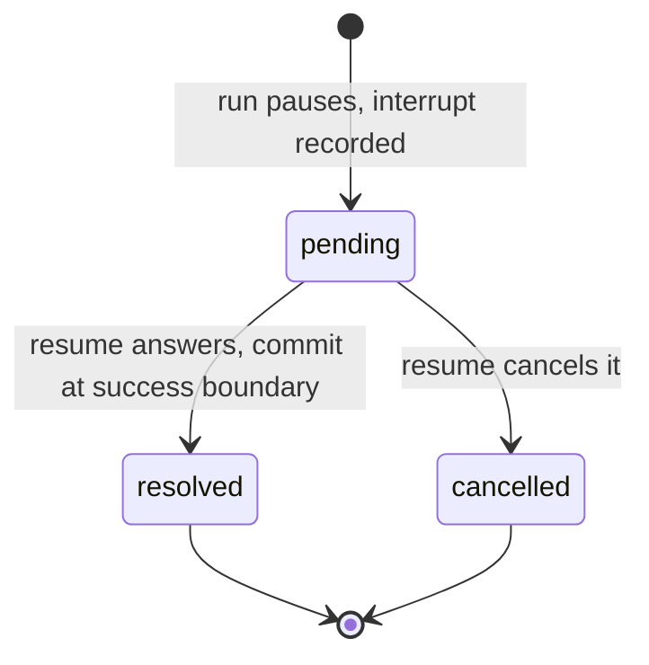

# Chat Persistence

If you need transcript + run status + approvals to survive process restart → add `withPersistence` to `chat()`.

```bash
pnpm add @tanstack/ai-persistence
npx @tanstack/intent@latest install
```

The second command wires [Agent Skills](../getting-started/agent-skills). Recipes match your DB and encode invariants (full-overwrite `saveThread`, insert-if-absent creates).

## 1. Add middleware

Point at your adapter ([Build your own adapter](./build-your-own-adapter) has a full SQLite walkthrough).

```ts group=chat-persistence
import {
  chat,
  chatParamsFromRequestBody,
  toServerSentEventsResponse,
} from '@tanstack/ai'
import { openaiText } from '@tanstack/ai-openai'
import { withPersistence } from '@tanstack/ai-persistence'
import { persistence } from './persistence'

export async function POST(request: Request) {
  const params = await chatParamsFromRequestBody(await request.json())
  const stream = chat({
    adapter: openaiText('gpt-5.5'),
    messages: params.messages,
    threadId: params.threadId,
    runId: params.runId,
    ...(params.resume ? { resume: params.resume } : {}),
    middleware: [withPersistence(persistence)],
  })
  return toServerSentEventsResponse(stream)
}
```

## 2. Pick stores (by presence, not flags)

| Store | Must / optional | Role |
| --- | --- | --- |
| `messages` | **Required** | Load/save full model-message thread |
| `runs` | Optional (required if `interrupts`) | running / interrupted / completed / failed / aborted |
| `interrupts` | Optional | Tool-approval / client-tool / generic waits |

Mutex across workers? Add `withLocks` — [Locks](../advanced/locks).

Local dev: create tables on open. Production: deploy migrations before code — [Migrations](./migrations).

## Transcript rule (authoritative history)

| Client sends | Server does |
| --- | --- |
| Non-empty `messages` | Treat as **full** conversation. On finish, **overwrite** stored thread. Send complete transcript, not a delta. |
| Empty `messages` | Load stored thread and continue. Client need not re-send history. |

## Identity

- Transcript keyed by `threadId`.
- Each execution gets a `runs` record.
- Reconnecting clients do **not** need a remembered `runId`: store resolves live run via `findActiveRun(threadId)`.

See [Id map](./id-map) and [How persistence works](./internals).

## When state is written

| Moment | Written | Best-effort? |
| --- | --- | --- |
| **Start** (`onStart`) | Pending turn (user message + prior history) | Yes — failure does not abort; finish is authoritative |
| **Interrupt** | Interrupt records, status `interrupted`, message snapshot | No |
| **Finish** (`onFinish`) | Full transcript (incl. terminal assistant `messageId`), status `completed`, commit resumes | No — transcript **before** completed |
| **Streaming** (optional) | Throttled partial text when `snapshotStreaming: true` | Yes |

```ts group=chat-persistence
const streamingMiddleware = [
  withPersistence(persistence, { snapshotStreaming: true }),
]
```

Defaults: snapshots off; `snapshotIntervalMs` default `1000`.

On **error** → `failed`. On **abort** → `aborted` with `finishedAt`. Resumes accepted in `onConfig` are **not** consumed until interrupt or finish success — failed runs leave interrupts retryable.

**Detach exception:** plain disconnect on a *detachable* run (durable event log + run store, e.g. `withSandbox` with durability) leaves status `'running'` and sets `detachedSince`. Cancel is out-of-band (`RunRecord.cancelRequested` or abort reason). See [Takeover & Detached Runs](../sandbox/takeover#detach-vs-cancel).

```mermaid
stateDiagram-v2
    [*] --> running : run starts (idempotent createOrResume)
    running --> completed : finish, transcript saved first
    running --> failed : error
    running --> aborted : abort (explicit cancel, or non-detachable)
    running --> interrupted : interrupt boundary
    running --> running : plain disconnect, DETACHABLE (detachedSince; takeover later)
    completed --> [*]
    failed --> [*]
    aborted --> [*]
    interrupted --> [*] : continuation under new runId
```



`completed` / `failed` / `aborted` are terminal. `interrupted` is parked; continuation is a new `runId`.

## Interrupts across restart

1. Run pauses → middleware records interrupt.
2. Later request **must** carry `resume` answering pending interrupts (or it is rejected) — forward `params.resume`.
3. Middleware validates batch, builds `ChatResumeToolState`, clears `config.resume` so the engine skips ephemeral reconstruction.
4. Store commits resolve/cancel only at a successful interrupt or finish boundary.



## Next

- [Client persistence](./client-persistence) — reload restores transcript + in-flight run
- [Build your own adapter](./build-your-own-adapter) — store contracts; skills via `npx @tanstack/intent@latest install`
- [Controls](./controls) — which stores to run
