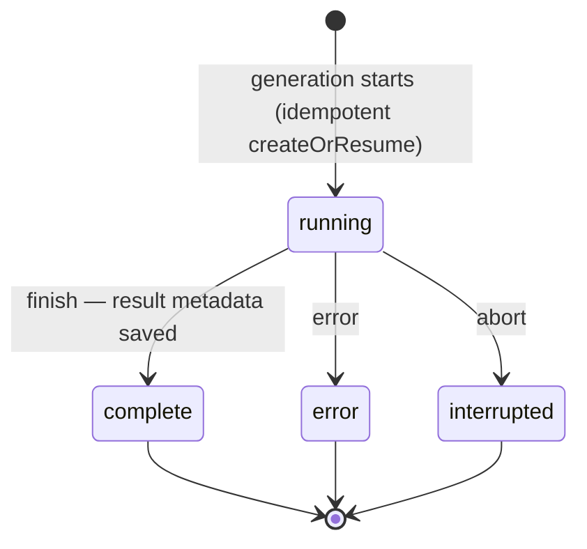
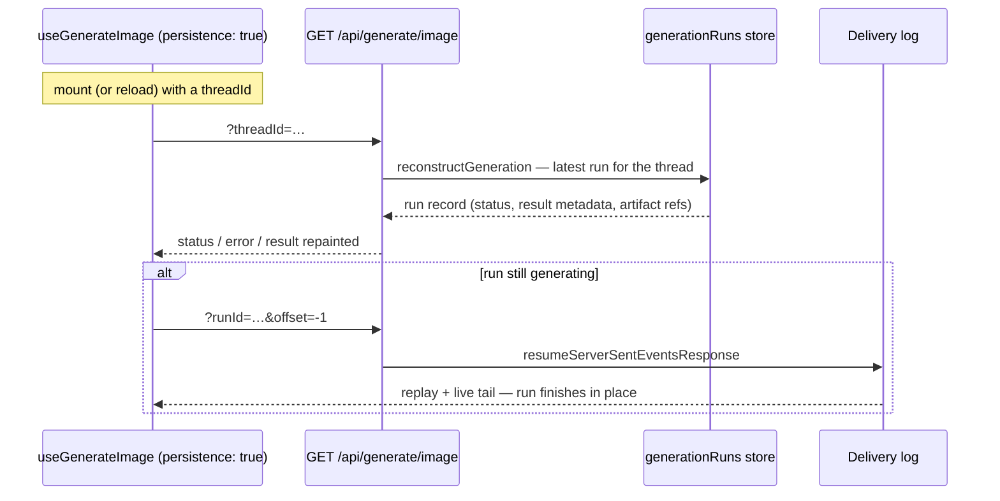

# Generation Persistence

Media generation takes time, and video can take minutes. If the user reloads the
page or their connection drops mid-run, that run is easy to lose. Generation
persistence keeps a small record of each run and restores it into the hook's
normal `status` / `result` / `error` fields, so a reload reads exactly like a
fresh run.

Reach for it when a run is long enough that a reload matters: video, batch
images, long audio, a big transcription. For a quick one-shot image you show and
forget, skip it.

## Choose a mode

Generation persistence mirrors chat's `persistence` option:

- **`persistence: true`** — server-driven. The client caches nothing; on mount
  it hydrates the last run for its `threadId` from the server.
- **`persistence: <adapter>`** (e.g. `localStoragePersistence()`) — client-driven.
  The client keeps a small snapshot in browser storage.
- **omitted / `false`** — off. The run lives in memory only; a reload starts
  empty.

Either way the server keeps a **generation job** record:
`withGenerationPersistence(persistence, { threadId })` needs a `generationRuns` store (a
`GenerationRunStore` keyed by the run's own `runId`; a generation has no conversation
of its own, so `threadId` is only an optional link). `memoryPersistence()` ships
one out of the box; see
[Build your own adapter](./build-your-own-adapter#generation--media-stores) for
your own backend.

The record never holds the generated bytes, so on its own a reload restores
`status` and `error` while `result` stays `null`. To bring the media back too,
add server byte storage: see [Keep generated files](./keep-generated-files).

The record's lifecycle is small — one status field the middleware advances:



A restored `interrupted` run surfaces to the hook as an error — an aborted
generation cannot be resumed, only re-run.

## Server-driven: `persistence: true`

One `POST` that runs the generation, and a `GET` on the same route that answers
the mount-time hydration with `reconstructGeneration`:

```ts group=generation-server-driven
import {
  generateImage,
  generationParamsFromRequest,
  memoryStream,
  resumeServerSentEventsResponse,
  toServerSentEventsResponse,
} from '@tanstack/ai'
import { openaiImage } from '@tanstack/ai-openai'
import {
  memoryPersistence,
  reconstructGeneration,
  withGenerationPersistence,
} from '@tanstack/ai-persistence'

const persistence = memoryPersistence()

export async function POST(request: Request) {
  const durability = memoryStream(request)
  const { input, threadId } = await generationParamsFromRequest('image', request)

  if (typeof input.prompt !== 'string') {
    throw new Error('This endpoint accepts text image prompts only.')
  }

  // Persistence requires the scope, so a request without one cannot be served:
  // the run would be filed nowhere the client could hydrate from.
  if (threadId === undefined) {
    return new Response('`threadId` is required', { status: 400 })
  }

  const stream = generateImage({
    adapter: openaiImage('gpt-image-2'),
    prompt: input.prompt,
    // The same scope the GET below finds the last run for.
    threadId,
    stream: true,
    // `artifactUrl` makes the restored media render from your own origin. It is
    // optional — see Keep generated files for the serve route it points at.
    middleware: [
      withGenerationPersistence(persistence, {
        threadId,
        artifactUrl: (ref) => `/api/generate/image/artifact?id=${ref.artifactId}`,
      }),
    ],
  })

  return toServerSentEventsResponse(stream, {
    durability: { adapter: durability },
  })
}

export function GET(request: Request): Response | Promise<Response> {
  const durability = memoryStream(request)
  // A reconnecting client carries a resume cursor; replay the live stream.
  if (durability.resumeFrom() !== null) {
    return resumeServerSentEventsResponse({ adapter: durability })
  }
  // Otherwise this is the mount-time hydration (?threadId). In multi-user apps
  // pass reconstructGeneration's `authorize` option so a guessed threadId can't
  // read another user's generation.
  return reconstructGeneration(persistence, request)
}
```

On the client, pass a connection, a stable `threadId`, and `persistence: true`.
The hook is transparent: a reload repaints the last run into the same fields a
fresh run uses, the way `useChat` restores into `messages`:

```tsx
import { fetchServerSentEvents, useGenerateImage } from '@tanstack/ai-react'

const connection = fetchServerSentEvents('/api/generate/image')

export function HeroImageGenerator({ threadId }: { threadId: string }) {
  const image = useGenerateImage({
    id: 'hero-image',
    threadId,
    connection,
    persistence: true,
  })

  return (
    <section>
      <button
        type="button"
        disabled={image.isLoading}
        onClick={() =>
          void image.generate({ prompt: 'A glass cabin in a pine forest' })
        }
      >
        Generate
      </button>

      {image.status === 'success' ? (
        <p>Last run finished{image.result?.id ? ` (${image.result.id})` : ''}.</p>
      ) : null}
      {image.error ? <p>Last run failed: {image.error.message}</p> : null}
      {image.result?.images.map((img, index) =>
        img.url ?  : null,
      )}
    </section>
  )
}
```

Because the server stamps a durable `artifactUrl`, the restored
`image.result.images[i].url` serves from your own origin, so the image renders
after a reload just as it did live. You never fetch or seed anything: the thread
id is the stable key, and a reload or the same thread on another device follow
the identical path.

If a run is **still generating** when the connection drops or the page reloads,
the client re-attaches to it and finishes it in place, exactly like `useChat`.
The `durability` adapter on `toServerSentEventsResponse` plus the `GET` resume
branch above are all it needs: on mount `reconstructGeneration` reports the live
run and the client tails it through the durability log. In production, swap
`memoryStream` for `durableStream` from `@tanstack/ai-durable-stream`, where
requests span processes. See [Resumable Streams](../resumable-streams/overview).



## Server functions / direct

The HTTP adapters above implement hydration and rejoin for you. With
[TanStack Start](https://tanstack.com/start) server functions (or any direct,
in-process call) there is no `GET` route to hang them on, so you supply the
two handlers yourself — one for mount-time hydration, one for replaying an
in-flight run — and pass them as options alongside the `fetcher` (or to
`stream()` / `rpcStream()`).

Three server functions cover it: one runs the generation, one answers
hydration with `getGenerationHydration`, and one replays the run's durability
log with `replayRunStream`:

```ts group=generation-server-functions
// server/image.ts
import { createServerFn } from '@tanstack/react-start'
import {
  generateImage,
  memoryStream,
  replayRunStream,
  toServerSentEventsResponse,
} from '@tanstack/ai'
import { openaiImage } from '@tanstack/ai-openai'
import {
  getGenerationHydration,
  memoryPersistence,
  withGenerationPersistence,
} from '@tanstack/ai-persistence'
import type { ImageGenerateInput } from '@tanstack/ai-client'

const persistence = memoryPersistence()

export const generateImageFn = createServerFn({ method: 'POST' })
  .inputValidator((data: ImageGenerateInput & { threadId: string }) => data)
  .handler(({ data: { threadId, ...input } }) => {
    if (typeof input.prompt !== 'string') {
      throw new Error('This endpoint accepts text image prompts only.')
    }
    // One run id for both the durability log and the run record, so the
    // rejoin below replays exactly the run hydration reports.
    const runId = crypto.randomUUID()
    const stream = generateImage({
      adapter: openaiImage('gpt-image-2'),
      prompt: input.prompt,
      threadId,
      runId,
      stream: true,
      // `artifactUrl` is optional — see Keep generated files.
      middleware: [
        withGenerationPersistence(persistence, {
          threadId,
          artifactUrl: (ref) => `/api/generate/image/artifact?id=${ref.artifactId}`,
        }),
      ],
    })
    return toServerSentEventsResponse(stream, {
      durability: { adapter: memoryStream({ runId }) },
    })
  })

export const getImageHydrationFn = createServerFn({ method: 'GET' })
  .inputValidator((threadId: string) => threadId)
  .handler(async ({ data: threadId }) => {
    // `getGenerationHydration` does no auth — gate on your session here, the
    // way you would pass `authorize` to `reconstructGeneration`. The hydration
    // crosses the wire as JSON, so return it in a `Response`.
    return Response.json(await getGenerationHydration(persistence, threadId))
  })

export const joinImageRunFn = createServerFn({ method: 'GET' })
  .inputValidator((runId: string) => runId)
  .handler(({ data: runId }) => replayRunStream(memoryStream({ runId })))
```

On the client, pass the two handlers next to the `fetcher`. A reload now
hydrates the last run through `getImageHydrationFn`, and a run still
generating is tailed to completion through `joinImageRunFn`:

```tsx
import { useGenerateImage } from '@tanstack/ai-react'
import {
  generateImageFn,
  getImageHydrationFn,
  joinImageRunFn,
} from './server/image'

export function HeroImageGenerator({ threadId }: { threadId: string }) {
  const image = useGenerateImage({
    id: 'hero-image',
    threadId,
    fetcher: (input) => generateImageFn({ data: { ...input, threadId } }),
    hydrateGeneration: async (id) =>
      (await getImageHydrationFn({ data: id })).json(),
    joinRun: async function* (runId, signal) {
      yield* await joinImageRunFn({ data: runId, signal })
    },
    persistence: true,
  })
  // The render is identical to the server-driven example above.
  return <p>{image.status}</p>
}
```

A restored run that was still generating but has **no** `joinRun` handler to
tail it surfaces as an interrupted error — it cannot be resumed, only re-run —
instead of hanging on `generating` forever.

The same handlers fit the lightweight connection adapters directly —
`stream(factory, { hydrateGeneration, joinRun })` and
`rpcStream(call, { hydrateGeneration, joinRun })` — for in-process or RPC
transports; they also accept a chat `hydrate` handler for `useChat`'s
server-driven persistence.

## Client-driven: a storage adapter

Pass a storage adapter instead, and give the hook a stable `id`. The client
writes the snapshot to browser storage as the run streams and reads it back on
mount, with no server `GET` for hydration. Everything else about the hook is the
same as above:

```tsx
import { localStoragePersistence } from '@tanstack/ai-client'
import { fetchServerSentEvents, useGenerateImage } from '@tanstack/ai-react'

// A bare call is all it takes, no type argument.
const snapshots = localStoragePersistence({ keyPrefix: 'my-app:' })

function HeroImageGenerator() {
  const image = useGenerateImage({
    // The scope this generation fills. Required by `persistence`, and the key
    // the snapshot is stored under — so keep it stable across reloads.
    threadId: 'hero-image',
    connection: fetchServerSentEvents('/api/generate/image'),
    persistence: snapshots,
  })
  // The render is identical to the server-driven example above.
  return <p>{image.status}</p>
}
```

Two things to keep in mind:

- **The hook is transparent.** After a reload it repaints `status`
  (`'idle'` / `'generating'` / `'success'` / `'error'`), `error`, and `result`
  just like a live run.
- **`result` needs byte storage to come back.** A browser snapshot never holds
  the bytes, so on its own a reload restores `status` and `error` while `result`
  stays `null`. Add server byte storage and `artifactUrl`
  ([Keep generated files](./keep-generated-files)) and the restored `result` is
  rebuilt, its media served from your own origin.

## Going further

- [Keep generated files](./keep-generated-files): store the generated bytes so
  the media itself survives, not just the record.
