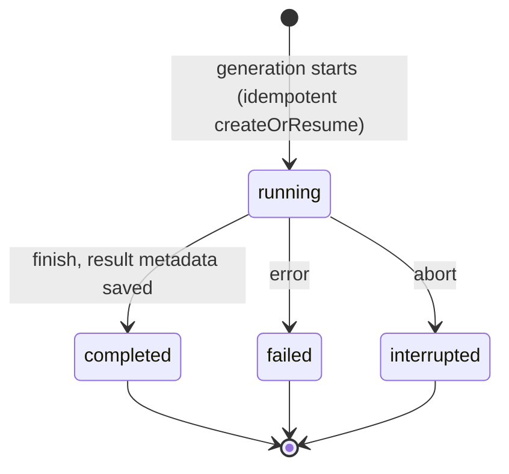
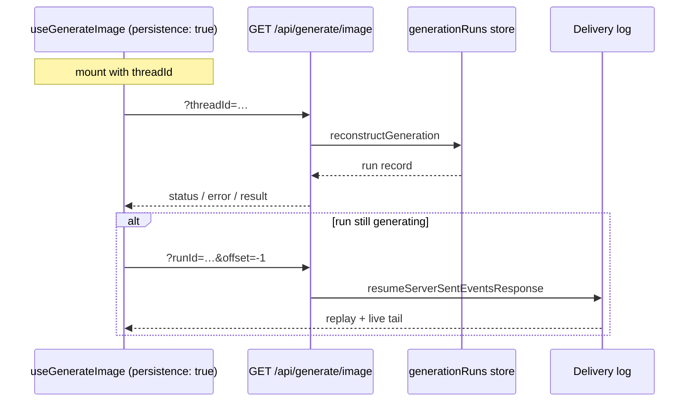

# Generation Persistence

If you need video/batch image/long audio to survive reload → `persistence: true` + `withGenerationPersistence`. Skip for one-shot images you show and forget.

## Identity: `threadId` is a slot

Not a conversation — a stable name for successive jobs (`product-7-hero`, `video-9-start-frame`). Each job has its own `runId`; restore returns the **newest** job in the slot.

Pass the same `threadId` to the hook and the activity. Middleware reads it off the activity — do not repeat it on the middleware options. [Id map](./id-map).

## Turn it on

| Value | Behavior |
| --- | --- |
| `persistence: true` | Server record; mount hydrates last run for `threadId` |
| omit / `false` | Memory only |

**Must:** `generationRuns` store (`GenerationRunStore` keyed by `runId`, `threadId` as slot). `memoryPersistence()` includes one. Own backend: [Build a generation adapter](./build-your-own-generation-adapter).

Browser caches nothing. Record holds metadata only — without byte storage, reload restores `status`/`error` while `result` stays `null`. Media bytes → [Keep generated files](./keep-generated-files).



Restored `interrupted` surfaces as error on the hook. Aborted generation cannot resume — re-run only.

## Wire the HTTP route

**Must:** `POST` (generate) + `GET` (hydrate / resume). Reject missing `threadId`.

```ts group=generation-server-driven
import {
  generateImage,
  generationParamsFromRequest,
  memoryStream,
  resumeServerSentEventsResponse,
  toServerSentEventsResponse,
} from '@tanstack/ai'
import { openaiImage } from '@tanstack/ai-openai'
import {
  memoryPersistence,
  reconstructGeneration,
  withGenerationPersistence,
} from '@tanstack/ai-persistence'

const persistence = memoryPersistence()

export async function POST(request: Request) {
  const durability = memoryStream(request)
  const { input, threadId } = await generationParamsFromRequest('image', request)

  if (typeof input.prompt !== 'string') {
    throw new Error('This endpoint accepts text image prompts only.')
  }
  if (threadId === undefined) {
    return new Response('`threadId` is required', { status: 400 })
  }

  const stream = generateImage({
    adapter: openaiImage('gpt-image-2'),
    prompt: input.prompt,
    threadId,
    stream: true,
    middleware: [
      withGenerationPersistence(persistence, {
        artifactUrl: (ref) => `/api/generate/image/artifact?id=${ref.artifactId}`,
      }),
    ],
  })

  return toServerSentEventsResponse(stream, {
    durability: { adapter: durability },
  })
}

export function GET(request: Request): Response | Promise<Response> {
  const durability = memoryStream(request)
  if (durability.resumeFrom() !== null) {
    return resumeServerSentEventsResponse({ adapter: durability })
  }
  // Multi-user: pass authorize so a guessed threadId cannot read others.
  return reconstructGeneration(persistence, request)
}
```

**Client:**

```tsx
import { fetchServerSentEvents, useGenerateImage } from '@tanstack/ai-react'

const connection = fetchServerSentEvents('/api/generate/image')

export function HeroImageGenerator({ threadId }: { threadId: string }) {
  const image = useGenerateImage({
    threadId,
    connection,
    persistence: true,
  })

  return (
    <section>
      <button
        type="button"
        disabled={image.isLoading}
        onClick={() =>
          void image.generate({ prompt: 'A glass cabin in a pine forest' })
        }
      >
        Generate
      </button>
      {image.status === 'success' ? (
        <p>Last run finished{image.result?.id ? ` (${image.result.id})` : ''}.</p>
      ) : null}
      {image.error ? <p>Last run failed: {image.error.message}</p> : null}
      {image.result?.images.map((img, index) =>
        img.url ?  : null,
      )}
    </section>
  )
}
```

With `artifactUrl`, restored `image.result.images[i].url` serves from your origin. In-flight rejoin uses durability on `POST` + `GET` resume branch. Production multi-process: swap `memoryStream` for `durableStream` from `@tanstack/ai-durable-stream` — [Resumable Streams](../resumable-streams/overview).



## Server functions / direct (no GET route)

Supply two handlers next to the fetcher: mount hydration + in-flight replay.

```ts group=generation-server-functions
// server/image.ts
import { createServerFn } from '@tanstack/react-start'
import { z } from 'zod'
import {
  generateImage,
  memoryStream,
  replayRunStream,
  toServerSentEventsResponse,
} from '@tanstack/ai'
import { openaiImage } from '@tanstack/ai-openai'
import {
  getGenerationHydration,
  memoryPersistence,
  withGenerationPersistence,
} from '@tanstack/ai-persistence'
import type { ImageGenerateInput } from '@tanstack/ai-client'

const persistence = memoryPersistence()

export const generateImageFn = createServerFn({ method: 'POST' })
  .inputValidator((data: ImageGenerateInput & { threadId: string }) => data)
  .handler(({ data: { threadId, ...input } }) => {
    if (typeof input.prompt !== 'string') {
      throw new Error('This endpoint accepts text image prompts only.')
    }
    const runId = crypto.randomUUID()
    const stream = generateImage({
      adapter: openaiImage('gpt-image-2'),
      prompt: input.prompt,
      threadId,
      runId,
      stream: true,
      middleware: [
        withGenerationPersistence(persistence, {
          artifactUrl: (ref) => `/api/generate/image/artifact?id=${ref.artifactId}`,
        }),
      ],
    })
    return toServerSentEventsResponse(stream, {
      durability: { adapter: memoryStream({ runId }) },
    })
  })

const hydrationSchema = z.object({
  resumeSnapshot: z
    .object({
      schemaVersion: z.literal(1),
      resumeState: z
        .object({ threadId: z.string(), runId: z.string() })
        .nullable(),
      status: z.enum(['idle', 'running', 'complete', 'error']),
      result: z.record(z.string(), z.any()).optional(),
      error: z
        .object({ message: z.string(), code: z.string().optional() })
        .optional(),
      activity: z.string().optional(),
    })
    .nullable(),
  activeRun: z.object({ runId: z.string() }).nullable(),
})

export const getImageHydrationFn = createServerFn({ method: 'GET' })
  .inputValidator(z.string().min(1))
  .handler(async ({ data: threadId }) => {
    // Gate on session — getGenerationHydration does no auth.
    return hydrationSchema.parse(
      await getGenerationHydration(persistence, threadId),
    )
  })

export const joinImageRunFn = createServerFn({ method: 'GET' })
  .inputValidator(z.string().min(1))
  .handler(({ data: runId }) =>
    toServerSentEventsResponse(replayRunStream(memoryStream({ runId }))),
  )
```

**Client** — decode SSE yourself for `joinRun`:

```tsx
import { useGenerateImage } from '@tanstack/ai-react'
import type { StreamChunk } from '@tanstack/ai'
import {
  generateImageFn,
  getImageHydrationFn,
  joinImageRunFn,
} from './server/image'

async function* chunksFromSseResponse(
  response: Response,
  signal?: AbortSignal,
): AsyncGenerator<StreamChunk> {
  if (!response.ok) throw new Error(`Join failed: ${response.status}`)
  const reader = response.body?.getReader()
  if (!reader) return
  const decoder = new TextDecoder()
  let buffer = ''
  try {
    while (!signal?.aborted) {
      const { done, value } = await reader.read()
      if (done) break
      buffer += decoder.decode(value, { stream: true })
      const lines = buffer.split('\n')
      buffer = lines.pop() ?? ''
      for (const line of lines) {
        if (!line.startsWith('data:')) continue
        const data = line.slice(5).trimStart()
        if (data) yield JSON.parse(data)
      }
    }
  } finally {
    reader.releaseLock()
  }
}

export function HeroImageGenerator({ threadId }: { threadId: string }) {
  const image = useGenerateImage({
    threadId,
    fetcher: (input) => generateImageFn({ data: { ...input, threadId } }),
    hydrateGeneration: (id) => getImageHydrationFn({ data: id }),
    joinRun: async function* (runId, signal) {
      const response = await joinImageRunFn({ data: runId })
      if (!(response instanceof Response)) {
        throw new Error('joinImageRunFn should return an SSE Response')
      }
      yield* chunksFromSseResponse(response, signal)
    },
    persistence: true,
  })
  return <p>{image.status}</p>
}
```

Non-streaming fetcher: only `hydrateGeneration` (no `joinRun`). Still-generating run without `joinRun` → interrupted error, not hung `generating`.

Same options work on `stream(factory, { hydrateGeneration, joinRun })` and `rpcStream(call, { … })`.

## What reload restores

1. Hook repaints `status` / `error` / `result` like a live run — no snapshot field to render yourself.
2. `result` needs [byte storage + `artifactUrl`](./keep-generated-files) or stays `null`.

## Non-streaming video (two calls)

`generateVideo({ stream: true })` is one run — ignore this section.

Without `stream: true`, create then poll. Same `threadId` + middleware on both. `jobId` correlates the run (id derived from it):

```ts
import { generateVideo, getVideoJobStatus } from '@tanstack/ai'
import {
  memoryPersistence,
  withGenerationPersistence,
} from '@tanstack/ai-persistence'
import { openaiVideo } from '@tanstack/ai-openai'

const persistence = memoryPersistence()
const adapter = openaiVideo('sora-2')
const middleware = [withGenerationPersistence(persistence)]
const threadId = 'product-7-launch-clip'

const { jobId } = await generateVideo({
  adapter,
  prompt: 'A cat chasing a dog in a sunny park',
  threadId,
  middleware,
})

const status = await getVideoJobStatus({ adapter, jobId, threadId, middleware })
```

Until a poll sees a terminal job state, record stays `running`. Failed submit → terminal `error` run.

## Next

- [Keep generated files](./keep-generated-files) — store/serve media bytes
