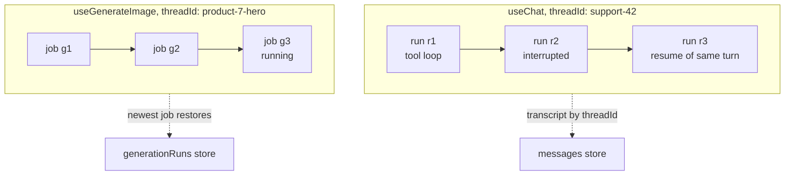

# Id Map

If restore looks broken → check `threadId` first. Persistence keys on it, not `runId`.

| Id | Names | Lifetime | You provide |
| --- | --- | --- | --- |
| `threadId` | conversation or generation slot | as long as the string stays stable | yes, from your domain |
| `runId` | one execution | minted at start, dead when it ends | no |

```tsx
import {
  fetchServerSentEvents,
  useChat,
  useGenerateImage,
} from '@tanstack/ai-react'

export function ProductPage({ productId }: { productId: string }) {
  const support = useChat({
    threadId: `support-${productId}`,
    connection: fetchServerSentEvents('/api/chat'),
    persistence: true,
  })

  const hero = useGenerateImage({
    threadId: `product-${productId}-hero`,
    connection: fetchServerSentEvents('/api/generate/image'),
    persistence: true,
  })

  return (
    <p>
      chat run {support.runId ?? 'none'}, image job {hero.runId ?? 'none'}
    </p>
  )
}
```

## `threadId`

Records write and load **by** `threadId`. Different string after reload → empty.

### Chat: conversation

All runs append to one transcript under the thread id. User sees conversation, not runs.

### Generation: slot

Each job is one result. Restore = **most recent** job for that slot (status, error, result metadata). Retries stay in the same slot.

| On screen | Good `threadId` |
| --- | --- |
| Product hero image | `product-${productId}-hero` |
| Video start frame | `video-${videoId}-start-frame` |
| Chapter voice-over | `chapter-${chapterId}-narration` |
| Upload transcription | `upload-${uploadId}-transcript` |
| Support conversation | `chat-${conversationId}` |

**Must:**

1. Different UI things → different ids (hero + thumbnail must not share a slot).
2. Same thing forever → same id (regenerate = new job, same slot).

## `runId`

One `RUN_STARTED` → `RUN_FINISHED`. Hooks report in-flight id or `null`.

### Chat: one turn (not one message)

- Whole [agentic tool loop](../chat/agentic-cycle) = one `runId`.
- One user message can span several runs: [interrupt](../interrupts/overview) ends a run; resume continues under a **new** `runId`. While paused, `runId` is `null`.
- `useChat().runId` = "what this client is running now", never "which message".



### Generation: the job

One `generate(...)` = one `runId`. Use it for server cancel — `stop()` only aborts the local stream:

```tsx
import { fetchServerSentEvents, useGenerateVideo } from '@tanstack/ai-react'

export function VideoPanel({ videoId }: { videoId: string }) {
  const video = useGenerateVideo({
    threadId: `video-${videoId}-clip`,
    connection: fetchServerSentEvents('/api/generate/video'),
    persistence: true,
  })

  async function cancel() {
    if (video.runId) {
      await fetch(`/api/generate/video/cancel?runId=${video.runId}`, {
        method: 'POST',
      })
    }
    video.stop()
  }

  return (
    <button type="button" onClick={() => void cancel()} disabled={!video.runId}>
      Cancel
    </button>
  )
}
```

Durability logs key by `runId` too — use it in server logs when chasing one execution.

## Why restore keys on the thread

Reloaded page does not know last `runId`. It knows `threadId` (product id, route param). Store answers: transcript + live run if any; then client tails that run's delivery log. See [Threads and runs](../chat/streaming#threads-and-runs), [Resumable streams](../resumable-streams/overview).

## Same string on both sides

Client hook `threadId` and server activity `threadId` must match exactly. Generation middleware reads activity `threadId` — nothing to pass on `withGenerationPersistence`:

```ts
import {
  generateImage,
  generationParamsFromRequest,
  toServerSentEventsResponse,
} from '@tanstack/ai'
import { openaiImage } from '@tanstack/ai-openai'
import {
  memoryPersistence,
  withGenerationPersistence,
} from '@tanstack/ai-persistence'

const persistence = memoryPersistence()

export async function POST(request: Request) {
  const { input, threadId } = await generationParamsFromRequest('image', request)

  if (threadId === undefined) {
    return new Response('`threadId` is required', { status: 400 })
  }
  if (typeof input.prompt !== 'string') {
    throw new Error('This endpoint accepts text image prompts only.')
  }

  const stream = generateImage({
    adapter: openaiImage('gpt-image-2'),
    prompt: input.prompt,
    threadId,
    stream: true,
    middleware: [withGenerationPersistence(persistence)],
  })

  return toServerSentEventsResponse(stream)
}
```

Client sends `threadId` on the wire. Chat: same with `useChat` → `chatParamsFromRequest` → `withPersistence`. [Chat persistence](./chat-persistence), [Generation persistence](./generation-persistence).

## When you can skip `threadId`

Without persistence: optional (hooks mint a protocol id). With `persistence`: **required** on hook and activity. `withGenerationPersistence` throws if neither activity nor middleware `threadId` override supplies one.

## Restore does nothing — checklist

1. **Thread id changed** — `crypto.randomUUID()` / `useId()` in the string → new key every mount. Log both sides.
2. **Client ≠ server** — strings must match exactly.
3. **Keyed on run id** — restore starts from thread only.
4. **Byte storage off** (generation) — `status`/`error` return, `result` null → [Keep generated files](./keep-generated-files).
