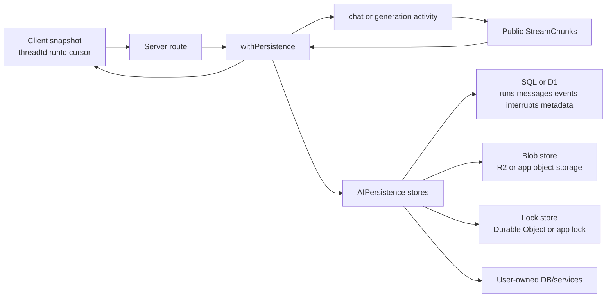
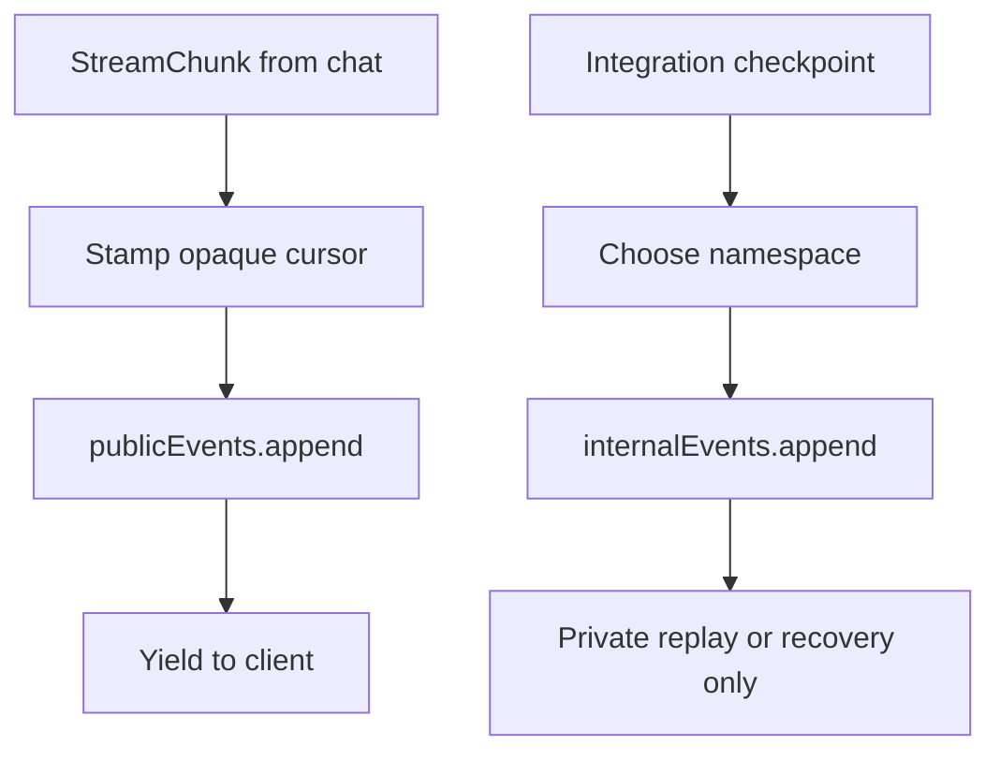
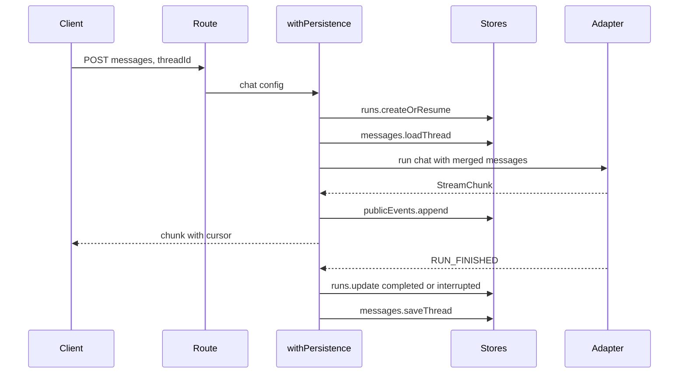
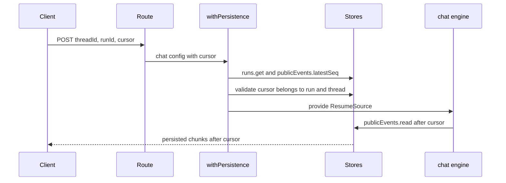
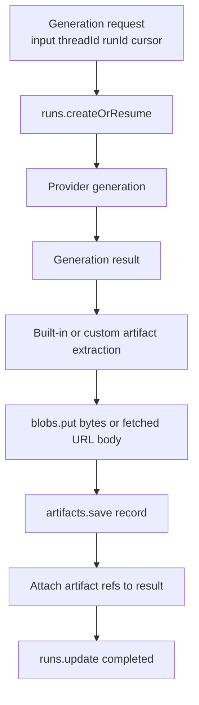
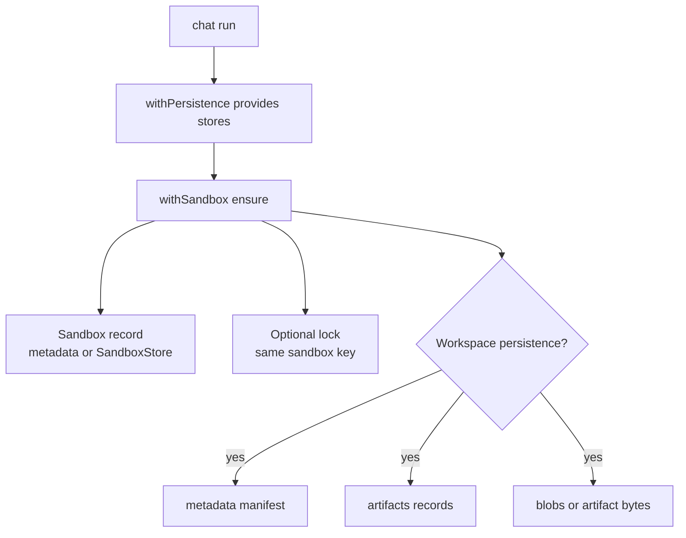
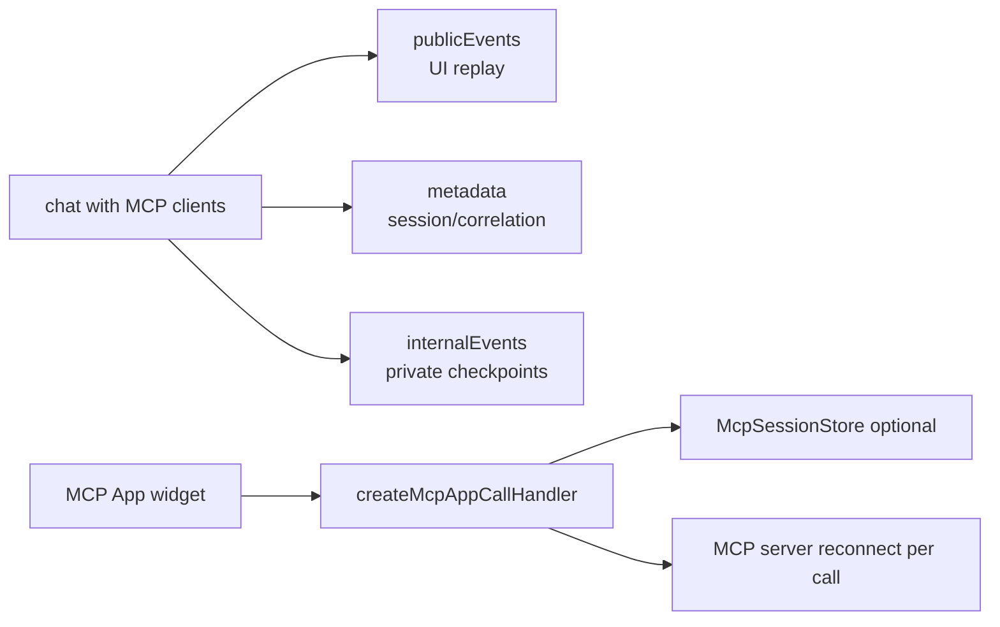
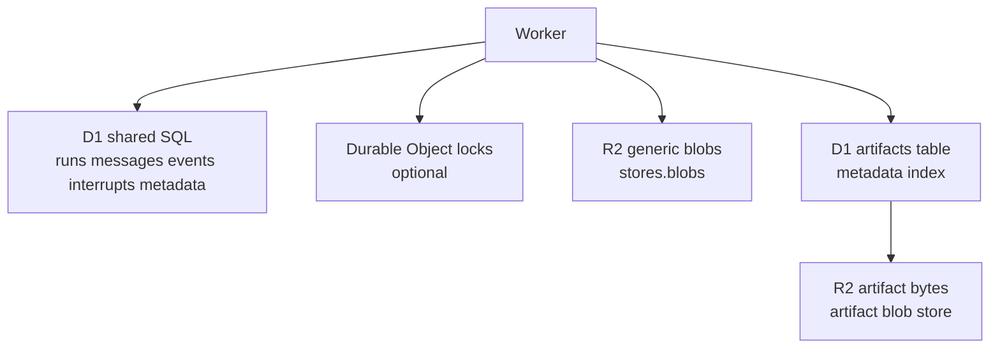

Persistence internals are for backend builders, custom store authors,
infrastructure owners, and integration authors who need to reason about the
durable boundary behind `withPersistence(...)`.

Use the journey pages first when you are wiring a product flow:
[Chat Persistence](./chat-persistence), [Generation Persistence](./generation-persistence),
[Sandbox Persistence](./sandbox-persistence), and [MCP Persistence](./mcp-persistence).
This page explains the store contracts, event logs, resume semantics, and
storage layouts those guides build on.

## Boundary model

`AIPersistence` is the stable persistence boundary. SQL tables, D1 rows, R2
objects, and object-store prefixes are backend implementation details. Custom
stores should implement the `AIPersistence.stores` methods directly and keep
app-specific schema, queues, and retention rules behind that boundary.

There is no separate high-level callback builder. Implement the store methods
and pass them under `stores`.

## Store contracts

Implement the smallest store set your feature needs. Methods are asynchronous,
and missing records generally return `null` or an empty collection rather than
throwing.

| Store | Methods | Expected behavior | Used by |
| --- | --- | --- | --- |
| `messages` | `loadThread(threadId)`, `saveThread(threadId, messages)` | Load returns the server-owned `ModelMessage[]` for the thread or `[]`. Save replaces the durable thread transcript. | Server-authoritative chat history. |
| `runs` | `createOrResume(input)`, `update(runId, patch)`, `get(runId)` | Create returns an existing run when present, otherwise creates a run with status, thread id, and timestamps. Update patches terminal status, error, finish time, or usage. Get returns `RunRecord | null`. | Durable replay, interrupts, generation run status. |
| `publicEvents` | `append({ runId, expectedSeq, event })`, `read(runId, opts)`, `hasRun(runId)`, `latestSeq(runId)` | Append writes the next per-run public event only when `expectedSeq` matches the latest persisted sequence and returns the persisted event plus an opaque cursor. Read yields ordered public events after an optional sequence. | Chat reconnect replay and interrupt surface events. |
| `internalEvents` | `append({ runId, expectedSeq, namespace, type, payload })`, `read(runId, opts)`, `latestSeq(runId, namespace?)` | Append writes the next event for a run and namespace. Read can filter by namespace and sequence. Ordering is per namespace. | Private integration checkpoints, workflow state, MCP checkpoints. |
| `interrupts` | `create`, `resolve`, `cancel`, `get`, `list`, `listPending`, `listByRun`, `listPendingByRun` | Create records a pending wait. Resolve/cancel marks the decision terminal and may store a response. List methods return thread/run scoped records. | Tool approvals, client-tool waits, human decisions. |
| `metadata` | `get(scope, key)`, `set(scope, key, value)`, `delete(scope, key)` | Scoped durable key/value storage. Get returns `unknown | null`; value shape is owned by the app or integration. | MCP session correlation, sandbox records, workspace manifests, app-owned pointers. |
| `locks` | `withLock(key, fn)` | Runs a critical section under a named lock and returns the callback result. In-memory locks are single-process only; distributed deployments need a durable lock. | Sandbox ensure, workspace checkpoints, cross-worker coordination. |
| `artifacts` | `save(record)`, `get(artifactId)`, `list(runId)`, optional `delete`, optional `deleteForRun` | Stores artifact metadata keyed by artifact id and run id. `get` may hydrate bytes when the backend stores them with the artifact. | Generation outputs, sandbox workspace files, durable app files. |
| `blobs` | `put`, `get`, `head`, `delete`, `list` | Raw byte/object storage by logical key. List may return a cursor and truncation flag. | Artifact bytes and app-owned object storage. |

Feature validation maps directly to these stores:

| Feature | Required stores |
| --- | --- |
| `messages` | `messages` |
| `durable-replay` | `runs`, `publicEvents` |
| `interrupts` | `runs`, `publicEvents`, `interrupts` |
| `internal-events` | `internalEvents` |
| `metadata` | `metadata` |
| `locks` | `locks` |
| `artifacts` | `artifacts` |
| `blobs` | `blobs` |

When artifact persistence is enabled for generation, `artifacts` and `blobs`
must be present together.

## Event model

Public events are user-visible `StreamChunk` values. They are the AG-UI stream:
`RUN_STARTED`, message and tool chunks, `MESSAGES_SNAPSHOT`, `CUSTOM`, terminal
`RUN_FINISHED`, and error chunks. `withPersistence(...)` stamps a cursor onto
each chat chunk before appending it to `publicEvents`.

Internal events are private checkpoints. They are not replayed to the UI and
should be namespaced by the owner, such as `mcp`, `workflow`, or an app-specific
name. Use `latestSeq(runId, namespace)` and pass the current latest sequence as
`expectedSeq` when appending the next internal event.

Cursors are opaque. Clients store and echo them back; they should not parse,
sort, increment, or derive database offsets from them. Backends may encode a
sequence internally, but the public contract is the cursor string.

## Chat timeline

On the first chat run, persistence creates or resumes the run, optionally loads
stored thread history, appends public chunks as they stream, and saves the final
thread transcript on normal completion. If the terminal event has
`RUN_FINISHED.outcome.type === 'interrupt'`, `withPersistence(...)` creates
pending interrupt records, updates the run to `interrupted`, and saves the
thread at the interrupt boundary.

Resume requires the same `threadId`, the same `runId`, and the last observed
opaque `cursor`. `withPersistence(...)` validates that the run exists, that it
belongs to the requested thread, and that the cursor references a persisted
public event before the chat engine reads from the resume source provided during
setup. The resume source then reads ordered public events after the validated
cursor.

## Generation timeline

Generation activities use persistence differently from chat.

`withPersistence(...)` creates or resumes a run for generation and updates run
status on finish, error, or abort. When artifact persistence is enabled, it
extracts built-in artifacts or calls `extractArtifacts`, writes bytes through
`blobs.put`, saves an `ArtifactRecord`, and attaches lightweight persisted refs
to the result.

Generation stream events are not persisted to `publicEvents` by
`withPersistence(...)` today. A generation hook can replay what the server has
durably produced only when your endpoint keeps enough state to replay or tail
the producer. Durable continuation therefore needs a lightweight client
snapshot plus durable producer/replay/result state owned by your app or
backend. Artifact stores persist generated bytes and refs; they do not by
themselves keep a canceled provider request running.

## Sandbox timeline

Sandbox persistence combines chat replay with sandbox-specific records.

`withSandbox(...)` prefers an explicit `SandboxStore` capability. If none is
provided and `withPersistence(...)` exposes `metadata`, sandbox records are
stored under persistence metadata. The record maps the computed sandbox key to
provider, provider sandbox id, thread id, latest run id, and optional snapshot
id.

Workspace persistence uses `metadata` for the manifest, `artifacts` for file
records, and artifact bytes or `blobs` depending on the backend. It may use
`locks` to serialize checkpoint updates. To resume a sandbox across processes,
you need durable metadata records and a provider/harness that can reattach to
the sandbox. To restore files when the filesystem is gone, you also need durable
artifact/file storage.

## MCP timeline

MCP persistence has two layers:

- Managed MCP tools inside `chat()` use the normal chat stores for thread
  messages, run status, public replay, and optional internal checkpoints.
- MCP Apps can additionally use `McpSessionStore` to resolve reconnectable MCP
  server descriptors for widget tool calls.

Use `metadata` for app-owned current lookup state such as server ids, session
ids, OAuth account ids, or resource versions. Use `internalEvents` for private
tool-call checkpoints that should not replay to the user. Use
`McpSessionStore` when interactive MCP Apps need stateful transport resolution;
the in-memory implementation is single-instance, and durable SQL or KV
implementations can satisfy the same interface.

## SQL schema map

The shared SQL schema backs SQLite, Postgres, Prisma, Drizzle, and the D1 core
tables used by Cloudflare persistence.

| Table | Store | Key columns | Notes |
| --- | --- | --- | --- |
| `runs` | `runs` | `run_id` primary key, `thread_id`, `status` | Stores lifecycle timestamps, error text, and usage JSON. |
| `messages` | `messages` | `thread_id` primary key | Stores the server-owned serialized `ModelMessage[]`. |
| `public_events` | `publicEvents` | primary key `(run_id, seq)` | Stores serialized public `StreamChunk` values. There is no `cursor` column by design; cursors are returned by the store contract. |
| `internal_events` | `internalEvents` | primary key `(run_id, namespace, seq)` | Stores namespaced private events. Ordering is per namespace. |
| `interrupts` | `interrupts` | `interrupt_id` primary key | Stores pending, resolved, or cancelled human/client waits with payload and optional response. |
| `metadata` | `metadata` | primary key `(scope, key)` | Stores scoped JSON values owned by apps and integrations. |
| `_tanstack_ai_migrations` | migration runner | `version` primary key | Migration bookkeeping only. Plain `ddl(...)` output does not emit this table; lazy migration creates it when `migrate: true` runs. |

The SQL DDL stores JSON as text for portability. `public_events` and
`internal_events` rely on append compare-and-swap with `expectedSeq`. If another
writer has advanced the same run or namespace, append should fail with a
conflict rather than silently create a forked event stream.

## Cloudflare storage map

Cloudflare persistence uses D1 for the shared SQL stores. When `r2` is passed,
it adds a generic R2-backed `blobs` store and a D1-indexed `artifacts` store
that can also write byte bodies to R2 for direct artifact saves. When
`durableObjects` is passed, it adds a Durable Object-backed `locks` store.

The Cloudflare artifact DDL creates:

| Table or object family | Purpose |
| --- | --- |
| `artifacts` D1 table | Artifact metadata and run index: `artifact_id`, `run_id`, `thread_id`, `name`, `mime_type`, `size`, `external_url`, `blob_key`, `created_at`, `updated_at`. |
| R2 artifact bytes | Byte bodies written by direct `ArtifactStore.save({ bytes })` calls and referenced by `artifacts.blob_key`. |
| R2 generic blobs | Logical `BlobStore` objects for app-owned keys and generated artifact bytes written before saving `ArtifactRecord` metadata. |
| Durable Object storage | One lock holder per object instance. |

`artifacts.updated_at` is row bookkeeping. It is not exposed as
`ArtifactRecord.updatedAt`; `ArtifactRecord` exposes `createdAt` plus optional
bytes or external URL. D1/R2 artifact deletion is not atomic: deleting an
artifact or a run deletes R2 objects and D1 rows in separate operations, so
cleanup can be best-effort under partial failure.

Generation artifact persistence writes bytes through `stores.blobs` first, then
saves an `ArtifactRecord` without inline bytes. Generated artifact refs
therefore point to blob records and do not depend on `artifacts.blob_key` being
populated. Direct app calls to `stores.artifacts.save({ bytes })` can still use
the artifact store byte path and populate `artifacts.blob_key`.

Cloudflare prefix defaults are intentionally split:

| Data | Prefix rule |
| --- | --- |
| Generic blobs (`stores.blobs`) | `r2BlobPrefix ?? r2ArtifactPrefix`, then the blob store default when neither is set. |
| D1-indexed artifact bytes (`stores.artifacts`) | `r2ArtifactPrefix ?? DEFAULT_R2_ARTIFACT_PREFIX`. |

This means an app can set one shared prefix through `r2ArtifactPrefix`, or keep
generic blobs and artifact bytes separate by setting both prefixes.

## Continue and resume requirements

Use these as operational checks when designing your own backend.

| Flow | Required durable state |
| --- | --- |
| Chat replay | `threadId`, `runId`, and opaque `cursor` from the client; run row; public events for that run; messages when the server owns transcript history. |
| Chat after interrupt | Chat replay state plus pending interrupt records and the client `resume[]` payload that resolves or cancels each pending interrupt. |
| Generation resume | Lightweight client snapshot plus durable app-owned replay/producer/result state. Artifact refs require artifact records and byte storage. `withPersistence(...)` updates run status and artifacts, but does not persist generation stream events to `publicEvents` today. |
| Sandbox resume | Durable sandbox metadata record keyed by the sandbox instance key, plus a reattach-capable provider/harness. Workspace restore also needs metadata manifest records and artifact/file bytes. Multi-worker correctness needs locks. |
| MCP Apps | Static client registry is enough for stateless per-call reconnect. Stateful or dynamic flows may need durable `McpSessionStore`, metadata, and internal checkpoints. |

## Sanity checks

- The shared SQL schema matches the current store contracts; treat store
  interfaces as stable and SQL columns as backend details.
- `public_events` has no cursor column by design.
- `internal_events` ordering is per `(run_id, namespace)`.
- `_tanstack_ai_migrations` is bookkeeping for lazy migrations, not part of
  plain DDL output.
- Cloudflare `artifacts.updated_at` is not exposed as
  `ArtifactRecord.updatedAt`.
- D1/R2 artifact deletion is not atomic.
- Generation stream events are not persisted to `publicEvents` by
  `withPersistence(...)` today.
