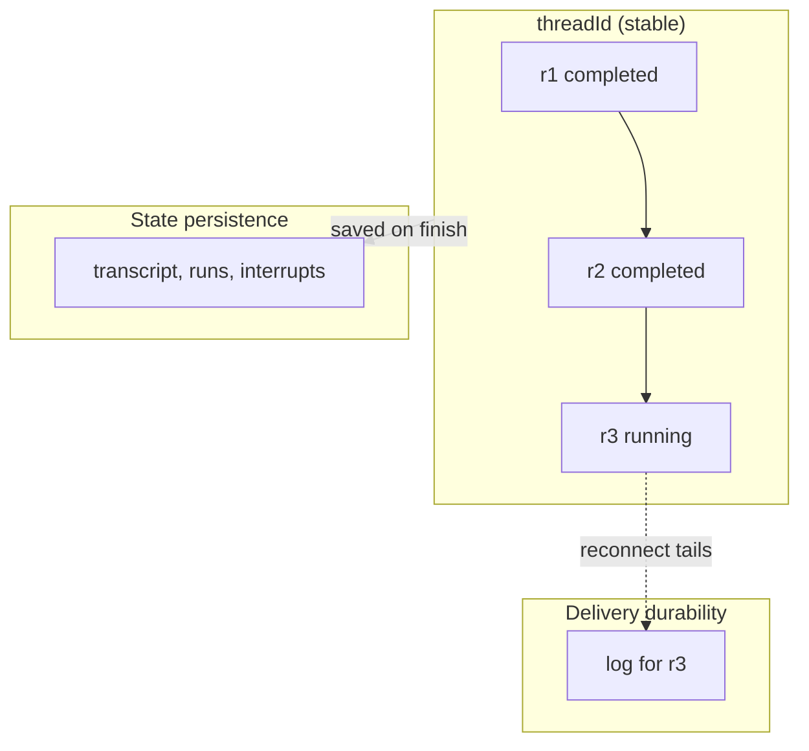
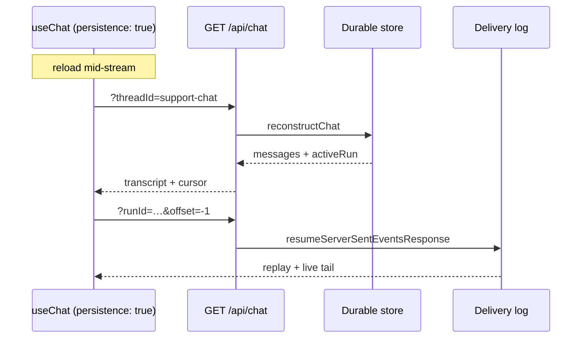

# How Persistence Works

If something surprised you or you are writing a backend → read this. Setup only → [overview](./overview).

## Two layers

| Layer | Answers | Lives | Docs |
| --- | --- | --- | --- |
| **Delivery durability** | reconnect to a still-running stream | per-run log, keyed by `runId` | [Resumable Streams](../resumable-streams/overview) |
| **State persistence** | conversation still there later | durable store (client and/or server) | this page |

They share no code. Replay ≠ saved conversation. Most apps want both.

## Identity: threads and runs

- **Thread** (`threadId`): stable conversation (or generation slot). Survives reloads/devices.
- **Run** (`runId`): one execution. Minted per stream. Delivery log is per run; state store holds the whole thread.


```mermaid
flowchart TB
    subgraph thread ["threadId (stable)"]
        direction LR
        run1["r1 completed"] --> run2["r2 completed"] --> run3["r3 running"]
    end

    subgraph delivery ["Delivery durability"]
        log["log for r3"]
    end

    subgraph state ["State persistence"]
        store["transcript, runs, interrupts"]
    end

    run3 -. "reconnect tails" .-> log
    thread -- "saved on finish" --> store
```

Reconnection resolves from `threadId` → `findActiveRun` → tail that run's log. [Id map](./id-map).

### Isolation is yours

Store APIs take bare `threadId`:

1. Derive `Scope.userId` / `Scope.tenantId` **server-side** from session.
2. Authorize before `loadThread` / `saveThread` / `reconstructChat({ authorize })`.
3. Never treat client-supplied thread id as ownership (ids are guessable).

`Scope` re-exported from `@tanstack/ai-persistence`.

## Who owns history

| Client `messages` | Server behavior |
| --- | --- |
| Non-empty | Full history. On finish, **overwrite** stored thread. Client authoritative; server mirrors. |
| Empty | Load stored transcript. Server authoritative; client is cache. |

No merge. Client-authoritative ≈ SPA; server-authoritative ≈ multi-device.

## What reload restores

**Client adapter:**

1. Run finished → transcript paints from storage, no network.
2. Interrupt paused → transcript + approval UI from resume pointer.
3. Still streaming → paint + rejoin via durability log (needs both layers).

Dropped socket, page open → delivery durability alone. Persistence matters when the page is gone.

**Server-authoritative:** paint from server `GET`, not localStorage. Delivery log is one run, not the thread.

Long-running **sandboxed agents** need takeover (producer may be gone) → [Takeover & Detached Runs](../sandbox/takeover).

## Why server-authoritative is the default

1. One source of truth — no drift; any device; survives restart.
2. Cheap client — no quota/parse cost for huge threads.
3. Reload still works — mount `GET` paints + `activeRun`.
4. Shared route with stream resume; `loadThread` returns ready messages.


```mermaid
sequenceDiagram
    participant Hook as useChat (persistence: true)
    participant Route as GET /api/chat
    participant Store as Durable store
    participant Log as Delivery log

    Note over Hook: reload mid-stream
    Hook->>Route: ?threadId=support-chat
    Route->>Store: reconstructChat
    Store-->>Route: messages + activeRun
    Route-->>Hook: transcript + cursor
    Hook->>Route: ?runId=…&offset=-1
    Route->>Log: resumeServerSentEventsResponse
    Log-->>Hook: replay + live tail
```

## Separate boundaries

1. **Server state** — `AIPersistence` + middleware (this page).
2. **Client hydration** — [Client persistence](./client-persistence).
3. **Stream delivery** — [Resumable Streams](../resumable-streams/overview).

State middleware does not mutate chunks for delivery offsets; it stores server event state, not client-rendered messages.

## Chat middleware lifecycle

`withPersistence(persistence)` from store presence:

1. **`setup`** — persistence / interrupt / lock capabilities when stores exist.
2. **`onConfig`** — createOrResume run, load pending interrupts, validate resume batch, merge stored messages if request has no history.
3. **`onChunk`** — on `RUN_FINISHED` interrupt: commit resumes, store interrupts, mark interrupted, save messages.
4. **`onFinish` / `onError` / `onAbort`** — terminalize run. Exception: detachable run, plain disconnect → leave `'running'` for takeover ([Takeover](../sandbox/takeover#detach-vs-cancel)).

Resumes commit only at successful interrupt/finish. AG-UI chunk stream unchanged.

Non-empty `messages` → overwrite on finish. Empty → load stored transcript.

## Read stores from your middleware

Declare `requires`, read capabilities — avoid a second persistence instance:

```ts
import { chat, defineChatMiddleware, toServerSentEventsResponse } from '@tanstack/ai'
import { openaiText } from '@tanstack/ai-openai'
import {
  InterruptsCapability,
  PersistenceCapability,
  getInterrupts,
  getPersistence,
  memoryPersistence,
  withPersistence,
} from '@tanstack/ai-persistence'
import type { ChatMiddlewareContext } from '@tanstack/ai'

const persistence = memoryPersistence()

const auditPending = defineChatMiddleware({
  name: 'audit-pending',
  requires: [PersistenceCapability, InterruptsCapability],
  async setup(ctx: ChatMiddlewareContext) {
    const stores = getPersistence(ctx).stores
    const interrupts = getInterrupts(ctx)
    const pending = await interrupts.listPending(ctx.threadId)
    await stores.metadata?.set(ctx.threadId, 'pending-count', {
      count: pending.length,
    })
  },
})

export async function POST(request: Request) {
  const { messages, threadId } = await request.json()
  const stream = chat({
    adapter: openaiText('gpt-5.5'),
    messages,
    threadId,
    middleware: [withPersistence(persistence), auditPending],
  })
  return toServerSentEventsResponse(stream)
}
```

| Capability | Getter | Content |
| --- | --- | --- |
| `PersistenceCapability` | `getPersistence(ctx)` | whole `AIPersistence` |
| `InterruptsCapability` | `getInterrupts(ctx)` | `interrupts` store (only if present) |

Write halves: `providePersistence`, `provideInterrupts`. Locks: [`@tanstack/ai/locks`](../advanced/locks).

## Generation middleware lifecycle

`withGenerationPersistence(persistence)`:

1. **`onStart`** — createOrResume generation run.
2. **`onFinish` / `onError` / `onAbort`** — terminalize.
3. **Result transform** — result metadata (ids, urls — never media bytes) on the record.
4. If `artifacts` + `blobs` → persist media, merge durable refs.

Uses `generationRuns` only (never chat `runs` / `messages`). Primary key: `ctx.runId ?? ctx.requestId`.

**`threadId` required** — slot for filing; `opts.threadId ?? ctx.threadId`; throws if neither. Never faked from request id.

## Composition semantics

```ts
import {
  composePersistence,
  memoryPersistence,
} from '@tanstack/ai-persistence'

const base = memoryPersistence()
const replacement = base.stores.messages

const result = composePersistence(base, {
  overrides: {
    messages: replacement,
    metadata: undefined,
    interrupts: false,
  },
})
```

- `messages` replaced; `metadata` inherited (`undefined`); `interrupts` removed; omitted keys inherited.
- Copies store map; does not mutate/dispose inputs.
- Unknown keys rejected statically and at runtime.

**Entrypoint validation:**

| Entry | Requires |
| --- | --- |
| chat | `messages`; `interrupts` without `runs` rejected |
| generation | `generationRuns` |
| `reconstructChat` | `messages` |
| `reconstructGeneration` | `generationRuns` |

## Backend ownership

Adapter owns connections, migrations, row mapping. Middleware only calls store methods.

`composePersistence` is not distributed transactions — define retry/idempotency across systems yourself.

**RunStore for durable runs:**

1. `update` must round-trip `driverEpoch` (fencing).
2. **Omitted** patch key = leave column; key with **`undefined`** = clear column (`detachedSince` on re-attach).

See [Build your own adapter](./build-your-own-adapter), [Takeover](../sandbox/takeover#requirements).
