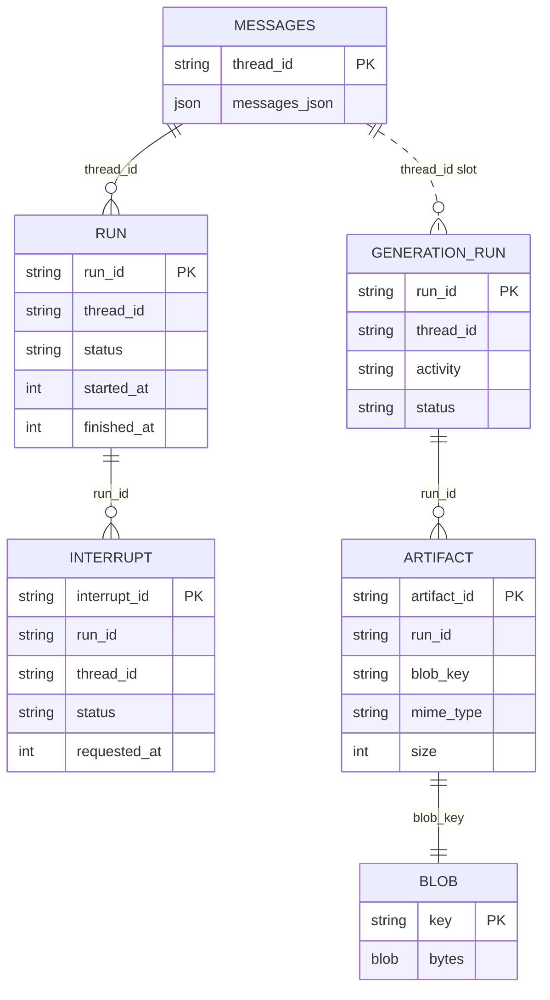

# Store Reference

If you need signatures and invariants → this page. Implement only the stores you need.

| Store | Purpose | Used by |
| --- | --- | --- |
| `messages` | Authoritative model-message history per thread | `withPersistence`, required |
| `runs` | Run status, timing, errors, usage | `withPersistence` |
| `interrupts` | Pending / resolved / cancelled human waits (needs `runs`) | `withPersistence` |
| `metadata` | App key/value state | `withPersistence` |
| `generationRuns` | Generation run status + result metadata by `runId` | `withGenerationPersistence`, required |
| `artifacts` | Generated-file metadata (needs `blobs`) | `withGenerationPersistence` |
| `blobs` | Generated bytes (needs `artifacts`) | `withGenerationPersistence` |

Named chat groupings: [Controls](./controls).

`runs` uses `RunRecord` / `RunStore` from `@tanstack/ai` (re-exported here) so chat and sandbox share one record type.

## MessageStore

```ts
import type { ModelMessage } from '@tanstack/ai'

interface MessageStore {
  loadThread(threadId: string): Promise<Array<ModelMessage>>
  saveThread(threadId: string, messages: Array<ModelMessage>): Promise<void>
}
```

- `saveThread` = full authoritative history (not a delta).
- `loadThread` = `[]` for never-saved (never `null`).

## RunStore

Import from `@tanstack/ai` or `@tanstack/ai-persistence`. `RunError` is `@tanstack/ai` only.

```ts
import type { TokenUsage } from '@tanstack/ai'

type TerminalRunStatus = 'completed' | 'failed' | 'aborted'
type RunStatus = 'running' | 'interrupted' | TerminalRunStatus

interface RunError {
  message: string
  code?: string // stable classification; providers often omit
}

interface RunRecord {
  runId: string
  threadId: string
  status: RunStatus
  startedAt: number // epoch ms
  finishedAt?: number
  error?: RunError
  usage?: TokenUsage
  // DURABLE SANDBOX ONLY — leave out for chat-only. See build-a-sandbox-adapter.
  sandboxKey?: string
  detachedSince?: number
  cancelRequested?: boolean
  driverEpoch?: number
}

interface RunStore {
  createOrResume(input: {
    runId: string
    threadId: string
    status?: RunStatus
    startedAt: number
  }): Promise<RunRecord>
  update(
    runId: string,
    patch: Partial<
      Pick<
        RunRecord,
        | 'status'
        | 'finishedAt'
        | 'error'
        | 'usage'
        | 'sandboxKey'
        | 'detachedSince'
        | 'cancelRequested'
        | 'driverEpoch'
      >
    >,
  ): Promise<void>
  get(runId: string): Promise<RunRecord | null>
  findActiveRun(threadId: string): Promise<RunRecord | null>
  listByThread?(threadId: string): Promise<Array<RunRecord>>
  listReclaimable?(opts: {
    now: number
    ttlMs: number
  }): Promise<Array<RunRecord>>
}
```

**Must (floor):**

1. `createOrResume` idempotent — second call returns stored record unchanged.
2. `update` unknown `runId` → no-op.
3. `get`
4. `findActiveRun` real work (newest `'running'` by `startedAt`). Stubbing `null` silently breaks mid-stream hydrate.

**Optional** (feature-detected; declare in `skipMethods`):

- Skip `listByThread` → cannot render past runs for a thread.
- Skip `listReclaimable` → `reapDetachedRuns` sweeps nothing. See [Takeover](../sandbox/takeover#configuration), [Reaping](../sandbox/reaping).

Sandbox fields: [Build a Sandbox Adapter](./build-a-sandbox-adapter#the-four-run-fields). Prove with `runDurableRunFieldsConformance` from `@tanstack/ai-sandbox/testkit`.

Helpers:

```ts
import { isTerminalRunStatus } from '@tanstack/ai-persistence'
import type { RunRecord, TerminalRunStatus } from '@tanstack/ai-persistence'

function finalStatus(run: RunRecord): TerminalRunStatus | null {
  return isTerminalRunStatus(run.status) ? run.status : null
}
```

`defineRunStore` preserves exact object shape (optional methods callable without `?.` on your concrete store).

No run lifecycle at all → omit `runs` (`ChatTranscriptStores`); do not stub methods.

Reference: `MemoryRunStore` in `packages/ai-persistence/src/memory.ts`. Example: `examples/ts-react-chat` SQLite adapter implements four required + `listReclaimable`, skips `runs.listByThread`.

## InterruptStore

```ts
interface InterruptRecord {
  interruptId: string
  runId: string
  threadId: string
  status: 'pending' | 'resolved' | 'cancelled'
  requestedAt: number
  resolvedAt?: number
  payload: Record<string, unknown>
  response?: unknown
}

interface InterruptStore {
  create(record: Omit<InterruptRecord, 'status' | 'resolvedAt'>): Promise<void>
  resolve(interruptId: string, response?: unknown): Promise<void>
  cancel(interruptId: string): Promise<void>
  get(interruptId: string): Promise<InterruptRecord | null>
  list(threadId: string): Promise<Array<InterruptRecord>>
  listPending(threadId: string): Promise<Array<InterruptRecord>>
  listByRun(runId: string): Promise<Array<InterruptRecord>>
  listPendingByRun(runId: string): Promise<Array<InterruptRecord>>
}
```

- `create` insert-if-absent; born `'pending'`.
- All `list*` ordered by `requestedAt` ascending.
- Chat: requires `runs`.

## MetadataStore

```ts
interface MetadataStore {
  get(scope: string, key: string): Promise<unknown | null>
  set(scope: string, key: string, value: unknown): Promise<void>
  delete(scope: string, key: string): Promise<void>
}
```

`(scope, key)` composite identity. Stored `null` indistinguishable from absence — wrap `{ value: null }` or reject nullish.

## GenerationRunStore

Not chat `runs`. Hydrate key: `findLatestForThread(threadId)`.

```ts
import type { PersistedArtifactRef, TokenUsage } from '@tanstack/ai'

type GenerationRunStatus =
  | 'running'
  | 'interrupted'
  | 'completed'
  | 'failed'
  | 'aborted'

interface GenerationRunRecord {
  runId: string
  threadId: string
  activity: string // 'image' | 'audio' | 'tts' | 'video' | 'transcription'
  provider: string
  model: string
  status: GenerationRunStatus
  startedAt: number
  finishedAt?: number
  error?: { message: string; code?: string }
  result?: unknown // metadata only, never media bytes
  artifacts?: Array<PersistedArtifactRef>
  usage?: TokenUsage
}

interface GenerationRunStore {
  createOrResume(input: {
    runId: string
    activity: string
    provider: string
    model: string
    startedAt: number
    threadId: string
    status?: GenerationRunStatus
  }): Promise<GenerationRunRecord>
  update(
    runId: string,
    patch: Partial<
      Pick<
        GenerationRunRecord,
        'status' | 'finishedAt' | 'error' | 'result' | 'artifacts' | 'usage'
      >
    >,
  ): Promise<void>
  get(runId: string): Promise<GenerationRunRecord | null>
  findLatestForThread(threadId: string): Promise<GenerationRunRecord | null>
}
```

`createOrResume` idempotent. `update` unknown id = no-op. `findLatestForThread` required (without it hydrate silently returns nothing forever).

## ArtifactStore

Provide with `BlobStore`.

```ts
interface ArtifactRecord {
  artifactId: string
  runId: string
  threadId: string
  blobKey?: string
  name: string
  mimeType: string
  size: number
  sourceUrl?: string
  createdAt: number
}

interface ArtifactStore {
  save(record: ArtifactRecord): Promise<void>
  get(artifactId: string): Promise<ArtifactRecord | null>
  list(runId: string): Promise<Array<ArtifactRecord>>
  delete(artifactId: string): Promise<void>
  deleteForRun(runId: string): Promise<void>
}
```

## BlobStore

Middleware writes under `artifacts/<runId>/<artifactId>`.

```ts
type BlobBody =
  | ReadableStream<Uint8Array>
  | ArrayBuffer
  | ArrayBufferView
  | string
  | Blob

interface BlobRecord {
  key: string
  size?: number
  etag?: string
  contentType?: string
  customMetadata?: Record<string, string>
  createdAt?: number
  updatedAt?: number
}

interface BlobObject extends BlobRecord {
  arrayBuffer(): Promise<ArrayBuffer>
  text(): Promise<string>
  body?: ReadableStream<Uint8Array>
  range?: { offset: number; length: number }
}

interface BlobListPage {
  objects: Array<BlobRecord>
  cursor?: string
  truncated?: boolean
}

interface BlobPutOptions {
  contentType?: string
  customMetadata?: Record<string, string>
  expectedLength?: number // advisory for upload strategy only
}

interface BlobRange {
  offset: number
  length?: number
}

interface BlobGetOptions {
  range?: BlobRange
}

interface BlobListOptions {
  prefix?: string
  cursor?: string
  limit?: number
}

interface BlobStore {
  put(key: string, body: BlobBody, options?: BlobPutOptions): Promise<BlobRecord>
  get(key: string, options?: BlobGetOptions): Promise<BlobObject | null>
  head(key: string): Promise<BlobRecord | null>
  delete(key: string): Promise<void>
  list(options?: BlobListOptions): Promise<BlobListPage>
}
```

**`list` must:**

1. Match `prefix` literally, case-sensitively (escape SQL `LIKE` metacharacters).
2. When limited and more remain: `truncated: true` + `cursor`; next page strictly following keys.
3. `limit: 0` → empty, untruncated page.

**`put` must** drain length-less streams (conformance exercises this). Length-strict backends (R2 workerd) use multipart when `expectedLength` absent — skill `ai-persistence/build-cloudflare-artifact-store`.

**`get` must** honour `range` (slice only). `size` = whole object; returned `range` = served slice. Use `resolveBlobRange`:

```ts ignore
import { resolveBlobRange } from '@tanstack/ai-persistence'

async get(key: string, options?: BlobGetOptions) {
  const row = await selectBlob(key)
  if (!row) return null
  if (!options?.range) return blobObject(row, row.body)
  const served = resolveBlobRange(row.size, options.range)
  const bytes = await selectBlobSlice(key, served.offset, served.length)
  return blobObject(row, bytes, served)
}
```

Reference-only (no bytes) → skip `blobs` entirely. Ignoring range breaks `<video>` seek / Safari.

## How records relate

Thread is not a table — other records hang off `thread_id`. Generation run is keyed by `run_id`; `thread_id` is the slot `findLatestForThread` uses.



## Typing an adapter

Helpers: `defineMessageStore`, `defineRunStore`, `defineInterruptStore`, `defineMetadataStore`, `defineGenerationRunStore`, `defineArtifactStore`, `defineBlobStore` → compose with `defineAIPersistence` (exact key presence; unknown keys throw).

Named types:

- `ChatPersistence` — all four chat stores
- `ChatTranscriptPersistence` — `messages` floor
- `AIPersistence` — all-optional bag (`withPersistence` rejects it)

## Next

- [Build a chat adapter](./build-your-own-chat-adapter)
- [Build a generation adapter](./build-your-own-generation-adapter)
- [Conformance suite](./build-your-own-adapter#prove-with-conformance)
