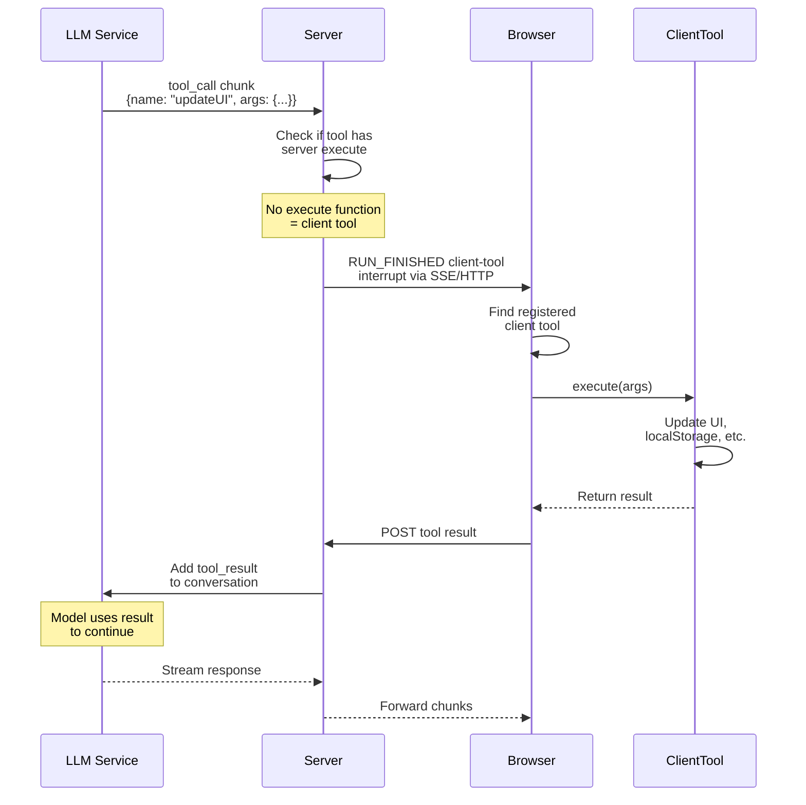

If the tool must touch UI, `localStorage`, or browser APIs → implement `.client()`. Server gets the **definition only** (no server `execute`).



## When to use

- UI updates (toasts, forms, visibility)
- Local storage / cache
- Browser APIs (geo, camera, clipboard)
- Framework state / navigation

## How it works

1. Model calls a client tool
2. Server sees no server `execute` → emits internal `client-tool-execution` pause (not a public `interrupts` item)
3. Browser runs registered `.client()` by name
4. Client auto-submits result via resume batch
5. Server validates, adds to conversation; model continues

Native client-tool execution shares the interrupt **batch** lifecycle but is **auto-resolved** — you do not call `resolveInterrupt` for it. Lifecycle: [Interrupts](../interrupts/overview).

## Approval is a separate axis

`needsApproval: true` → pause on `tool-approval` first. You resolve **only the decision**; then `.client()` runs automatically:

```ts ignore
const approval = interrupts.find(
  (interrupt) =>
    interrupt.kind === 'tool-approval' &&
    interrupt.toolName === 'delete_local_data',
)

if (
  approval?.kind === 'tool-approval' &&
  approval.toolName === 'delete_local_data'
) {
  approval.resolveInterrupt(true)
}
```

No `.client()` but you supply the result yourself → `addToolResult` (validated against output schema). See [Tool approval](./tool-approval).

## 1. Share definitions

```typescript
// tools/definitions.ts
import { toolDefinition } from "@tanstack/ai";
import { z } from "zod";

export const updateUIDef = toolDefinition({
  name: "update_ui",
  description: "Update the UI with new information",
  inputSchema: z.object({
    message: z.string().meta({ description: "Message to display" }),
    type: z.enum(["success", "error", "info"]).meta({ description: "Message type" }),
  }),
  outputSchema: z.object({
    success: z.boolean(),
  }),
});

export const saveToLocalStorageDef = toolDefinition({
  name: "save_to_local_storage",
  description: "Save data to browser local storage",
  inputSchema: z.object({
    key: z.string().meta({ description: "Storage key" }),
    value: z.string().meta({ description: "Value to store" }),
  }),
  outputSchema: z.object({
    saved: z.boolean(),
  }),
});
```

## 2. Server — pass definitions

```typescript
// api/chat/route.ts
import { chat, toServerSentEventsResponse } from "@tanstack/ai";
import { openaiText } from "@tanstack/ai-openai";
import { updateUIDef, saveToLocalStorageDef } from "./tools/definitions";

export async function POST(request: Request) {
  const { messages } = await request.json();

  const stream = chat({
    adapter: openaiText("gpt-5.5"),
    messages,
    tools: [updateUIDef, saveToLocalStorageDef],
  });

  return toServerSentEventsResponse(stream);
}
```

> **Security:** static definitions = server decides the allowlist. Client-advertised tools via `RunAgentInput.tools` need [`mergeAgentTools`](../migration/ag-ui-compliance#tier-3--optional-let-the-client-advertise-its-tools) — read its security note first.

## 3. Client — implement + wire

```tsx
// app/chat.tsx
import { useChat, fetchServerSentEvents } from "@tanstack/ai-react";
import {
  createChatClientOptions,
  type InferChatMessages,
  type MessagePart,
} from "@tanstack/ai-client";
import { toolDefinition } from "@tanstack/ai";
import { z } from "zod";

const updateUIDef = toolDefinition({
  name: "update_ui",
  description: "Update the UI with new information",
  inputSchema: z.object({
    message: z.string().meta({ description: "Message to display" }),
    type: z.enum(["success", "error", "info"]).meta({ description: "Message type" }),
  }),
  outputSchema: z.object({ success: z.boolean() }),
});

const saveToLocalStorageDef = toolDefinition({
  name: "save_to_local_storage",
  description: "Save data to browser local storage",
  inputSchema: z.object({
    key: z.string().meta({ description: "Storage key" }),
    value: z.string().meta({ description: "Value to store" }),
  }),
  outputSchema: z.object({ saved: z.boolean() }),
});

const updateUI = updateUIDef.client((input) => {
  console.log(input.message, input.type);
  return { success: true };
});

const saveToLocalStorage = saveToLocalStorageDef.client((input) => {
  localStorage.setItem(input.key, input.value);
  return { saved: true };
});

const tools = [updateUI, saveToLocalStorage];

const chatOptions = createChatClientOptions({
  connection: fetchServerSentEvents("/api/chat"),
  tools,
});

type ChatMessages = InferChatMessages<typeof chatOptions>;

function ChatComponent() {
  const { messages, sendMessage, isLoading } = useChat(chatOptions);

  return (
    <div>
      {messages.map((message) => (
        <MessageComponent key={message.id} message={message} />
      ))}
    </div>
  );
}

function MessageComponent({ message }: { message: ChatMessages[number] }) {
  return (
    <div>
      {message.parts.map((part: MessagePart) => {
        if (part.type === "text") {
          return <p>{part.content}</p>;
        }

        if (part.type === "tool-call") {
          if (part.name === "update_ui") {
            return (
              <div>
                Tool: {part.name}
                {part.output && <span>✓ Success</span>}
              </div>
            );
          }
        }
        return null;
      })}
    </div>
  );
}
```

## Client runtime context

Local to the hook/`ChatClient` — not serialized to the server:

```typescript
import { createChatClientOptions } from "@tanstack/ai-client";
import { useChat, fetchServerSentEvents } from "@tanstack/ai-react";
import { toolDefinition } from "@tanstack/ai";
import { toast } from "./toast";

const activeProjectId = "";

type ClientContext = {
  activeProjectId: string;
  toast(message: string): void;
};

const showToast = toolDefinition({
  name: "show_toast",
  description: "Show a browser notification",
}).client<ClientContext>((_input, ctx) => {
  ctx.context.toast(`Project ${ctx.context.activeProjectId} updated`);
  return { ok: true };
});

const chatOptions = createChatClientOptions({
  connection: fetchServerSentEvents("/api/chat"),
  tools: [showToast],
  context: {
    activeProjectId,
    toast: (message) => toast(message),
  },
});

const chat = useChat(chatOptions);
```

Server needs a client value? Send via `forwardedProps`, validate in the route, map into `chat({ context })`. See [Runtime Context](../advanced/runtime-context).

## Optional: `clientTools()`

Plain `tools: [toolA, toolB]` is enough for inference. Use `clientTools()` only to build a shared tools tuple outside the hook:

```ts
import { clientTools } from "@tanstack/ai-client";
import { toolDefinition } from "@tanstack/ai";

const notify = toolDefinition({
  name: "notify",
  description: "Show a notification",
}).client(() => ({ ok: true }));

const tools = clientTools(notify);
```

## Call states (UI)

| `part.state` | Show |
| --- | --- |
| `awaiting-input` | Waiting for args |
| `input-streaming` | Partial args |
| `input-complete` | Running / ready |
| `approval-requested` | Approval UI |
| `approval-responded` | Decision made |

Runtime never moves the call part to `complete` — use `part.output` and sibling `tool-result` (`complete` / `error`):

```tsx
import type { ToolCallPart } from "@tanstack/ai-client";

function ToolCallDisplay({ part }: { part: ToolCallPart }) {
  if (part.state === "awaiting-input") {
    return <div>🔄 Waiting for arguments...</div>;
  }

  if (part.state === "input-streaming") {
    return <div>📥 Receiving arguments...</div>;
  }

  if (part.state === "input-complete") {
    return <div>✓ Arguments received, running tool...</div>;
  }

  if (part.output) {
    return <div>✅ Tool complete</div>;
  }

  return null;
}
```

## Hybrid

```typescript
import { toolDefinition, chat } from "@tanstack/ai";
import { openaiText } from "@tanstack/ai-openai";
import { z } from "zod";
import { db } from "./db";

const addToCartDef = toolDefinition({
  name: "add_to_cart",
  description: "Add item to shopping cart",
  inputSchema: z.object({
    itemId: z.string(),
    quantity: z.number(),
  }),
  outputSchema: z.object({
    success: z.boolean(),
    cartId: z.string(),
  }),
});

const addToCartServer = addToCartDef.server(async (input) => {
  const cart = await db.carts.create({
    data: { itemId: input.itemId, quantity: input.quantity },
  });
  return { success: true, cartId: cart.id };
});

const addToCartClient = addToCartDef.client((input) => {
  const wishlist = JSON.parse(localStorage.getItem("wishlist") || "[]");
  wishlist.push(input.itemId);
  localStorage.setItem("wishlist", JSON.stringify(wishlist));
  return { success: true, cartId: "local" };
});

// Definition → client executes
chat({ adapter: openaiText('gpt-5.5'), messages: [], tools: [addToCartDef] });

// Server impl → server executes
chat({ adapter: openaiText('gpt-5.5'), messages: [], tools: [addToCartServer] });
```

## Must-do

1. Keep client tools light (bundle size)
2. Return errors in the output schema shape
3. Drive UI from tool states / results
4. Never store secrets in local storage or client tools

## Next

- [How Tools Work](./tool-architecture)
- [Server Tools](./server-tools)
- [Tool Approval Flow](./tool-approval)
