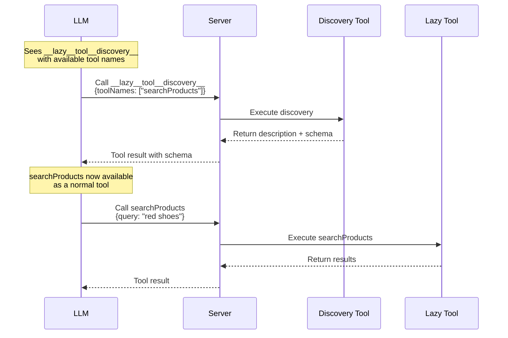

If you have many tools and want lower token cost → set `lazy: true`. Lazy tools are **not** sent upfront; the model discovers them via `__lazy__tool__discovery__`.



## Mark tools lazy

```typescript group=lazy-intro
import { toolDefinition, chat, toServerSentEventsResponse } from "@tanstack/ai";
import { openaiText } from "@tanstack/ai-openai";
import { z } from "zod";
import { db } from "./db";
import { getProducts, compareProducts } from "./tools";

const searchProductsDef = toolDefinition({
  name: "searchProducts",
  description: "Search products by keyword in name or description",
  inputSchema: z.object({
    query: z.string().describe("Search keyword or phrase"),
  }),
  outputSchema: z.object({
    results: z.array(
      z.object({
        id: z.number(),
        name: z.string(),
        price: z.number(),
      })
    ),
  }),
  lazy: true,
});

const searchProducts = searchProductsDef.server(async ({ query }) => {
  const results = await db.products.search(query);
  return { results };
});
```

```typescript group=lazy-intro
async function handleRequest(request: Request) {
  const { messages } = await request.json();
  const stream = chat({
    adapter: openaiText("gpt-5.5"),
    messages,
    tools: [
      getProducts, // eager
      searchProducts, // lazy
      compareProducts, // lazy
    ],
  });

  return toServerSentEventsResponse(stream);
}
```

## Catalog detail (`lazyToolsConfig`)

Default catalog lists **names only**. Tune pre-discovery description depth:

```typescript
import { chat, toServerSentEventsResponse } from "@tanstack/ai";
import { openaiText } from "@tanstack/ai-openai";
import { getProducts, searchProducts, compareProducts } from "./tools";

async function handleRequest(request: Request) {
  const { messages } = await request.json();
  const stream = chat({
    adapter: openaiText("gpt-5.5"),
    messages,
    tools: [getProducts, searchProducts, compareProducts],
    lazyToolsConfig: {
      includeDescription: "first-sentence", // 'none' | 'first-sentence' | 'full'
    },
  });

  return toServerSentEventsResponse(stream);
}
```

| `includeDescription` | Catalog entry |
| -------------------- | ------------- |
| `'none'` (default)   | `searchProducts` |
| `'first-sentence'`   | `searchProducts — Search products by keyword.` |
| `'full'`             | `searchProducts — <full description>` |

Discovery **result** always returns full description + argument schema. Same option exists on Code Mode `createCodeMode()` — [Code Mode Lazy Tools](../code-mode/lazy-tools).

## When to use

**Lazy:** many tools, rare secondary tools, large descriptions.

**Eager (default):** tools used in most conversations.

## Discovery flow

1. Model sees `__lazy__tool__discovery__` with catalog names
2. Calls discovery with needed names
3. Gets full schemas; tools inject for next iteration
4. Calls discovered tools normally

Discover many at once:

```
__lazy__tool__discovery__({ toolNames: ["searchProducts", "compareProducts"] })
```

## Multi-turn

Discovered tools stay available later in the same conversation (history scanned for prior discovery results). No re-discovery required.

## Self-correction

Calling a not-yet-discovered lazy tool returns:

```
Error: Tool 'searchProducts' must be discovered first.
Call __lazy__tool__discovery__ with toolNames: ['searchProducts'] to discover it.
```

Model discovers, then retries.

## Zero overhead

No `lazy: true` → no discovery tool. All lazy tools discovered → discovery tool removed.

## Complete example

```typescript
import { toolDefinition, chat, toServerSentEventsResponse, maxIterations } from "@tanstack/ai";
import { openaiText } from "@tanstack/ai-openai";
import { z } from "zod";
import { db } from "./db";

const getProductsDef = toolDefinition({
  name: "getProducts",
  description: "Get all products from the catalog",
  inputSchema: z.object({}),
  outputSchema: z.array(
    z.object({
      id: z.number(),
      name: z.string(),
      price: z.number(),
    })
  ),
});

const getProducts = getProductsDef.server(async () => {
  return await db.products.findMany();
});

const compareProductsDef = toolDefinition({
  name: "compareProducts",
  description: "Compare two or more products side by side",
  inputSchema: z.object({
    productIds: z.array(z.number()).min(2),
  }),
  lazy: true,
});

const compareProducts = compareProductsDef.server(async ({ productIds }) => {
  const products = await db.products.findMany({
    where: { id: { in: productIds } },
  });
  return { products };
});

const calculateFinancingDef = toolDefinition({
  name: "calculateFinancing",
  description: "Calculate monthly payment plans for a product",
  inputSchema: z.object({
    productId: z.number(),
    months: z.number(),
  }),
  lazy: true,
});

const calculateFinancing = calculateFinancingDef.server(async ({ productId, months }) => {
  const product = await db.products.findUnique({ where: { id: productId } });
  const monthlyPayment = product.price / months;
  return { monthlyPayment, totalPrice: product.price, months };
});

export async function POST(request: Request) {
  const { messages } = await request.json();

  const stream = chat({
    adapter: openaiText("gpt-5.5"),
    messages,
    tools: [getProducts, compareProducts, calculateFinancing],
    agentLoopStrategy: maxIterations(20),
  });

  return toServerSentEventsResponse(stream);
}
```

Model always sees `getProducts` + `__lazy__tool__discovery__`; discovers `compareProducts` / `calculateFinancing` when needed.

## Next

- [Tools Overview](./tools)
- [Server Tools](./server-tools)
- [Tool Architecture](./tool-architecture)
- [Agentic Cycle](../chat/agentic-cycle)
