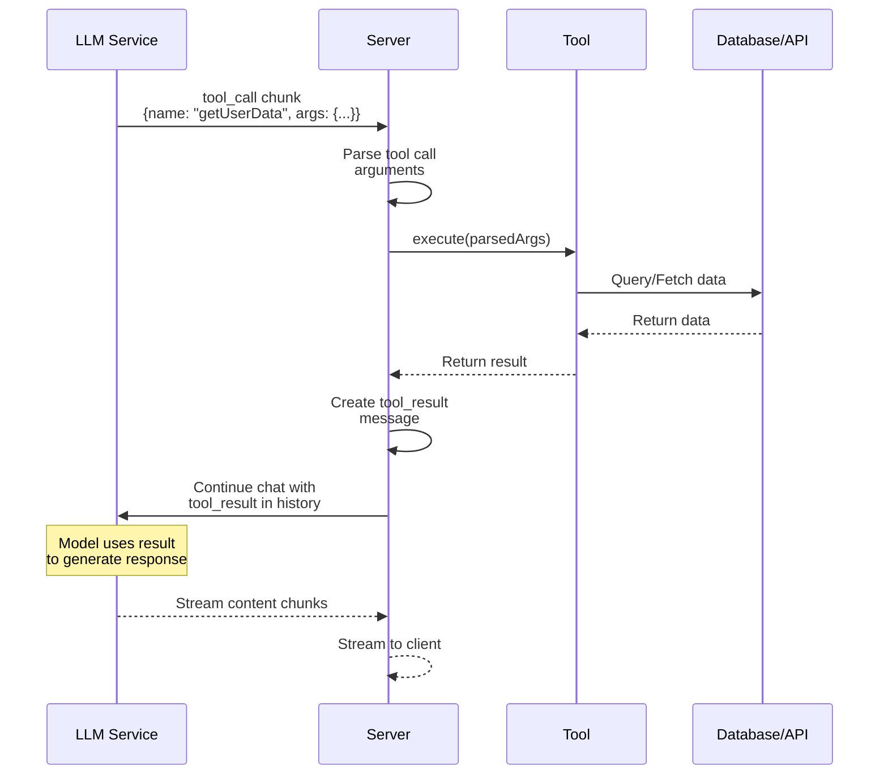

If the tool needs DB/API/env secrets → implement with `.server()`. It runs automatically when the model calls it (or after approval if `needsApproval`).



## Execution steps

1. Server receives tool call → parse/validate args against input schema
2. Run `.server()` execute
3. Validate output schema (if defined) → tool result message in history
4. Chat continues so the model can answer from the result

**Default:** auto-execute. **`needsApproval: true`:** still auto-executes, but only after client approval — [Tool Approval](./tool-approval).

## Define + implement

```typescript
import { toolDefinition } from "@tanstack/ai";
import { z } from "zod";
import { db } from "./db";

const getUserDataDef = toolDefinition({
  name: "get_user_data",
  description: "Get user information from the database",
  inputSchema: z.object({
    userId: z.string().meta({ description: "The user ID to look up" }),
  }),
  outputSchema: z.object({
    name: z.string(),
    email: z.string().email(),
    createdAt: z.string(),
  }),
});

const getUserData = getUserDataDef.server(async ({ userId }) => {
  const user = await db.users.findUnique({ where: { id: userId } });
  return {
    name: user.name,
    email: user.email,
    createdAt: user.createdAt.toISOString(),
  };
});
```

API call with server-only secrets:

```typescript
import { toolDefinition } from "@tanstack/ai";
import { z } from "zod";

const searchProductsDef = toolDefinition({
  name: "search_products",
  description: "Search for products in the catalog",
  inputSchema: z.object({
    query: z.string().meta({ description: "Search query" }),
    limit: z.number().optional().meta({ description: "Maximum number of results" }),
  }),
});

const searchProducts = searchProductsDef.server(async ({ query, limit = 10 }) => {
  const response = await fetch(
    `https://api.example.com/products?q=${query}&limit=${limit}`,
    {
      headers: {
        Authorization: `Bearer ${process.env.API_KEY}`,
      },
    }
  );
  return await response.json();
});
```

## Pass to `chat`

```typescript
import { chat, toServerSentEventsResponse } from "@tanstack/ai";
import { openaiText } from "@tanstack/ai-openai";
import { getUserData, searchProducts } from "./tools";

export async function POST(request: Request) {
  const { messages } = await request.json();

  const stream = chat({
    adapter: openaiText("gpt-5.5"),
    messages,
    tools: [getUserData, searchProducts],
  });

  return toServerSentEventsResponse(stream);
}
```

## Runtime context

Second arg of `.server()` — request-scoped deps (auth, DB, tenant):

```typescript
import { chat, toolDefinition, toServerSentEventsResponse } from "@tanstack/ai";
import { openaiText } from "@tanstack/ai-openai";
import { z } from "zod";
import { getSession, getDb } from "./auth";

type AppContext = {
  userId: string;
  db: {
    users: {
      findUnique(args: { where: { id: string } }): Promise<{ name: string } | null>;
    };
  };
};

const getCurrentUser = toolDefinition({
  name: "get_current_user",
  description: "Get the current authenticated user",
  inputSchema: z.object({}),
  outputSchema: z.object({
    name: z.string().nullable(),
  }),
}).server<AppContext>(async (_input, ctx) => {
  const user = await ctx.context.db.users.findUnique({
    where: { id: ctx.context.userId },
  });

  return { name: user?.name ?? null };
});

export async function POST(request: Request) {
  const { messages } = await request.json();
  const session = await getSession(request);
  const db = getDb();

  const stream = chat({
    adapter: openaiText("gpt-5.5"),
    messages,
    tools: [getCurrentUser],
    context: {
      userId: session.user.id,
      db,
    },
  });

  return toServerSentEventsResponse(stream);
}
```

If a tool declares a context generic, `chat()` requires compatible `context`. Untyped tools get `unknown`. Middleware/handoff: [Runtime Context](../advanced/runtime-context).

## Organize defs vs implementations

```typescript ignore
// tools/definitions.ts
import { toolDefinition } from "@tanstack/ai";
import { z } from "zod";

export const getUserDataDef = toolDefinition({
  name: "get_user_data",
  description: "Get user information",
  inputSchema: z.object({
    userId: z.string(),
  }),
  outputSchema: z.object({
    name: z.string(),
    email: z.string(),
  }),
});

export const searchProductsDef = toolDefinition({
  name: "search_products",
  description: "Search products",
  inputSchema: z.object({
    query: z.string(),
  }),
});

// tools/server.ts
import { getUserDataDef, searchProductsDef } from "./definitions";
import { db } from "@/lib/db";

export const getUserData = getUserDataDef.server(async ({ userId }) => {
  const user = await db.users.findUnique({ where: { id: userId } });
  return { name: user.name, email: user.email };
});

export const searchProducts = searchProductsDef.server(async ({ query }) => {
  const products = await db.products.search(query);
  return products;
});

// api/chat/route.ts
import { chat } from "@tanstack/ai";
import { openaiText } from "@tanstack/ai-openai";
import { getUserData, searchProducts } from "@/tools/server";

const stream = chat({
  adapter: openaiText("gpt-5.5"),
  messages,
  tools: [getUserData, searchProducts],
});
```

## Error handling

Prefer structured `{ error }` in the return (include it in `outputSchema`). Throws become tool-result errors with less control over the message:

```typescript
import { toolDefinition } from "@tanstack/ai";
import { z } from "zod";
import { db } from "./db";

const getUserDataDef = toolDefinition({
  name: "get_user_data",
  description: "Get user information",
  inputSchema: z.object({
    userId: z.string(),
  }),
  outputSchema: z.object({
    name: z.string().optional(),
    email: z.string().optional(),
    error: z.string().optional(),
  }),
});

const getUserData = getUserDataDef.server(async ({ userId }) => {
  try {
    const user = await db.users.findUnique({ where: { id: userId } });
    if (!user) {
      return { error: "User not found" };
    }
    return { name: user.name, email: user.email };
  } catch {
    return { error: "Failed to fetch user data" };
  }
});
```

With `outputSchema`, returns are validated before the conversation updates.

## JSON Schema tools

Args are `unknown` — narrow before use. No Zod runtime validation:

```typescript
import { toolDefinition } from "@tanstack/ai";
import type { JSONSchema } from "@tanstack/ai";
import { db } from "./db";

const inputSchema: JSONSchema = {
  type: "object",
  properties: {
    userId: {
      type: "string",
      description: "The user ID to look up",
    },
  },
  required: ["userId"],
};

const outputSchema: JSONSchema = {
  type: "object",
  properties: {
    name: { type: "string" },
    email: { type: "string" },
  },
  required: ["name", "email"],
};

const getUserDataDef = toolDefinition({
  name: "get_user_data",
  description: "Get user information from the database",
  inputSchema,
  outputSchema,
});

const getUserData = getUserDataDef.server(async (args) => {
  if (typeof args !== "object" || args === null || !("userId" in args)) {
    throw new Error("Invalid input: expected a userId");
  }
  const user = await db.users.findUnique({ where: { id: String(args.userId) } });
  return { name: user.name, email: user.email };
});
```

Typed tools also narrow stream events — [Type-Safe Tool Call Events](../chat/streaming#type-safe-tool-call-events).

## Must-do

1. Keep each tool focused
2. Validate with Zod when possible
3. Return clear errors
4. Write descriptions the model can follow
5. Never expose secrets to the client

## Next

- [Client Tools](./client-tools)
- [Tool Approval Flow](./tool-approval)
