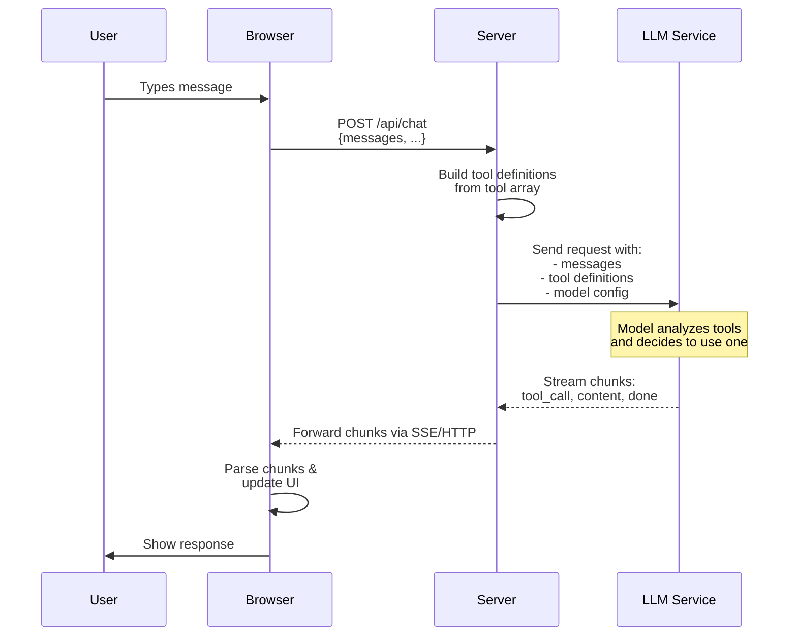
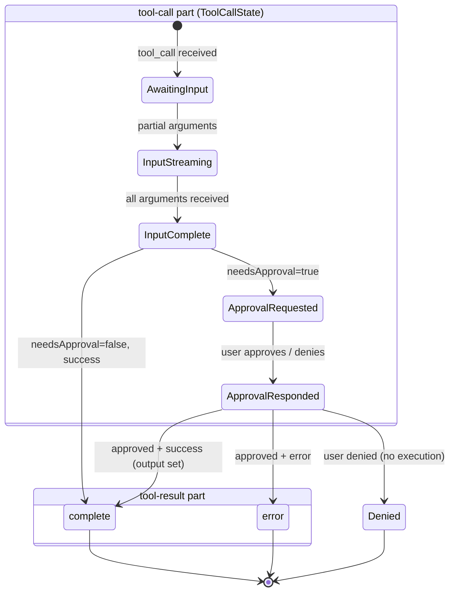
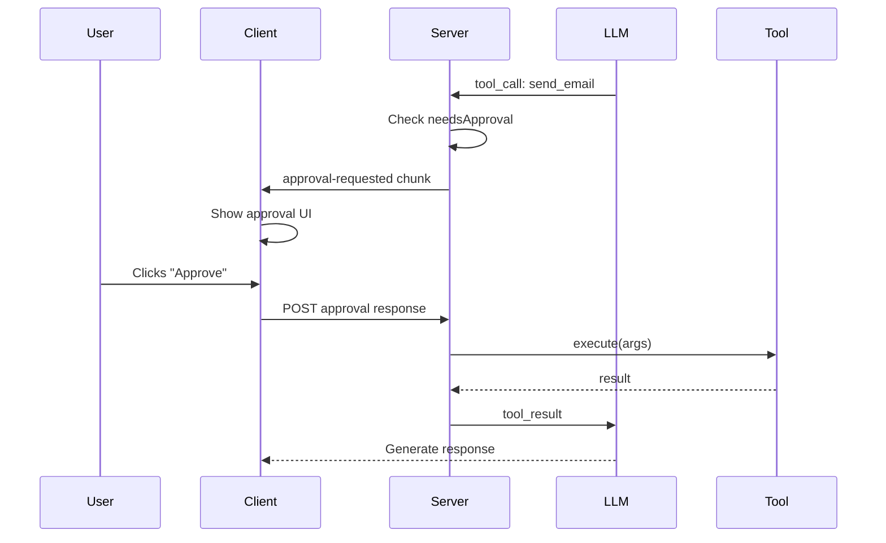
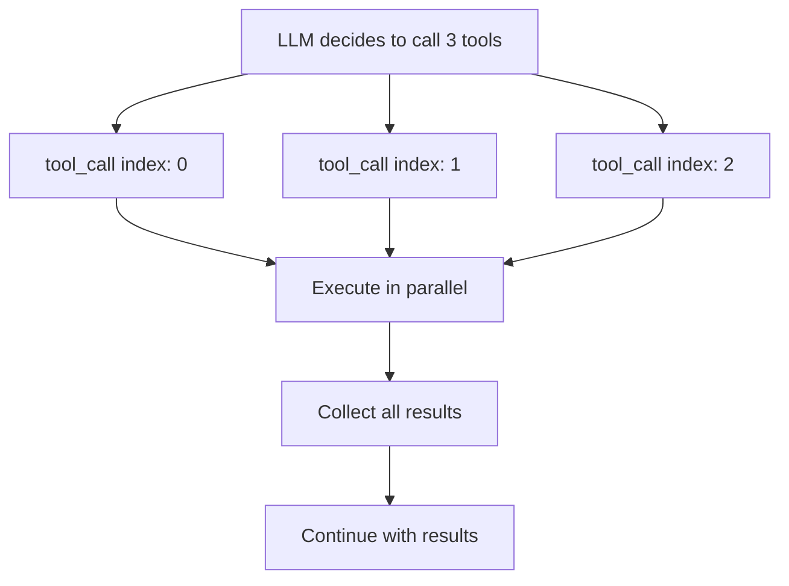

If you need to know where a tool runs or which `part.state` to render → use this page.

| Path | Doc |
| --- | --- |
| Server execution | [Server Tools](./server-tools) |
| Client execution | [Client Tools](./client-tools) |
| Multi-step loops | [Agentic Cycle](../chat/agentic-cycle) |
| Human-in-the-loop | [Tool Approval](./tool-approval) |

## Call flow: client → LLM



1. User sends message
2. Client POSTs `messages` (+ optional `body`)
3. Server formats tools for the LLM
4. LLM may emit tool calls
5. Chunks stream back; UI updates

### Server

```typescript
import { chat, toServerSentEventsResponse } from "@tanstack/ai";
import { openaiText } from "@tanstack/ai-openai";
import { getWeather, sendEmail } from "./tools";

export async function POST(request: Request) {
  const { messages } = await request.json();

  const stream = chat({
    adapter: openaiText("gpt-5.5"),
    messages,
    tools: [getWeather, sendEmail],
  });

  return toServerSentEventsResponse(stream);
}
```

### Client

```tsx
import { useState } from "react";
import { useChat, fetchServerSentEvents } from "@tanstack/ai-react";

function ChatComponent() {
  const [input, setInput] = useState("");
  const { messages, sendMessage, isLoading } = useChat({
    connection: fetchServerSentEvents("/api/chat"),
  });

  return (
    <div>
      {messages.map((message) => (
        <div key={message.id}>{/* Render message */}</div>
      ))}
      <form
        onSubmit={(e) => {
          e.preventDefault();
          sendMessage(input);
          setInput("");
        }}
      >
        <input value={input} onChange={(e) => setInput(e.target.value)} />
        <button type="submit" disabled={isLoading}>
          Send
        </button>
      </form>
    </div>
  );
}
```

## States (canonical)

> **Two parts, two state sets.** Call states live on **`tool-call`** as `part.state`. There is no `complete`/`error`/`executing` on the call part. Result lives on sibling **`tool-result`** (`streaming` / `complete` / `error`); value also mirrored on `part.output`.



### Call states (`tool-call`)

| State | UI action |
|-------|-----------|
| `awaiting-input` | Show loading |
| `input-streaming` | Show progress |
| `input-complete` | Ready / executing |
| `approval-requested` | Show approval UI |
| `approval-responded` | Wait for result |

### Result states (`tool-result`)

| State | UI action |
|-------|-----------|
| `streaming` | Progress (future) |
| `complete` | Show result |
| `error` | Show error |

### Monitor in React

```tsx
import { useChat, fetchServerSentEvents } from "@tanstack/ai-react";
import { createChatClientOptions } from "@tanstack/ai-client";
import { getWeather, sendEmail } from "./tools";
import { ApprovalUI } from "./approval-ui";

const chatOptions = createChatClientOptions({
  connection: fetchServerSentEvents("/api/chat"),
  tools: [getWeather, sendEmail],
});

function ChatComponent() {
  const { messages } = useChat(chatOptions);

  return (
    <div>
      {messages.map((message) => (
        <div key={message.id}>
          {message.parts.map((part) => {
            if (part.type === "tool-call") {
              return (
                <div key={part.id} className="tool-status">
                  {part.state === "awaiting-input" && (
                    <div>🔄 Calling {part.name}...</div>
                  )}
                  {part.state === "input-streaming" && (
                    <div>📥 Receiving arguments...</div>
                  )}
                  {part.state === "input-complete" && (
                    <div>✓ Arguments ready</div>
                  )}
                  {part.state === "approval-requested" && (
                    <ApprovalUI part={part} />
                  )}
                </div>
              );
            }
            if (part.type === "tool-result") {
              return (
                <div key={part.toolCallId}>
                  {part.state === "complete" && (
                    <div>✓ Tool completed</div>
                  )}
                  {part.state === "error" && (
                    <div>❌ Error: {part.error}</div>
                  )}
                </div>
              );
            }
            return null;
          })}
        </div>
      ))}
    </div>
  );
}
```

## Approval flow



```typescript
import { toolDefinition } from "@tanstack/ai";
import { z } from "zod";
import { emailService } from "./email-service";

const sendEmailDef = toolDefinition({
  name: "send_email",
  description: "Send an email",
  inputSchema: z.object({
    to: z.string().email(),
    subject: z.string(),
    body: z.string(),
  }),
  needsApproval: true,
});

const sendEmail = sendEmailDef.server(async ({ to, subject, body }) => {
  await emailService.send({ to, subject, body });
  return { success: true };
});
```

Resolve from `interrupts` (not deprecated `addToolApprovalResponse`):

```tsx ignore
const { messages, interrupts } = useChat({
  connection: fetchServerSentEvents("/api/chat"),
  tools: [sendEmail],
});

{interrupts.map((interrupt) =>
  interrupt.kind === "tool-approval" ? (
    <div key={interrupt.id}>
      <p>Approve {interrupt.toolName}?</p>
      <button onClick={() => interrupt.resolveInterrupt(true)}>Approve</button>
      <button onClick={() => interrupt.resolveInterrupt(false)}>Deny</button>
    </div>
  ) : null,
)}
```

Full API: [Tool Approval Flow](./tool-approval).

## Hybrid tools

```typescript
import { toolDefinition } from "@tanstack/ai";
import { z } from "zod";
import { db } from "./db";
import { i18n } from "./i18n";

const fetchUserPrefsDef = toolDefinition({
  name: "fetch_user_preferences",
  description: "Get user preferences from server",
  inputSchema: z.object({
    userId: z.string(),
  }),
});

const fetchUserPreferences = fetchUserPrefsDef.server(async ({ userId }) => {
  const prefs = await db.userPreferences.findUnique({ where: { userId } });
  return prefs;
});

const applyPrefsDef = toolDefinition({
  name: "apply_preferences",
  description: "Apply user preferences to the UI",
  inputSchema: z.object({
    theme: z.string(),
    language: z.string(),
  }),
});

const applyPreferences = applyPrefsDef.client(async ({ theme, language }) => {
  document.body.className = theme;
  i18n.changeLanguage(language);
  return { applied: true };
});
// Model can chain: server fetch → client apply
```

## Parallel tool calls



Example: "Compare weather in NYC, SF, and LA" → three `get_weather` calls at once, then comparison text.

## Must vs optional practices

**Must:**

1. One clear responsibility per tool
2. Zod (or validated) inputs; sensitive ops on server
3. `needsApproval` for destructive actions
4. Return meaningful errors (prefer structured `{ error }` over throw)

**Optional:**

1. Cache results; allow parallel calls
2. Timeouts on external APIs
3. Rate limits and audit logs

## Next

- [Tools Overview](./tools)
- [Server Tools](./server-tools)
- [Client Tools](./client-tools)
- [Tool Approval Flow](./tool-approval)
- [AG-UI protocol](https://docs.ag-ui.com/introduction)
